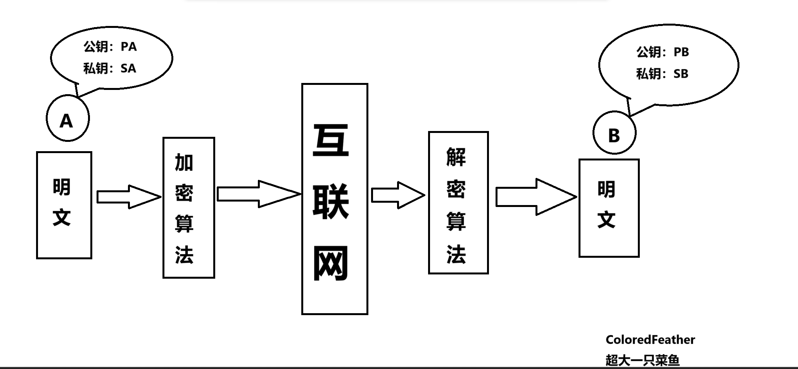
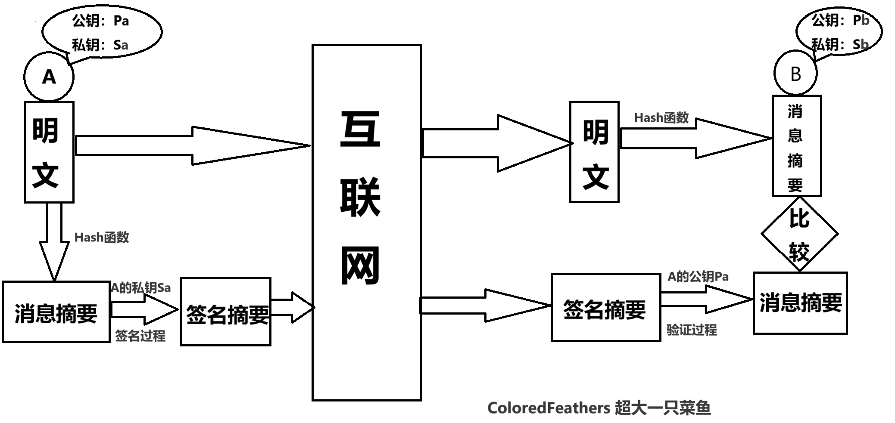

# 【软考】信息安全

## 一.信息安全基础知识

信息安全是保障信息系统和数据的保密性、完整性、可用性、可控性和可追溯性的综合措施。这五个要素是信息安全的基础，缺一不可。

### 1. **保密性 (Confidentiality)**

- **定义:** 保证信息只被授权人员访问。
- **举例:** 银行账户信息、医疗记录、商业机密等都需要严格保密，防止泄露给未经授权的人。
- 实现方式:
  - **加密:** 将数据转换为只有授权人员才能解读的密文。
  - **访问控制:** 设置访问权限，限制不同用户对信息的访问。
  - **身份认证:** 通过用户名、密码、生物特征等方式验证用户身份。

### 2. **完整性 (Integrity)**

- **定义:** 保证信息在传输和存储过程中不被篡改。
- **举例:** 银行转账金额、电子合同内容等必须保持完整，防止被恶意修改。
- 实现方式:
  - **校验:** 对数据进行计算，生成一个校验值，接收方通过重新计算校验值进行比对。
  - **数字签名:** 使用私钥对数据进行签名，接收方使用公钥验证签名。
  - **版本控制:** 记录数据的修改历史，方便追溯。

### 3. **可用性 (Availability)**

- **定义:** 保证授权用户在需要时能够访问信息。
- **举例:** 银行系统、电子商务网站等必须保证7×24小时可用。
- 实现方式:
  - **冗余备份:** 创建数据的副本，防止数据丢失。
  - **灾难恢复:** 制定应急预案，在系统故障时快速恢复。
  - **负载均衡:** 分散系统负载，提高系统性能。

### 4. **可控性 (Controllability)**

- **定义:** 保证对信息系统和数据的访问、使用和修改进行控制。
- **举例:** 企业内部网络的访问控制，对敏感数据的访问权限设置。
- 实现方式:
  - **访问控制列表 (ACL):** 规定哪些用户可以访问哪些资源。
  - **日志审计:** 记录系统和用户的所有操作，便于分析和追溯。
  - **安全策略:** 制定详细的安全策略，指导系统的安全配置和管理。

### 5. **可追溯性 (Accountability)**

- **定义:** 保证能够追踪到对信息系统和数据的所有操作。
- **举例:** 系统管理员对系统进行的修改操作，用户对数据的访问记录。
- 实现方式:
  - **日志审计:** 记录所有操作。
  - **数字签名:** 对操作进行签名，证明操作者的身份。
  - **审计追踪:** 对系统事件进行跟踪和分析。

## **总结**

**机密性**:确保信息不暴露给未经授权的实体或进程,**要足够安全隐蔽**。**(加密)**

**完整性**:只有得到允许的人才能修改数据，并且能够判别出数据是否已经被篡改，**能看出数据有没有被偷偷修改而且还有有权限的人才能改，没权限的还不行**。**(摘要)**

**可用性**:得到授权的实体在需要时可访问数据，即攻击者不能占用所有的资源而阻碍授权者的工作，**简单来说就是你有需要的时候你要能查得到**。

**可控性**:可以控制授权范围内的信息流向及行为方式，**你给别人的权限你自己要能控制，比如你拉人进你的群，你是群主，但是你拉的这个人能给你踢出群聊，这就很荒唐了**。**(用户权限控制)**

**可审查性**:对出现的信息安全问题提供调查的依据和手段，**简单来说就是查日志**。**(审计)**

信息安全的五个基本要素是相互关联的。例如，为了保证数据的保密性，需要进行访问控制，而访问控制又涉及到可控性。通过综合运用各种安全技术和管理措施，可以有效地保护信息系统的安全。**如果是考试的话其实前四个是必不可少的，可能最后一个有些地方是不可否认性，或者说是审计性等，如果是考试的话大概记一下就好了，知道大概内容就行，不用去背得那么详细**。

## 二.加密技术与认证技术

**加密技术和认证技术是保障信息安全的两大基石。它们通过不同的方式来保护数据的机密性、完整性和可用性。**

### 1.加密技术

**加密技术是将数据转换成一种只有授权用户才能理解的格式，从而保护数据的机密性。**

- **对称加密:**

   **使用相同的密钥进行加密和解密。**

  - **优点:** 加解密速度快，效率高。
  - **缺点:** **密钥管理困难，一旦密钥泄露，整个系统将不再安全。**
  - **常见算法:** AES、DES、3DES、RC-5、IDEA、RC-4等算法

- **非对称加密:**

   **使用一对密钥进行加密和解密**，

  **分别称为公钥和私钥。**

  - **优点:** **密钥管理相对安全**，适合用于**密钥交换和数字签名**。
  - **缺点:** 加解密速度较慢。
  - **常见算法:** RSA、ECC、DSA

**补充：**对于**非对称加密**又称为**公开密钥加密**，而**共享密钥加密**指**对称加密**。常见的对称加密算法有:DES，RC-5、IDEA、AES，**数字签名和认证不是加密算法**。

**理解：**

**对称加密就是两个人用同一个钥匙来开锁**。比如说你弟弟出门用一个锁把家里门锁上了，然后考虑到你可能哪天要回家，所以你弟弟在锁门之后要想办法把钥匙寄给你，然后等你回家的时候能拿这个钥匙来开门。在这个例子里，就好比你弟弟对家（报文）进行了加密，需要通过钥匙（秘钥）来进行解密（开门），在这个过程中只有你们两个人能有这个钥匙，其他人是不行的。

**非对称加密就是指用你公开的东西来加密(你的公钥)我要传输给你的东西，你能用你自己私有的东西(你的私钥)来解开而别人不行**。比如**A**（A的公钥PA,A的私钥SA**)要给B**(B的公钥PB,B的私钥SB)**发东西**，A只要把B的公钥拿过来（PB）加密一下，然后发给B就好了，B拿到手后再用自己有的SB解密一下即可。在这个过程中，整个网上都有B的公开秘钥PB，但是只有B自己能解密用他公钥加密的密文，因为只有他自己有自己私钥SB。**(非对称在加密技术上的体现)**



|    特点    |   对称加密（共享密钥加密）   |  非对称加密（公开密钥加密）   |
| :--------: | :--------------------------: | :---------------------------: |
|  密钥数量  |             1个              |       2个（公钥和私钥）       |
|  密钥分发  | **需要双方事先安全共享密钥** |  **公钥可以公开，私钥保密**   |
| 加解密速度 |              快              |              慢               |
|  应用场景  |   大数据量加密、文件加密等   | 数字签名、密钥交换、SSL/TLS等 |
|   安全性   |              低              |              高               |

**SSL/TLS的作用**

**是一种安全协议，旨在为互联网通信提供安全及数据完整性保障。**

- **加密数据:** 将传输的数据进行加密，防止数据在传输过程中被窃听或篡改。
- **身份认证:** 验证服务器的身份，确保用户连接的是正确的服务器，防止中间人攻击。
- **数据完整性:** 通过数字签名等技术，确保数据在传输过程中未被篡改。

### 2.认证技术

**认证技术是用来验证用户或设备的身份，确保只有授权的用户或设备才能访问系统资源。**

- **基于密码的认证:** 用户名和密码是最常见的认证方式。
- **基于生物特征的认证:** 指纹、人脸识别、虹膜识别等。
- **基于令牌的认证:** 一次性密码、USB Key等。

### 3.数字签名与信息摘要

**数字签名和信息摘要是保证数据完整性和不可否认性的重要技术。**

- **信息摘要:**

   通过哈希函数将任意长度的数据转换为固定长度的摘要信息，**多用于验证信息的完整性**。

  - **作用:** 验证数据的完整性，防止数据被篡改。
  - **常见算法:** **MD5（128位）、SHA-1（160位）、SHA-256（256位）**

- **数字签名:**

   使用**非对称加密技术**，

  将**发送者的私钥**与**数据摘要结合生成数字签名**。

  - **作用:** **身份认证、数据完整性验证、防止抵赖。**
  - **①接收者可验证消息来源的真实性;**
    **②发送者无法否认发送过该消息，**
    **③接收者无法伪造或篡改消息。**

**补充:刚刚在非对称加密中举例的例子是非对称在加密上的体现，而数字签名是在认证上的体现**，**比如A想要向B发送消息并确保消息的完整性和不可否认性，就需要对消息进行数字签名。A首先使用哈希函数计算出消息的摘要，然后用自己的私钥对该摘要进行加密，生成数字签名。B收到消息和数字签名后，使用A的公钥对数字签名进行解密，得到计算出的摘要。B再对收到的消息计算摘要，如果两个摘要一致，就证明消息在传输过程中没有被篡改，并且该消息确实是由A发送的。这就好比A用自己的私章盖章，B用A的公章验证一样，确保了消息的真实性和完整性。**



### **4.数字**证书

**数字证书是用来证明数字身份的电子文件，由权威的证书认证机构（CA）颁发。**

- **组成:** 证书主体、公钥、有效期、签发机构等。
- 作用:
  - 身份验证：证明证书中包含的公钥属于特定的主体。
  - 数据加密：使用证书中的公钥加密数据，只有对应的私钥才能解密。
  - 数字签名：验证数字签名的合法性。

举个例子你在网上购买商品，需要确认对方的身份。对方提供了一个数字证书，相当于出示了一份电子身份证。你通过验证CA的权威性，确认这份电子身份证是真实的。然后，你核对证书上的信息，确认对方就是你想要交易的对象。最后，你使用证书中的**公钥**对对方发来的信息进行验证，确保信息的完整性和来源可靠性。

**应用场景**

**1、数字证书的内容包括:CA签名、用户信息(用户名称)、用户公钥等**
**2、证书中的CA签名验证数字证书的可靠性。**
**3、用户公钥:客户端利用证书中的公钥加密，服务器利用自己的私钥解密**

- **HTTPS:** 使用数字证书对通信双方进行身份认证，并对传输的数据进行加密，保障网络通信的安全。
- **电子邮件:** 使用数字签名来验证邮件的来源和完整性，防止邮件被篡改或伪造。
- **软件下载:** 使用数字签名来验证软件的来源和完整性，防止恶意软件的传播。
- **电子商务:** 使用数字证书对交易双方进行身份认证，并对交易数据进行加密，保障交易的安全。

## 习题

**习题1(CA签名)**

```
某网站向CA申请了数字证书，用户通过()来验证网站的真伪。
A.CA的签名
B.证书中的公钥
C.网站的私钥
D.用户的公钥

解析：
答案是 A.CA的签名。
数字证书是由证书授权中心（Certificate Authority，简称CA）颁发的，它包含了证书持有者的公钥以及一些其他信息，如证书持有者的身份、证书的有效期等。以下是各个选项的解释：

A. CA的签名： 数字证书包含了CA的数字签名。用户通过验证CA的签名来确认证书的有效性。如果签名有效，用户可以信任证书中的信息，包括网站公钥的真实性。

B. 证书中的公钥： 证书中的公钥是用来加密发送给证书持有者（例如网站）的数据。用户不能仅通过公钥来验证网站的真伪，因为公钥本身并不能证明其来源的合法性。

C. 网站的私钥： 网站的私钥是保密的，用于解密用户使用公钥加密的数据，以及生成数字签名。用户无法访问网站的私钥，因此不能用它来验证网站的真伪。

D. 用户的公钥： 用户的公钥与验证网站的真伪无关。用户的公钥通常用于网站加密发送给用户的数据。

因此，用户通过验证CA的签名来确认数字证书的有效性，从而验证网站的真伪。如果签名验证成功，用户可以相信该证书是由可信赖的CA颁发的，并且证书中的公钥确实属于该网站。
```


**习题2(公钥和私钥)**

```
公钥体系中，私钥用于(1),公钥用于(2)。
第1问：
A.解密和签名     B.加密和签名
C.解密和认证     D.加密和认证
第2问：
A.解密和签名     B.加密和签名
C.解密和认证     D.加密和认证

解析：	
第1问的答案是 A. 解密和签名。 第2问的答案是 D. 加密和认证。

私钥（第1问）：
解密：私钥用于解密用公钥加密的数据。
签名：私钥用于创建数字签名，这可以证明消息是由持有私钥的用户发送的，并且消息在发送过程中未被篡改。

公钥（第2问）：
加密：公钥用于加密数据，这样只有持有对应私钥的用户才能解密。
认证：公钥可以用于验证数字签名，确保消息是由持有相应私钥的用户发送的。
因此，私钥用于解密和签名，而公钥用于加密和认证。
```


## 总结

加密技术、认证技术、数字签名、信息摘要和数字证书是保障信息安全的重要技术手段。它们通过不同的方式来保护数据的机密性、完整性、可用性和真实性。**数字证书和数字签名都是非对称加密的具体应用，都是用对方的公钥来加密或解密。对于加密技术有两种，对称和非对称，对称常用口诀3S5I（AES、DES、3DES、RC-5、IDEA、RC-4）,这里指常用的几种对称加密算法，对非对称常用2ACC（ECC、RSA、DSA），指常用的几种非对称机密算法。要知道常用的加密算法，去理解各种技术的具体加密过程，这个内容才算掌握**

## 三.网络安全协议

### 1.安全协议分层图

|     应用层     |     PGP      |  HTTPS   |    SSL     |
| :------------: | :----------: | :------: | :--------: |
|   **表示层**   |              |          |  **SSL**   |
|   **会话层**   |              |          |  **SSL**   |
|   **传输层**   |   **TLS**    | **SET**  |  **SSL**   |
|   **网络层**   |  **防火墙**  |          | **IP Sec** |
| **数据链路层** | **链路加密** | **PPTP** |  **L2TP**  |
|   **物理层**   |   **隔离**   |          |  **屏蔽**  |

**应用层**：直接面向用户，协议如PGP用于加密电子邮件，HTTP用于传输网页，HTTPS和SSL则在HTTP的基础上增加了加密层，保证数据传输的安全性。

**表示层**和**会话层**：主要负责SSL连接的建立、管理和终止，为上层协议提供安全传输的基础。

**传输层**：TLS是SSL的继任者，提供更高级别的安全保护；SET协议专门用于电子商务支付的安全；SSL协议则为多种网络应用提供安全通信。

**网络层**：防火墙对进出网络的数据包进行过滤，IP Sec则提供IP层的数据加密、认证和完整性保护。

**数据链路层**：链路加密对数据链路上的数据进行加密，PPTP和L2TP协议用于建立虚拟专用网络（VPN）。

**物理层**：通过物理隔离、屏蔽等手段防止非法访问，是网络安全的底层保障。

### 2.具体协议补充以及注意点

**HTTPS协议**：这是我们上网时最常见的安全协议之一。它是在**HTTP协议的基础上，结合了SSL/TLS协议**，为数据传输添加了一层加密锁。这样，我们在浏览网页时，我们的信息就不会被轻易窃听了。HTTPS协议默认使用**443端口**。

**PGP协议**：主要用于保护电子邮件的安全。它可以对邮件内容进行加密，确保只有收件人才能阅读。**除了PGP，像MIME/S、SSL等协议也常用于邮件系统的安全保护**。**(MIME不是啊，这个是邮箱扩展协议，别弄乱了)**

**SET协议**：专为电子商务设计的安全协议。当你在线购物时，SET协议会**保护你的支付信息，防止被他人窃取**。它确保了电子交易的安全性。

**SSH协议**：**SSH是一个非常可靠的协议**，常用于远程登录。比如，你通过SSH连接到服务器，就可以像在本地一样操作服务器上的文件。SSH协议提供了强大的安全保护，防止你的账号密码被截获。

**Telnet协议**：**虽然Telnet也是远程登录协议，但它并不安全。**因为Telnet传输的数据都是明文，很容易被截获。所以，在实际应用中，我们通常使用更安全的SSH协议。

## 总结

**安全协议**是保障网络通信安全的重要基石。它们按照网络协议的层次，从物理层到应用层，为数据传输提供了多层保护。**物理层**通过隔离和屏蔽等物理手段防止非法访问；**数据链路层**的协议如PPTP和L2TP则构建虚拟专用网络，实现远程安全访问；**网络层**的IP Sec协议为IP层数据提供加密和认证；**传输层**的TLS/SSL协议是应用最广泛的安全协议之一，为HTTP、FTP等应用层协议提供安全传输通道；**表示层和会话层**主要负责SSL连接的管理；**应用层**的协议如PGP、HTTPS和SET则针对不同的应用场景提供定制化的安全服务。这些协议共同构成了一个多层次的安全防护体系，保障数据的机密性、完整性和可用性。在实际应用中，不同的协议组合起来，为各种网络应用提供全方位的安全保护。

**总结来说，安全协议通过在网络的各个层次上提供不同的安全服务，共同保障了网络通信的安全性，这些东西适当记忆就行了，知道哪一层有什么协议是干什么的，但是你的七层模型必须会，顺序要清楚，每一层是干什么的要知道，不会的回去好好复习计网内容。**

## 四.网络安全威胁

### 1.被动攻击

被动攻击则侧重于窃取信息，以获取信息为主。

|   攻击类型   |      攻击名称       |                             描述                             |       常用手段       |         防御措施         |
| :----------: | :-----------------: | :----------------------------------------------------------: | :------------------: | :----------------------: |
| **被动攻击** | **窃听(网络监听)**  | 用各种可能的合法或非法的手段窃取系统中的信息资源和敏感信息。 |  网络嗅探、协议分析  |   加密、VPN、访问控制    |
|   被动攻击   |   **业务流分析**    | 通过对系统进行长期监听，利用统计分析方法对诸如通信频度、通信的信息流向、通信总量的变化等参数进行研究，从而发现有价值的信息和规律。 |     流量分析工具     |    流量加密、匿名网络    |
|   被动攻击   | **流量分析(截取）** | 分析网络流量的特征，推断出系统的类型、所使用的操作系统和应用程序等信息。 |     流量分析工具     |    流量加密、匿名网络    |
|   被动攻击   |    垃圾邮件收集     | 收集大量的电子邮件地址，用于发送垃圾邮件或进行其他恶意活动。 | 邮件爬虫、社会工程学 | 反垃圾邮件系统、邮件验证 |

### 2.主动攻击

主动攻击是指攻击者主动向目标系统发送数据包或进行其他操作，以破坏系统或窃取数据。这种攻击方式**通常具有破坏性**，容易被发现。

|   攻击类型   |   攻击名称   |                             描述                             |            常用手段            |                           防御措施                           |
| :----------: | :----------: | :----------------------------------------------------------: | :----------------------------: | :----------------------------------------------------------: |
|     篡改     |   数据篡改   | 攻击者在数据传输过程中，对数据进行修改，达到欺骗或破坏的目的。 |    拦截数据包、修改数据内容    |         数据完整性校验（如CRC、MD5）、数字签名、加密         |
|              |   命令注入   |  攻击者将恶意的命令注入到合法命令中，从而执行未授权的命令。  | SQL注入、命令行注入、XPath注入 |                  输入验证、参数化查询、编码                  |
|     伪造     |   身份伪造   |             攻击者伪装成合法用户，获取系统授权。             |   欺骗、社会工程学、重放攻击   |              双因素认证、身份认证机制、访问控制              |
|              |  源地址伪造  |           攻击者伪造数据包的源地址，隐藏真实身份。           |        IP欺骗、ARP欺骗         |                     防火墙、入侵检测系统                     |
|     重放     |   重放攻击   | 攻击者截获合法用户的通信数据，并在适当的时候重新发送，以达到重复执行某个操作的目的。 |       网络嗅探、重放工具       |                时序戳、序列号、挑战-响应机制                 |
| **拒绝服务** | **DoS攻击**  | **攻击者通过大量请求或其他手段，使系统无法正常响应合法用户的请求。** | **SYN洪水、UDP洪水、ICMP洪水** |           **防火墙、入侵检测系统、限速、负载均衡**           |
|              | **DDoS攻击** |  **利用多个被控制的计算机同时发起攻击，造成更大的破坏力。**  |      **Botnet、僵尸网络**      |             **DDoS防护设备、源IP追踪、流量清洗**             |
|   恶意代码   |     病毒     |           自我复制，感染其他程序或文件，破坏系统。           |        文件感染、宏病毒        |             防病毒软件、行为分析、文件完整性校验             |
|              |     蠕虫     |           自我复制，通过网络传播，感染其他计算机。           |       网络扫描、漏洞利用       |                防火墙、入侵检测系统、漏洞修复                |
|              |     木马     |     伪装成合法程序，在用户不知情的情况下，执行恶意操作。     |       社工攻击、钓鱼网站       |             防病毒软件、行为分析、应用程序白名单             |
|   漏洞利用   |  缓冲区溢出  | 攻击者通过向程序传递过多的数据，导致程序崩溃或执行恶意代码。 |     缓冲区溢出漏洞利用工具     |               编程规范、内存保护机制、漏洞修复               |
|              |   Web漏洞    | 攻击者利用Web应用程序的漏洞，获取非法访问权限或执行恶意代码。SQL 注入攻击，就是通过把 SQL 命令插入到 Web 表单提交或输入域名或页面请求的查询字符串，最终达到欺骗服务器执行恶意的 SQL 命令。其首要目的是获取数据库访问权限。 |       XSS、SQL注入、CSRF       | 输入验证、输出编码、**对用户输入做关键字过滤、Web 应用防火墙、定期扫描系统漏洞并及时修复都可以有效防御 SQL 注入攻击。** |
|     其他     |     后门     |       攻击者在系统中留下后门，以便在以后进行远程控制。       |         后门工具、木马         |                      漏洞扫描、系统加固                      |

**入侵检测技术:专家系统、模型检测、简单匹配**

### 3.病毒

#### 3.1文件型计算机病毒

- **感染对象：** 可执行文件（如 .exe, .com），以及其他类型的文件（如 .doc, .xls）。
- **感染方式：** 病毒代码嵌入到目标文件的代码中，当运行该文件时，病毒代码也被执行。
- 危害：
  - 破坏文件内容。
  - 窃取用户信息。
  - 占用系统资源。
- 示例：
  - **引导型病毒：** 病毒代码隐藏在引导扇区中，每次系统启动时都会被执行。
  - **宏病毒：** 利用宏语言编写，感染Office文档（Word、Excel等），当打开文档时触发病毒。

#### 3.2引导型计算机病毒

- **感染对象：** 磁盘的引导扇区。
- **感染方式：** 病毒代码覆盖或修改引导扇区的内容，使系统在启动时首先执行病毒代码。
- 危害：
  - 阻止操作系统正常启动。
  - 破坏磁盘数据。
  - 隐藏自身。
- 示例：
  - **引导区病毒：** 直接感染磁盘的引导区，如著名的“小球病毒”。

#### 3.3 目录型计算机病毒

- **感染对象：** 文件目录。
- **感染方式：** 修改文件目录表中的信息，使系统无法找到正确的文件。
- 危害：
  - 导致系统无法正常运行。
  - 隐藏文件或文件夹。
- 示例：
  - **目录病毒：** 通过修改文件目录表，使系统无法找到可执行文件。

#### 3.4宏病毒

- **感染对象：** 宏语言编写的文档（如Word、Excel、PowerPoint）。
- **感染方式：** 病毒代码嵌入到宏中，当打开文档并执行宏时，病毒代码被触发。
- 危害：
  - 篡改文档内容。
  - 自动发送邮件。
  - 执行其他恶意操作。
- 示例：
  - **Word宏病毒：** 利用VBA语言编写，感染Word文档，自动打开其他文件或发送邮件。

### 其他类型的病毒

除了上述常见的病毒类型，还有以下几种：

- **网络蠕虫：** 自我复制，通过网络传播。**(欢乐时光，熊猫烧香，红色代码，爱虫病毒，震网)**
- **木马程序：** 伪装成合法程序，在用户不知情的情况下，执行恶意操作。**(冰河)**
- **后门程序：** 给攻击者提供一个后门，以便远程控制系统。
- **勒索病毒：** 加密用户数据，要求支付赎金才能恢复。
- **Worm表示蠕虫病毒、Trojan表示特洛伊木马、Backdoor表示后门病毒、Macro表示宏病毒**

### 病毒的传播方式

- **U盘感染：** 通过U盘拷贝文件进行传播。
- **网络传播：** 通过网络共享、邮件附件等方式传播。
- **系统漏洞：** 利用系统漏洞进行传播。

### 如何防范病毒

- **安装杀毒软件：** 定期更新病毒库，进行全盘扫描。
- **不打开不明邮件附件：** 避免点击来历不明的链接或下载不明文件。
- **及时更新系统补丁：** 修复系统漏洞。
- **备份重要数据：** 定期备份重要数据，以防数据丢失。
- **提高安全意识：** 学习基本的网络安全知识，避免被骗。

**Sniffer 是用于拦截通过网络传输的TCP/IP/UDP/CMP等数据包的一款工具，可用于分析网络应用协议，用于网络编程的调试、监控通过网络传输的数据、检测木马程序等。**

补充：

```
病毒和木马是两种不同类型的恶意软件，它们可以对个人计算机、网络以及整个信息系统造成不同程度的破坏。以下是它们可能造成的影响：

病毒（Virus）：
文件损坏或丢失：病毒可以修改或删除文件，导致数据丢失或损坏。
系统不稳定：病毒可能会占用系统资源，导致计算机运行缓慢或频繁崩溃。
功能破坏：某些病毒会破坏操作系统的关键组件，影响计算机的正常使用。
信息泄露：病毒可能会窃取个人或机密信息，并将其发送给攻击者。
传播恶意软件：病毒可以传播其他类型的恶意软件，如木马或间谍软件。
网络中断：某些病毒会试图中断网络连接，影响网络通信。
木马（Trojan）：
未经授权的访问：木马为攻击者提供远程访问受感染计算机的能力。
数据窃取：木马可以窃取个人信息，如银行账户信息、密码、信用卡详情等。
键盘记录：木马可能会记录用户的键盘操作，从而窃取敏感信息。
系统破坏：某些木马具有破坏系统的能力，例如格式化硬盘。
用作传播媒介：木马可以作为传播其他恶意软件的媒介。
僵尸网络：木马可以将被感染的计算机变成僵尸网络的一部分，用于执行如DDoS攻击等恶意活动。
其他恶意软件可能造成的影响：
间谍软件（Spyware）：监控用户活动，窃取个人信息和企业机密。
广告软件（Adware）：不断弹出广告，影响用户体验，并可能导致下载其他恶意软件。
勒索软件（Ransomware）：加密用户文件，要求赎金以获取解密密钥。
蠕虫（Worm）：自我复制并在网络中传播，可能导致网络拥堵和服务中断。
恶意软件的影响可以是轻微的，如降低系统性能，也可以是灾难性的，如数据丢失、财务损失或业务中断。因此，使用防病毒软件、定期更新系统和软件、谨慎上网是保护计算机和网络免受恶意软件侵害的重要措施。
```


## 习题

**习题1（木马）**

```
计算机感染特洛伊木马后的典型现象是()。
A.程序异常退出
B.有未知程序试图建立网络连接
C.邮箱被垃圾邮件填满
D.Windows系统黑屏

解析：
答案是 B.有未知程序试图建立网络连接。
特洛伊木马（Trojan Horse）是一种恶意软件，它伪装成合法软件诱使用户安装。一旦安装在计算机上，特洛伊木马通常会执行以下操作：

A. 程序异常退出： 虽然特洛伊木马可能会导致某些程序异常退出，但这并不是其典型现象。程序异常退出可能由多种原因引起，包括软件冲突、系统错误等。

B. 有未知程序试图建立网络连接： 这是特洛伊木马的典型现象。特洛伊木马通常会试图与远程服务器建立连接，以便将窃取的信息发送出去，或者接收来自攻击者的进一步指令。

C. 邮箱被垃圾邮件填满： 这种情况更可能与垃圾邮件发送者或网络钓鱼攻击有关，而不是特洛伊木马直接导致的。

D. Windows系统黑屏： 系统黑屏通常是由于硬件故障、系统文件损坏或严重的软件冲突引起的，而不是特洛伊木马的特征。

特洛伊木马的主要目的是在用户不知情的情况下窃取信息、控制系统或造成其他损害。因此，它们通常会试图隐藏自己的存在，而不会导致系统崩溃或明显的异常行为。监测网络连接是检测特洛伊木马活动的一种有效方法。
```


**习题2（木马病毒）**

```
以下关于木马程序的叙述中，正确的是()。
A.木马程序主要通过移动磁盘传播
B.木马程序的客户端运行在攻击者的机器上
C.木马程序的目的是使计算机或网络无法提供正常的服务
D.Sniffer是典型的木马程序

解析：
正确的答案是 B. 木马程序的客户端运行在攻击者的机器上。

A. 木马程序主要通过移动磁盘传播： 这种说法并不准确。木马程序可以通过多种途径传播，包括网络下载、电子邮件附件、恶意网站、软件漏洞等，而不仅仅是移动磁盘。

B. 木马程序的客户端运行在攻击者的机器上： 这是正确的。木马程序通常由两部分组成：服务器端（被植入到受害者的计算机上）和客户端（由攻击者控制）。客户端用于远程控制服务器端，从而控制受害者的计算机。

C. 木马程序的目的是使计算机或网络无法提供正常的服务： 这种说法描述的是拒绝服务攻击（DoS）的目的，而不是木马程序。木马程序的主要目的是获取未经授权的访问和控制权，可能包括窃取信息、监控用户行为、发动进一步的网络攻击等。

D. Sniffer是典型的木马程序： Sniffer是一种网络监控工具，它可以捕获网络上的数据包。虽然它可以被用于恶意目的，但它本身不是一个木马程序。Sniffer可以是合法的网络管理工具，也可以被用作攻击工具，但它不具备木马程序的特征，如隐藏自身、远程控制和开后门等。

因此，选项B是正确的描述。
```


**习题3(ARP攻击)**

```
ARP攻击造成网络无法跨网段通信的原因是(8)。
A.发送大量ARP报文造成网络拥塞
B.伪造网关ARP报文使得数据包无法发送到网关
C.ARP攻击破坏了网络的物理连通性
D.ARP攻击破坏了网关设备

解析：
答案是 B. 伪造网关ARP报文使得数据包无法发送到网关。

解释如下：

ARP（地址解析协议）攻击通常是指攻击者在局域网内发送伪造的ARP响应，从而欺骗网络中的其他设备。以下是各个选项的解释：

A. 发送大量ARP报文造成网络拥塞： 虽然大量ARP报文可能会造成网络拥塞，但这并不是ARP攻击导致网络无法跨网段通信的主要原因。

B. 伪造网关ARP报文使得数据包无法发送到网关： 这是正确的。ARP攻击通常通过伪造网关的ARP响应，将网关的MAC地址映射到攻击者的MAC地址上。这样，当主机尝试发送数据包到网关时，数据包实际上会被发送到攻击者的机器上，导致数据包无法到达真正的网关，从而无法跨网段通信。

C. ARP攻击破坏了网络的物理连通性： ARP攻击不会破坏网络的物理连通性，它攻击的是网络层的数据包转发机制。

D. ARP攻击破坏了网关设备： ARP攻击通常不会直接破坏网关设备，而是通过欺骗手段影响网络通信。

因此，ARP攻击导致网络无法跨网段通信的主要原因是攻击者伪造网关的ARP报文，使得数据包无法正确发送到网关。
```


## 总结

- **被动攻击**主要指窃取信息，不直接对系统造成破坏。常见的被动攻击包括窃听、业务流分析和流量分析等。防御这些攻击的关键在于加密、访问控制和匿名化技术。
- **主动攻击**则会直接对系统造成破坏或数据泄露。常见的主动攻击包括篡改数据、命令注入、伪造身份、源地址伪造、重放攻击、拒绝服务攻击（DoS/DDoS）、恶意代码（病毒、蠕虫、木马等）和Web漏洞攻击等。防御这些攻击需要综合运用多种技术手段，如防火墙、入侵检测系统、加密、访问控制、输入验证、漏洞扫描等。

**病毒**是网络安全威胁的重要组成部分，根据感染对象和方式可分为文件型病毒、引导型病毒、目录型病毒、宏病毒等。病毒的传播方式多样，如U盘感染、网络传播、系统漏洞利用等。

**入侵检测技术**是发现网络攻击的重要手段，常见的技术包括专家系统、模型检测和简单匹配。

**记住主动攻击和被动的区别，主动攻击有破坏性，被动攻击以获取信息为主。知道常见的病毒比如蠕虫病毒，木马病毒，宏病毒，木马病毒等，很多病毒都可以见名知意，也要记住这些病毒下有什么具体的例子，比如网络蠕虫有欢乐时光，熊猫烧香，红色代码，爱虫病毒，震网等。**

## 五.网络安全控制

### 1.用户识别技术

用户识别技术是系统通过各种手段来确认用户身份的过程。其目的是确保只有授权的用户才能访问系统资源。

- **基于知识的认证：** 用户需要提供只有自己知道的秘密信息，如密码、口令等。
- **基于特征的认证：** 利用用户独特的生理特征（如指纹、虹膜、面部特征）或行为特征（如签名、击键习惯）进行认证。
- **基于令牌的认证：** 用户携带一个物理设备（如智能卡、USB Key）作为身份凭证。
- **多因素认证：** 结合两种或两种以上的认证方式，提高认证的安全性。

### 2.访问控制技术

访问控制是根据安全策略，控制主体对客体的访问行为。

- **强制访问控制（MAC）:** 基于安全标签，对主体和客体进行分类，并定义访问规则。
- **自主访问控制（DAC）:** 由数据所有者决定谁可以访问自己的数据。
- **基于角色的访问控制（RBAC）:** 根据用户在组织中的角色分配权限。
- **属性基访问控制（ABAC）:** 根据属性来定义访问控制策略。

### 3.访问控制列表（ACL）

访问控制列表ACL:访问控制列表(ACL)是一种基于**包过滤**的访问控制技术，它可以根据设定的条件对接口上的数据包进行过滤，允许其通过或丢弃。访问控制列表被广泛地应用于**路由器和三层交换机**，借助于访问控制列表，可以有效地控制用户对网络的访问，从而最大程度地保障网络安全。ACL也可以结合防火墙使用。

### 4.漏洞扫描

漏洞扫描是通过扫描系统、应用程序和网络，发现其中的安全漏洞的过程，**但是单存的漏洞扫描是没有修复功能的**。

- **漏洞扫描工具：** Nessus、OpenVAS、Nmap等。
- **扫描类型：** 端口扫描、漏洞扫描、Web漏洞扫描等。
- **扫描目的：** 及时发现并修复系统漏洞，降低被攻击的风险。

### 5.入侵检测系统（IDS）

IDS通过监测网络流量和系统活动，来检测入侵和攻击行为，**常见的有专家系统，模型检测，简单匹配（漏洞扫描不是）。**

- **基于网络的IDS：** 监测网络流量，发现网络层的攻击。
- **基于主机的IDS：** 监测主机系统活动，发现主机上的攻击。
- **检测方法：** 签名检测、异常检测、行为分析。

| 特征         | 入侵检测系统（IDS）                                          | 入侵防御系统（IPS）                                          |
| ------------ | ------------------------------------------------------------ | ------------------------------------------------------------ |
| 定义         | 一种网络安全设备或应用软件，用于监控网络传输或者系统，检查是否有可疑活动或者违反企业的政策。 | 在IDS的基础上，具备主动防御能力，能够在检测到入侵行为后，采取措施阻止攻击。 |
| 部署位置     | 一般采用旁路挂接的方式，不直接处理网络流量。                 | 通常串联在网络中，对流量进行实时监控和防护。                 |
| 入侵响应能力 | 主要通过记录日志、发出警报等方式通知管理员，**对入侵行为不采取主动防御措施。** | **能够主动采取防御措施，如丢弃攻击数据包、阻断连接、修改安全策略等。** |
| 检测方式     | 基于特征的检测、异常检测、行为分析                           | 基于特征的检测、异常检测、行为分析                           |
| 检测类型     | 网络入侵检测、主机入侵检测                                   | 网络入侵检测、主机入侵检测                                   |
| 优点         | 检测范围广，对网络影响小；能够发现未知攻击。                 | 能够主动防御，降低攻击成功率；可以集成到防火墙等设备中。     |
| 缺点         | 无法主动阻止攻击；产生大量告警，需要人工分析；对性能影响较小。 | 可能误报率较高，影响正常业务；对网络性能影响较大。           |
| 适用场景     | 作为网络安全的第一道防线，用于发现潜在威胁。                 | 需要较高安全防护要求的网络环境，如金融、政府等。             |
| 典型应用     | 监测网络流量、主机日志，发现可疑活动；为安全事件调查提供线索。 | 防止网络攻击、保护关键资产。                                 |

### 6.防火墙

防火墙是位于不同网络之间的一组设备，用于控制网络流量并阻止未经授权的访问，**而且防火墙防内不防外，防火墙认为系统内部是安全的**。

- **包过滤防火墙（Packet Filtering Firewall）**
  - **层级**：网络层（第3层）和传输层（第4层）
  - **说明**：包过滤防火墙工作在OSI模型的网络层和传输层。它们根据预设的规则来检查网络层和传输层的包头信息，如源IP地址、目的IP地址、端口号、协议类型等，以决定是否允许数据包通过。
- **状态检测防火墙（Stateful Inspection Firewall）**
  - **层级**：网络层（第3层）、传输层（第4层）以及会话层（有时被认为是第5层）
  - **说明**：状态检测防火墙不仅检查数据包的包头信息，还会跟踪网络连接的状态。它们维护一个状态表，记录每个连接的状态信息，确保只有合法的、状态正确的数据包被允许通过。
- **应用层防火墙（Application Layer Firewall）**
  - **层级**：应用层（第7层）
  - **说明**：应用层防火墙也被称为代理防火墙。它们工作在OSI模型的应用层，能够理解特定应用协议的数据内容，并提供更细粒度的访问控制。例如，它们可以阻止基于特定HTTP请求的恶意流量，而不仅仅是基于端口和IP地址。

**知识点补充：**

**受保护程度分层**

在一个用路由器连接的局域网中，我们可以将网络划分为三个区域:安全级别最高的LAN Area(内网)，安全级别中等的DMZ区域和安全级别最低的Internet区域(外网)。三个区域因担负不同的任务而拥有不同的访问策略。
**所以受保护程度由低到高为外网、DMZ、内网**。

**包过滤防火墙**是最简单的一种防火墙，它在**网络层截获网络数据包**，根据防火墙的规则表，来检测攻击行为。**包过滤防火墙**一般作用在网络层(IP层)，故也称网络层防火墙(Network Lev Firewall)或IP过滤器(IP filters)。

包过滤防火墙工作在网络协议IP层，它只对IP包的源地址、目标地址及相应端口进行处理，**因此速度比较快**，能够处理的并发连接比较多，**缺点是对应用层的攻击无能为力**，**包过滤成本与它的安全性能没有因果关系，而应用程序和用户对于包过滤的过程并不需要了解，因此该技术对应用和用户是透明的**。

**代理服务器防火墙**将收到的IP包还原成高层协议的通讯数据，比如http连接信息，因此能够对基于高层协议的攻击进行拦截。缺点是处理**速度比较慢，能够处理的并发数比较少**，所以不能提高网络整体性能，而代理对于用户认证可以设置。

**数据包过滤(Packet Filtering)**是指在网络层对数据包进行分析、选择。通过检査数据流中每一个数据包的源IP地址、目的IP地址、源端口号、目的端口号、协议类型等因素或它们的组合来确定是否允许该数据包通过。在网络层提供较低级别的安全防护和控制。


### 7.各技术之间的关系

- **用户识别**是访问控制的基础，通过识别用户身份，确定其访问权限。
- **ACL**是访问控制的一种具体实现方式，用于定义访问规则。
- **漏洞扫描**可以发现系统中的漏洞，为后续的加固提供依据。
- **IDS**可以检测到正在发生的攻击，并发出警报。
- **防火墙**可以阻止攻击者进入网络。

## 习题

**习题1(防火墙)**

```
防火墙是内部网和外部网的隔离()点，它可对应用层的通信数据流进行监控和过滤。
A.包过滤
B.应用级网关
C.数据库
D.WEB

解析：
答案是 B.应用级网关。
防火墙是一种网络安全系统，它可以根据预定的安全规则控制进出网络的数据流。根据防火墙所工作的网络层次和所采用的技术，可以将防火墙分为几种类型：

A. 包过滤（Packet Filtering）: 包过滤防火墙工作在网络的网络层或传输层，它根据设定好的过滤规则，检查每一个通过的数据包，如源IP地址、目的IP地址、端口号等，然后决定是允许该数据包通过还是将其丢弃。

B. 应用级网关（Application-Level Gateway）: 应用级网关，也称为代理服务器，它工作在应用层，可以理解并监控应用层的通信数据流。它能够对特定应用程序的通信进行监控和过滤，如HTTP、FTP等。应用级网关在转发请求之前会完全地检查每一个请求，它可以提供更高级的安全功能，比如用户身份验证和数据加密。

C. 数据库: 数据库不是防火墙的一种类型，而是用于存储数据的系统。数据库需要通过防火墙来保护其免受未经授权的访问。

D. WEB: WEB指的是万维网（World Wide Web），它是一套通过互联网访问的文档和资源的系统。WEB防火墙（WAF）是一种专门保护网站或网页应用免受攻击的防火墙，它通常工作在应用层，专门针对HTTP和HTTPS流量。
```


**习题2(网络安全管理）**

```
在网络安全管理中,加强内防内控可采取的策略有()。
①控制终端接入数量
②终端访问授权，防止合法终端越权访问
③加强终端的安全检查与策略管理
④加强员工上网行为管理与违规审计
A.②③
B.②④
C.①②③④
D.②③④

解析：
答案是 D.②③④。

相关知识点内容：

在网络安全管理中，加强内防内控的策略主要目的是减少内部威胁，确保网络资源的安全。以下是各个策略的解释：

① 控制终端接入数量： 虽然控制接入网络的终端数量可以减少潜在的攻击面，但这并不是直接加强内防内控的措施。它更多的是一种物理控制手段，而不是针对终端的访问权限和安全状态的。

② 终端访问授权，防止合法终端越权访问： 这是一个有效的内防内控策略，通过对终端进行访问授权，确保只有经过认证和授权的终端才能访问特定的网络资源，防止合法终端用户的越权访问。

③ 加强终端的安全检查与策略管理： 定期对终端进行安全检查，比如病毒扫描、漏洞修复等，以及实施安全策略管理，比如强制使用复杂密码、更新操作系统和应用软件，都是加强内防内控的重要措施。

④ 加强员工上网行为管理与违规审计： 监控员工的上网行为，制定上网行为规范，并对违规行为进行审计，可以有效地防止内部人员的不当行为导致的网络安全事件。

因此，选项②、③和④都是加强内防内控的有效策略，而选项①虽然有助于网络安全，但不是直接针对内防内控的措施。所以正确答案是 D.②③④。
```


**习题3(IE浏览器)**

```
在IE浏览器中，安全级别最高的区域设置是()。
A. Internet
B.本地Intranet
C.可信站点
D.受限站点

解析：
答案是 D. 受限站点。
在IE浏览器中，安全区域设置是用来定义不同类型的网站如何处理潜在的安全威胁。以下是各个选项的解释：

A. Internet：这是默认的安全区域，通常设置为中等安全级别，适用于一般的网页浏览。

B. 本地Intranet：这个区域通常用于公司内部网络，其安全级别通常比Internet区域要低，因为它假设内部网络是可信的。

C. 可信站点：这个区域是为用户信任的网站设计的，安全级别通常比Internet区域要低，允许更多的网页功能。

D. 受限站点：这个区域的安全级别是最高的，因为它对网站的功能进行了严格的限制，比如禁止运行脚本、ActiveX控件等，从而减少安全风险。

因此，受限站点的安全级别最高，因为它提供了最严格的限制，以防止潜在的安全威胁。
```


**习题4(信息安全)**

```
利用()可以获取某FTP服务器中是否存在可写目录的信息。
A.防火墙系统
B.漏洞扫描系统
C.入侵检测系统
D.病毒防御系统

解析：
答案是 B. 漏洞扫描系统。

A. 防火墙系统：防火墙主要用于监控和控制进出网络的数据流，它基于预设的规则来允许或阻止流量。虽然防火墙可以提供一定程度的保护，但它通常不用于检测特定服务（如FTP服务器）中的可写目录。

B. 漏洞扫描系统：漏洞扫描系统是用来检测网络中的安全漏洞的工具。它可以扫描FTP服务器，查找是否存在可写目录或其他安全漏洞。

C. 入侵检测系统（IDS）：入侵检测系统用于监控网络或系统的行为，以识别可能的攻击或异常行为。虽然它可以检测到某些类型的攻击，但它通常不专注于扫描特定服务的配置问题，如FTP服务器上的可写目录。

D. 病毒防御系统：病毒防御系统（或防病毒软件）主要用于检测和清除计算机病毒、恶意软件和其他恶意代码。它不专门用于扫描FTP服务器以查找可写目录。

因此，漏洞扫描系统最适合用于获取FTP服务器中是否存在可写目录的信息。
```


**习题5(防范网络监听)**

```
下列选项中，防范网络监听最有效的方法是(9)。
A.安装防火墙
B.采用无线网络传输
C.数据加密
D.漏洞扫描

解析：
选项C. 数据加密是防范网络监听最有效的方法。
A. 安装防火墙：防火墙可以帮助阻止未授权的访问和过滤恶意流量，但它并不能完全防止网络监听，特别是如果攻击者已经渗透到网络内部。

B. 采用无线网络传输：无线网络传输并不比有线网络更安全，实际上，无线信号更容易被截获。使用无线网络并不能有效防范网络监听。

C. 数据加密：数据加密可以确保即使数据在传输过程中被截获，攻击者也无法解读其内容。这是保护数据免受监听的最佳方式。

D. 漏洞扫描：漏洞扫描可以帮助发现网络中的安全漏洞，但它本身并不提供防止数据被监听的保护措施。

因此，为了防范网络监听，最有效的方法是对敏感数据进行加密。
```


**习题6(身份认证)**

```
IS6.0支持的身份验证安全机制有4种验证方法，其中安全级别最高的验证方法是(9)。
A.匿名身份验证
B.集成Windows身份验证
C.基本身份验证
D.摘要式身份验证

解析：
答案是 B. 集成Windows身份验证。

在IIS 6.0中，身份验证安全机制有以下几种验证方法，它们的安全级别从低到高排列如下：

A. 匿名身份验证：这是安全级别最低的身份验证方法，因为它不要求用户提供任何凭据即可访问受保护的资源。

C. 基本身份验证：这种方法要求用户提供用户名和密码，但这些凭据在网络上是以明文形式传输的，因此它的安全级别相对较低。

D. 摘要式身份验证：这种方法比基本身份验证更安全，因为它不会以明文形式发送密码。相反，它会发送一个哈希值，这个哈希值是基于用户名、密码和服务器提供的随机数计算得出的。

B. 集成Windows身份验证：这是安全级别最高的验证方法，它使用Kerberos协议或NTLM（NT LAN Manager）协议在客户端和服务器之间进行身份验证，而不会在网络上发送密码。这种验证方法依赖于Windows域控制器的身份验证机制，因此比其他方法更安全。

因此，集成Windows身份验证是IIS 6.0支持的身份验证安全机制中安全级别最高的验证方法。
```


## 总结

这些技术共同构成了一个完整的网络安全体系。通过合理地结合这些技术，可以有效地保护系统和数据的安全。**重点放在防火墙的知识上，比如从内到外的安全层度是内网最高，其次是DMZ,再是外网，防火墙对内认为一切安全，防火墙主要是保护用户资料与信息安全性的一种技术，防病毒效果有限等，其他的知道每个安全控制的技术是干什么的，大概有哪些内容即可**。

## 六.安全防范体系

### 1. 物理环境安全

- **物理访问控制：** 人员出入控制、设备出入控制、区域划分；
- **环境监测：** 温度、湿度、烟雾、水浸等环境监控；
- **物理防护：** 防盗报警系统、视频监控、门禁系统；
- **灾备中心：** 数据备份、异地容灾；
- **应急响应：** 火灾、地震等自然灾害的应急预案。

包括通信线路、物理设备和机房的安全等。物理层的安全主要体现在通信线路的可靠性(线路备份、网管软件和传输介质)、软硬件设备的安全性(替换设备、拆卸设备、增加设备)、设备的备份、防灾害能力、防干扰能力、设备的运行环境(温度、湿度、烟尘)和不间断电源保障等。

### 2. 操作系统安全

- **操作系统加固：** 关闭不必要的服务、修复系统漏洞、配置安全策略；
- **身份认证与访问控制：** 用户认证、权限管理、角色划分；
- **系统日志审计：** 记录系统活动，以便进行安全分析；
- **恶意代码防护：** 防病毒软件、入侵检测系统；
- **补丁管理：** 及时安装操作系统补丁。

主要表现在三个方面，一是操作系统本身的缺陷带来的不安全因素，主要包括身份认证访问控制和系统漏洞等:二是对操作系统的安全配置问题:三是病毒对操作系统的威胁。

### 3. 网络安全

- **网络隔离：** DMZ、VPN等技术实现网络隔离；
- **防火墙：** 过滤进出网络的数据包；
- **入侵检测与防护系统：** 监测网络流量，发现并阻止攻击；
- **加密技术：** 保护数据传输的机密性、完整性；
- **无线网络安全：** WPA2加密、MAC地址过滤；
- **DDoS防护：** 防御分布式拒绝服务攻击。

**网络的安全性。**网络层的安全问题主要体现在计算机网络方面的安全性，包括网络层身份认证、网络资源的访问控制、数据传输的保密与完整性、远程接入的安全、域名系统的安全、路由系统的安全、入侵检测的手段和网络设施防病毒等。

### 4. 应用安全

- **输入验证：** 防止SQL注入、跨站脚本攻击等；
- **输出编码：** 防止XSS攻击；
- **会话管理：** 防止会话劫持；
- **漏洞扫描：** 定期对应用系统进行漏洞扫描；
- **Web应用防火墙：** 防御Web应用层攻击。

**应用的安全性。**由提供服务所采用的应用软件和数据的安全性产生，包括Web服务、电子邮件系统和DNS等。此外，还包括病毒对系统的威胁。

### 5. 数据安全

- **数据加密：** 对敏感数据进行加密存储和传输；
- **数据备份：** 定期备份重要数据；
- **数据访问控制：** 限制对数据的访问权限；
- **数据丢失防护：** 防止数据泄露、丢失。

**数据安全**是指保护数据不被未经授权的访问、使用、披露、破坏、修改或丢失的一系列技术和管理措施。通过加密技术，可以将数据转换为只有授权人员才能解读的密文，从而保护数据的机密性。定期备份重要数据，可以防止数据因意外丢失或损坏而导致业务中断。访问控制机制则通过设置权限，确保只有授权人员才能访问特定的数据，从而保护数据的完整性。此外，采取各种措施防止数据泄露和丢失，也是数据安全的重要一环。

### 6. 管理安全

- **安全策略制定：** 明确安全目标、职责划分、应急响应流程；
- **安全意识培训：** 提高员工的安全意识；
- **安全审计：** 定期对安全措施进行评估；
- **应急响应团队：** 建立专业的应急响应团队。

**管理的安全性。**包括安全技术和设备的管理、安全管理制度、部门与人员的组织规则等。管理的制度化极大程度地影响着整个计算机网络的安全，严格的安全管理制度、明确的部门安全职责划分与合理的人员角色配置，都可以在很大程度上降低其他层次的安全漏洞。

## 总结

安全防范是一个系统工程，需要从多个层面进行综合考虑。上述六个层次的安全防范体系，从物理环境、操作系统、网络、应用、数据和管理等方面，为构建一个安全的IT环境提供了全面的指导。

**安全防范体系的关键在于：**

- **多层次防护：** 每个层次的安全措施都至关重要，缺一不可。
- **动态调整：** 随着技术的发展和威胁的演变，安全策略需要不断调整和更新。
- **人员参与：** 员工的安全意识和操作习惯对整个系统的安全性有重要影响。
- **持续改进：** 安全是一个动态的过程，需要不断进行评估和改进。

**知道大概有哪些内容即可。**
