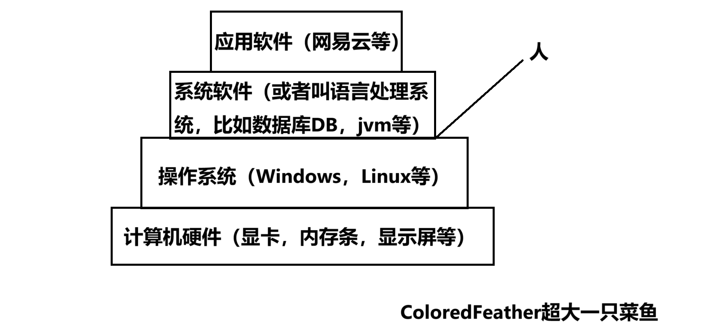
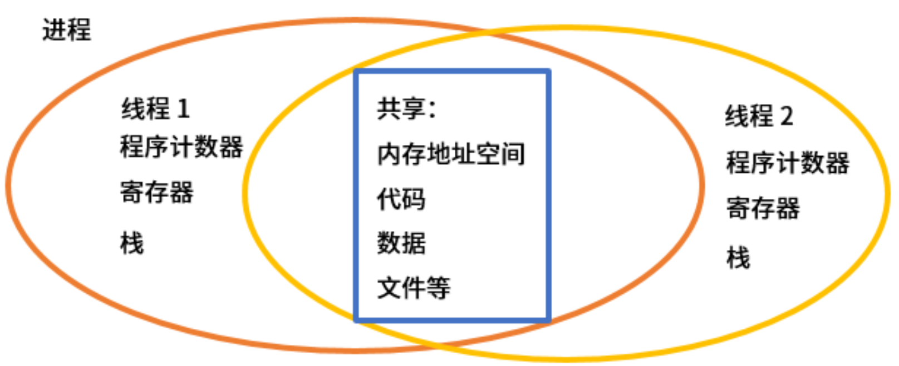
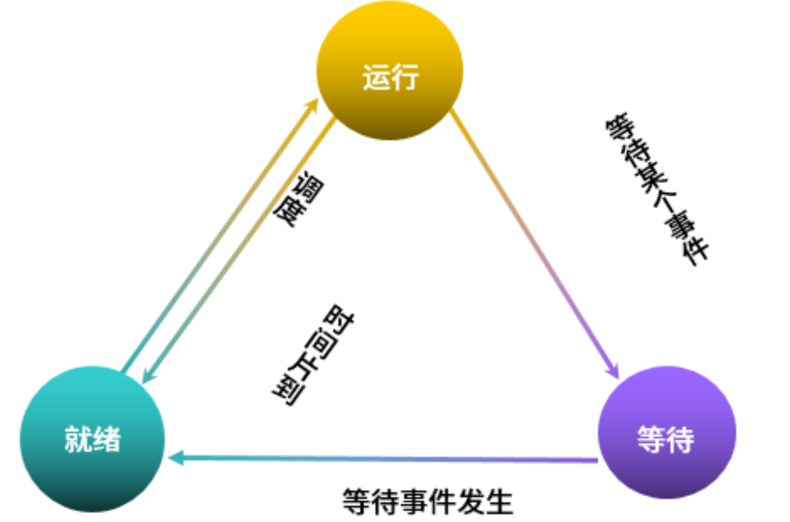
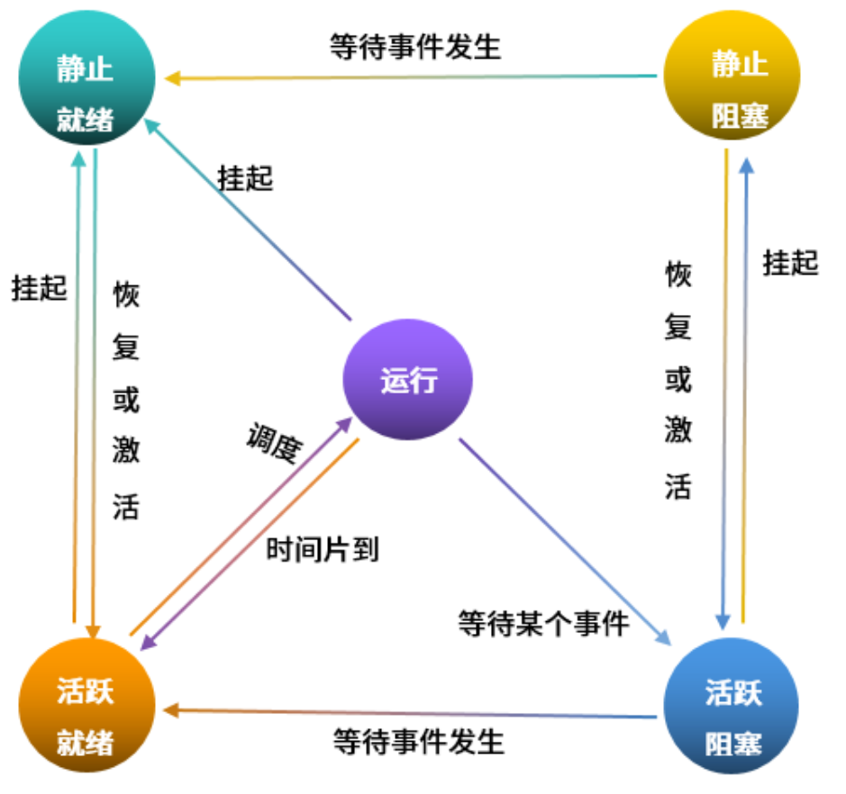

# 【软考】操作系统

## 一.操作系统概述

### 1.软件分层

**(图要留个印象别，四层分别是什么)**

**软件分层**是将复杂的软件系统分解为多个抽象层次，每个层次负责特定的功能，从而降低系统复杂度、提高可维护性、增强可重用性的一种设计方法。

#### 1.1各层作用

**(这里看看就好不用记那么多)**

1. **硬件层**
   - **作用：** 提供计算机系统最基本的计算、存储和输入输出能力。
   - **组成：** CPU、内存、硬盘、网卡等物理设备。
   - **功能：** 执行指令、存储数据、与外部设备交互。
2. **操作系统层**
   - **作用：** 管理计算机硬件资源，提供统一的接口给上层软件，并协调各个软件组件的运行。
   - **功能：** 进程管理、内存管理、文件系统管理、设备驱动程序、用户界面等。
   - **示例：** Windows、Linux、macOS。
3. **语言处理系统**
   - **作用：** 将高级编程语言编写的源代码翻译成机器可以执行的机器码。
   - **功能：** 词法分析、语法分析、语义分析、代码优化、目标代码生成。
   - **示例：** 编译器（C、C++）、解释器（Python、JavaScript）。
4. **应用软件层**
   - **作用：** 直接面向用户，提供各种各样的功能，满足用户需求。
   - **功能：** 文字处理、表格计算、图像处理、网络通信、游戏等。
   - **示例：** Word、Excel、Photoshop、浏览器、游戏。

#### 1.2各层之间的关系

- **硬件层**是基础，为上层软件提供硬件资源。
- **操作系统层**作为硬件和上层软件的桥梁，管理硬件资源，并为上层软件提供服务。
- **语言处理系统**将高级语言翻译成机器码，使程序能够在计算机上运行。
- **应用软件层**直接面向用户，利用操作系统提供的服务和语言处理系统的支持，实现各种各样的功能。

### 2.**操作系统的主要功能**

**(这里看看就好不用记那么多)**

#### 2.1 **处理器管理**

- **进程管理:** 创建、撤销进程，分配处理机时间，实现进程间的同步与通信。
- **中断处理:** 处理各种中断，如硬件中断、软件中断等，保证系统正常运行。

#### 2.2**内存管理**

- **内存分配:** 将主存空间分配给各个进程，并进行动态管理。
- **页面/分段管理:** 将内存分成大小相等的页面或分段，实现虚拟内存。
- **内存保护:** 防止进程非法访问其他进程的内存空间。

#### 2.3 **文件管理**

- **文件存储:** 将文件存储在磁盘上，并进行组织管理。
- **文件读写:** 提供文件读写操作的接口。
- **目录管理:** 管理文件目录结构。
- **文件系统:** 实现文件系统，提供文件访问的统一接口。

#### 2.4 **设备管理**

- **设备驱动程序:** 提供设备驱动程序，管理各种硬件设备。
- **I/O调度:** 对I/O请求进行调度，提高I/O效率。
- **缓冲区管理:** 提供缓冲区，提高I/O速度。

#### 2.5 **用户接口**

- **命令行接口 (CLI):** 提供命令行方式与系统交互。
- **图形用户界面 (GUI):** 提供图形化界面，方便用户操作。

#### 2.6 **系统调用**

- **提供系统调用接口:** 应用程序通过系统调用请求操作系统提供的服务。

#### 2.7 **其他功能**

- **网络功能:** 提供网络通信功能，实现计算机之间的数据交换。
- **安全功能:** 提供用户认证、访问控制、数据加密等安全机制。

### 3.嵌入式操作系统的特点

**(这里简单记一下有什么性质)**

嵌入式操作系统**具有微型化、实时性、可靠性、可定制和易移植性等特点**，使其能够在资源有限的硬件平台上高效运行，并满足不同应用对响应速度、稳定性、灵活性和兼容性的需求。

**微型化**是指操作系统占用资源少，内核精简，适合运行在内存和处理器资源有限的嵌入式设备上。

**实时性**是指操作系统能够在严格的时间限制内响应外部事件，保证系统及时响应。

**可靠性**是指操作系统能够在恶劣的环境下稳定运行，具有较高的容错能力。

**可定制性**是指操作系统可以根据不同的应用需求进行裁剪和配置，以适应各种硬件平台和软件需求。

**易移植性**是指操作系统可以方便地移植到不同的硬件平台上，减少开发成本和时间。（为了提高系统的易移植性，通常采用硬件抽象层(Hardware Abstraction Level，HAL)和板级支持包(Board Support Package，BSP)的底层设计技术。）

### 4.特殊的操作系统

**一些特殊的操作系统概述，这个考试一般不考，考的话也是考可用性，可定制性，易移植性这一类的，想了解的可以看一下。**

|    操作系统类型     |                         主要特征                         |                      主要特点                      |                      应用场景                      |          细分分类           |              更多特点              |
| :-----------------: | :------------------------------------------------------: | :------------------------------------------------: | :------------------------------------------------: | :-------------------------: | :--------------------------------: |
|   批处理操作系统    |               用户事先将一批作业提交给系统               |        系统按顺序自动执行作业，无需用户干预        | 大型机上处理大量数据计算任务，如科学计算、工程仿真 |           无交互            | 高效利用系统资源，适合批量处理任务 |
|    分时操作系统     | 多个用户同时连接到系统，系统将CPU时间分片分配给各个用户  | 交互性强，响应速度快，多个用户可以同时使用系统资源 |        多用户终端环境，如大型机上的分时系统        |       时间片轮转调度        |    支持多任务并发，提供虚拟终端    |
| 实时操作系统 (RTOS) |      对任务的响应时间有严格要求，能及时响应外部事件      |            高可靠性，高实时性，确定性强            | 工业控制、航空航天、机器人控制等实时性要求高的领域 |       硬实时、软实时        |    任务优先级调度，中断处理机制    |
|    网络操作系统     | 提供网络服务，管理网络资源，支持多个计算机之间的数据通信 |     网络透明性，分布式文件系统，远程登录等功能     |          局域网、广域网、互联网等网络环境          |       客户/服务器架构       |  提供网络协议栈，支持各种网络服务  |
|    微机操作系统     |        专为微型计算机设计，用户界面友好，易于操作        |        资源占用少，运行效率高，适合个人用户        |               个人电脑、笔记本电脑等               |     图形用户界面 (GUI)      |    提供丰富的应用程序接口 (API)    |
|   嵌入式操作系统    |   面向嵌入式系统，资源有限，对系统实时性、可靠性要求高   |          代码紧凑，占用资源少，可裁剪性强          |      智能家电、移动设备、汽车电子等嵌入式设备      | RTOS、基于Linux的嵌入式系统 |      低功耗、高可靠性、安全性      |
|   分布式操作系统    |         将多个计算机连接起来，形成一个统一的系统         |           高度可扩展性、容错性强、透明性           |             大型计算机集群、云计算平台             | 共享文件系统、分布式数据库  |          支持异构硬件平台          |
|    并行操作系统     |              支持多个处理器同时执行多个任务              |             高性能、适合大规模计算任务             |                高性能计算、科学模拟                |        并行编程模型         |     利用多核处理器提高计算效率     |
|     云操作系统      |         提供虚拟化技术，将物理资源抽象成虚拟资源         |              弹性扩展、自服务、多租户              |                   云计算服务平台                   |      IaaS、PaaS、SaaS       |          支持虚拟机、容器          |
|   物联网操作系统    |     面向物联网设备，具有低功耗、实时性、安全性等特点     |         连接性强、数据处理能力强、资源受限         |                智能家居、工业物联网                |         轻量级内核          |          支持多种通信协议          |
|    主机操作系统     |     运行在大型计算机上，提供强大的计算能力和存储能力     |            高性能、稳定性高、支持多用户            |              大型企业级应用、科学计算              |        批处理、分时         |      支持大型数据库、事务处理      |

**批处理操作系统**：强调了无交互的特性，以及高效利用系统资源的优势。

**分时操作系统**：补充了时间片轮转调度和虚拟终端的概念。

**实时操作系统**：区分了硬实时和软实时，并强调了任务优先级调度和中断处理机制。

**网络操作系统**：明确了客户/服务器架构，以及提供网络协议栈和各种网络服务的能力。

**微机操作系统**：强调了图形用户界面和丰富的应用程序接口。

**嵌入式操作系统**：除了低功耗、高可靠性外，还强调了安全性。

**分布式操作系统**：补充了共享文件系统和分布式数据库的概念，以及支持异构硬件平台的能力。

**并行操作系统**：强调了并行编程模型和利用多核处理器提高计算效率。

**云操作系统**：明确了IaaS、PaaS、SaaS的概念，以及支持虚拟机和容器的能力。

**物联网操作系统**：强调了轻量级内核和支持多种通信协议。

**主机操作系统**：补充了批处理和分时两种模式，以及支持大型数据库和事务处理的能力。

## **总结**

**知道操作软件分层的顺序，从硬件层到操作系统，再到系统软件和应用系统，每一层是干什么的知道个大概。知道操作系统的重主要作用如管理系统的硬件、软件、数据资源，控制程序运行，人机之间的接口，应用软件与硬件之间的接口。以及知道嵌入式操作系统的特点知道有这些功能就好**，不用记得那么仔细，减少记忆负担。

## 二.进程管理

(这个东西要理解一下，知道程序，进程，线程的概念以及之间的关系，以及进程的状态图)

### 1.进程和线程的概念

**首先，程序是一个静止的概念，进程是动态的，有什么周期的。比如当我们运行程序时，就会产生相对应的进程，而当程序运行完时，我们的进程的生命周期也就到头了，进程也会结束，这是程序和进程之间的概念。 进程在抢夺CPU资源的时候会派生出许多的小弟，也就是线程来帮忙抢CPU，你也可以理解为进程是父亲，线程是儿子，进程的东西可以被线程共享，而线程的东西不能被其他线程共享。**

#### 1.1进程（Process）

- **概念：** 进程是操作系统分配资源的基本单位，是一个正在执行的程序的实例。每个进程都有自己独立的内存空间、打开的文件、设备等资源。
- 举例：
  - **打开多个文档：** 在Windows上同时打开多个Word文档，每个文档就是一个独立的进程。
  - **运行多个程序：** 同时运行浏览器、音乐播放器和聊天软件，每个程序都是一个进程。
- 特点：
  - **资源开销大：** 每个进程都需要独立的内存空间，创建和销毁进程的开销较大。
  - **相对独立：** 进程之间相互独立，一个进程崩溃不会影响其他进程。

#### 1.2线程（Thread）

- **概念：** 线程是进程的一个执行单元，是CPU调度和分派的基本单位。一个进程可以包含多个线程，这些线程共享进程的资源。
- 举例：
  - **网页浏览器：** 在一个浏览器窗口中，下载网页、渲染页面、处理用户输入等任务可以由不同的线程来完成。
  - **文字处理软件：** 在Word中，拼写检查、语法检查、自动保存等功能可以由不同的线程来实现。
- 特点：
  - **资源开销小：** 线程共享进程的资源，创建和销毁线程的开销较小。
  - **并发执行：** 一个进程中的多个线程可以并发执行，提高程序的并发性。

| 特点     | 进程         | 线程             |
| -------- | ------------ | ---------------- |
| 定义     | 执行中的程序 | 进程内的执行单元 |
| 资源     | 独立的资源   | 共享进程的资源   |
| 创建开销 | 大           | 小               |
| 并发性   | 相对独立     | 并发执行         |

### **2.进程三状态图**

举个例子比如有一个简单的操作系统，正在运行四个进程A、B、C、D。它们可能执行不同的任务，比如A负责计算，B负责I/O操作，C负责打印，D负责网络通信。

**状态转换示例：**

**初始状态：**进程A、B、C、D都处于就绪态，等待被操作系统调度。

**进程A开始运行：**A从就绪态进入运行态。

**进程A需要进行I/O操作：**A从运行态进入阻塞态，等待I/O操作完成。

**进程B获得CPU：**B从就绪态进入运行态。

**进程A的I/O操作完成：**A从阻塞态进入就绪态，等待再次被调度。

**进程C、D依次获得CPU并执行：**C、D从就绪态进入运行态，然后可能再次进入阻塞态或就绪态。

再说白一点就是运行状态根据你的CPU来决定同时能运行多少个进程，准备好的进程就缺CPU运行的就在就绪状态等着，等别的进程运行完了再上去运行，如果是在运行时缺东西，那就会被请到等待区等着，等你要的东西到了再到就绪状态等CPU。**这东西就好比医院挂号一样，你可以把运行状态当做医生问诊，就绪状态当做准备好了排队挂号，等待状态就是你号都没挂，一般轮到你的号你就去医生那问诊，就从就绪状态变成运行状态，你没挂号的去挂号就是从等待变成就续，你在就诊诊断一般你需要去拍片的就去拍片，就是从运行到等待，拍完了就去就绪那里等（这只是举个例子，与现实生活有些许出入）这只是简单例子，详细内容看下面解释。**

**运行态 (Running)：** 进程正在占用CPU，执行指令。

**就绪态 (Ready)：** 进程已经准备好运行，但由于CPU被其他进程占用，暂时无法运行。

**阻塞态 (Blocked)：** 进程正在等待某个事件发生（例如I/O操作完成、资源可用），无法运行。

| 状态   | 描述                                                         | 进入该状态的原因                                             | 离开该状态的原因                                    |
| ------ | ------------------------------------------------------------ | ------------------------------------------------------------ | --------------------------------------------------- |
| 运行态 | 进程正在占用CPU，执行指令                                    | 从就绪态转来，获得CPU                                        | 时间片用完、被更高优先级进程抢占、等待I/O或其他事件 |
| 就绪态 | 进程已经准备好运行，等待CPU分配                              | 从创建态转来、从阻塞态转来、从运行态转来（时间片用完或被抢占） | 获得CPU进入运行态                                   |
| 阻塞态 | 进程正在等待某个事件发生（如I/O操作完成、资源可用），无法运行 | 从运行态转来，等待I/O或其他事件                              | 等待的事件发生，进入就绪态                          |

##### 2.1状态转换图

- **运行态 -> 就绪态：**
  - 时间片到期：当进程的时间片用完，操作系统会将其移出CPU，让其他进程有机会运行。
  - 被更高优先级的进程抢占：如果有更高优先级的进程进入就绪态，当前运行的进程可能会被暂停，进入就绪态。
- **就绪态 -> 运行态：**
  - CPU空闲：当CPU空闲时，操作系统会从就绪队列中选择一个进程分配CPU，使其进入运行态。
- **运行态 -> 阻塞态：**
  - 进程等待I/O操作：当进程需要进行I/O操作（如读取文件、网络通信）时，会进入阻塞态，等待I/O操作完成。
  - 进程等待其他事件：当进程等待其他事件发生（如信号、锁）时，也会进入阻塞态。
- **阻塞态 -> 就绪态：**
  - 等待的事件发生：当进程等待的事件发生后，进程会从阻塞态转为就绪态，等待被调度。

##### 2.2为什么要引入三态模型？

- **简化进程管理：** 通过将进程的状态抽象为这三种，简化了操作系统的进程管理。
- **方便理解进程生命周期：** 状态图直观地展示了进程在生命周期中可能经历的各种状态以及状态之间的转换。
- **为进程调度提供理论基础：** 不同的进程调度算法会根据进程的状态进行不同的调度决策。

##### 2.3三态模型的局限性

- **过于简单：** 实际的进程状态可能比三态模型描述的更为复杂。
- **没有考虑其他状态：** 比如，有些系统会引入创建态、终止态等状态。

### 3.进程五状态图

**比三状态图多了两个状态，一个静止就绪，一个禁止阻塞，阻塞就是等待。活跃和静止的区别其实就是急不急的问题（进程的优先级高低，优先级越高越容易拿到CPU），急而且准备好就去挂活跃就绪，急但是没准备好就挂活跃阻塞，不急准备好就挂静止就绪，不急也没准备好就挂静止阻塞。而且有几个比较特殊的点，可以结合下面的图来理解，如果你一个进程不是很急的进程A在运行，突然来了一个很急的进程B准备好了要来抢CPU，那你这个进程A有很大概率会被挂到静止就绪去（除非CPU的位置够两个进程同时运行）。只有活跃就绪能抢占CPU资源，其他的自己看图理解吧。**

#### 3.1**状态转换说明**

- **创建态 -> 就绪态：** 进程创建完成，进入就绪队列等待调度。
- **就绪态 -> 运行态：** 进程获得CPU，开始执行。
- **运行态 -> 就绪态：** 进程的时间片用完或被更高优先级的进程抢占。
- **运行态 -> 阻塞态：** 进程等待某个事件（如I/O操作完成、信号量可用）。
- **阻塞态 -> 就绪态：** 进程等待的事件发生。
- **运行态 -> 终止态：** 进程执行完毕或发生异常。

#### 3.2状态转换示例

- **一个程序刚启动时：** 从创建态进入就绪态，等待操作系统调度。
- **一个进程正在执行I/O操作：** 从运行态进入阻塞态，等待I/O操作完成。
- **一个进程的时间片用完：** 从运行态进入就绪态，等待下一次调度。
- **一个进程执行完毕：** 从运行态进入终止态。

#### 3.3五状态模型的优点

- **更详细：** 比三态模型更全面地描述了进程的生命周期。

- **更准确：** 可以更准确地反映进程的各种状态。

- **更实用：** 在实际操作系统中，五态模型更符合进程的运行情况

  

**做个题**

在**单处理机系统中**，采用先来先服务调度算法。系统中有4个进程P1、P2、P3、P4(假设进程按此顺序到达)，其中P1为运行状
态，P2为就绪状态，P3和P4为等待状态，且P3等待打印机，P4等待扫描仪,。若P1（1）则P1、P2、P3和P4的状态应分别为(2)。

**第一题：**

**A、时间片到**               B、释放了扫描仪
C、释放了打印机       D、已完成

**第二题：**

A等待、就绪、等待和等待    B、运行、就绪、运行和等待
**C就绪、运行、等待和等待**    D、就绪、就绪、等待和运行

**解析：首先光第一个空选什么都看不出来结果，所以从第二个空开始看，因为这是个单处理机，所以肯定只有一个运行，所以B排除，因为CPU不会闲着，所以也不可能没有运行状态，所以A也是错的，所以只剩下C，D，P4一开始是等待状态，在等待状态下是不能直接跳到就绪状态的，所以D错误，第二题选C，结合答案就绪、运行、等待和等待可以知道P1应该是做一半就被踹下来了，所以选A。**

### 4.信号量与PV操作

​	
