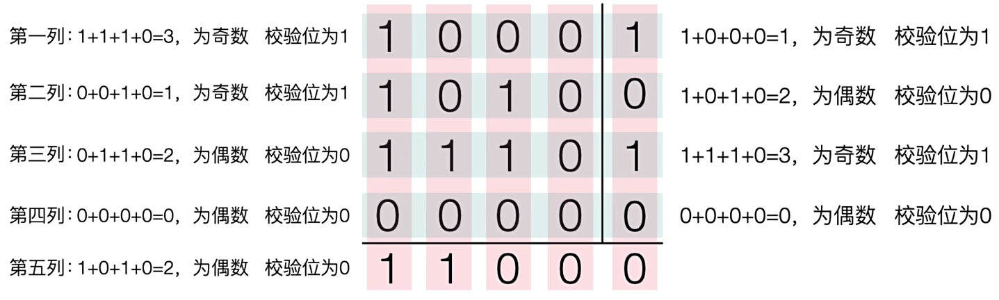
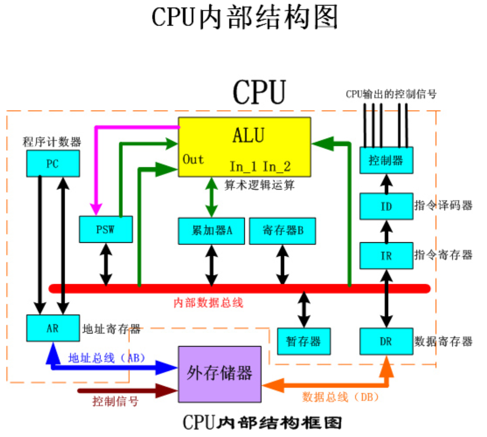
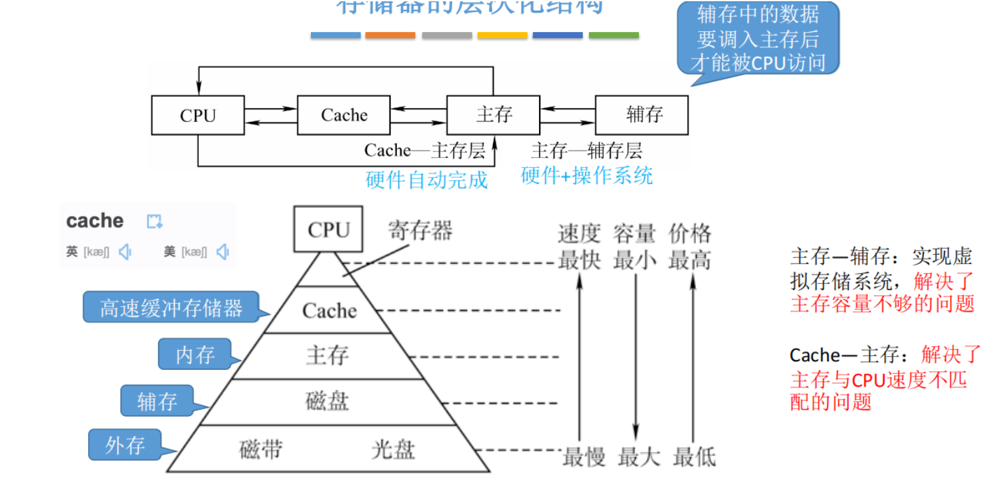

# 【软考】计算机组成体系与构成

## 一.数据的表示

（补充：1B=8bit，210B=1KB(准确来说应该是1024kB=1M)）

### 1.进制转换

**(要知道进制之间的转换，给你一个不同进制的数你要会换算)**

|   进制   |   数码   | 基数 |      位权      |
| :------: | :------: | :--: | :------------: |
|  十进制  |   0~9    |  10  | 10k |
|  二进制  |   0，1   |  2   | 2k  |
|  八进制  |   0~7    |  8   | 8k  |
| 十六进制 | 0~9，A-F |  16  | 16k |

#### 1.1加权法/按权展开法

**简单来说就是：n进制   ————> 十进制，什么进制数转成十进制就用它的位权来算**

举个例子比如:

**二进制**转成**十进制**：111=1×20+2×21+3×22  ，10100.01=1×24+1×22+1×2-2

**八进制**转成**十进制**: 2063=2×83+6×81+3×80  

**十六进制**转成**十进制**: 2029A=2×164 +2×162 +9×161 +10×160  

#### 1.2短除法/除基数取余法

**简单来说就是：一个十进制的数去转成n进制的数，比如二进制，十六进制等**

举个例子比如**十进制**的**94**转换成**二进制**：

| 除数(二进制数) | 被除数(十进制数) | 余数 |
| :------------: | :--------------: | :--: |
|       2        |        94        |  0   |
|       2        |        47        |  1   |
|       2        |        23        |  1   |
|       2        |        11        |  1   |
|       2        |        5         |  1   |
|       2        |        2         |  0   |
|       2        |        1         |  1   |
|                |        0         |      |

**得到结果是(余数从下到上看):1011110**

#### 1.3凑维权法

**简单来说就是：画个图来直观表示，费时间但不容易错**

举个例子，比如把**十进制**的**7**和**86**转成**二进制数**，可以画个表然后慢慢配，但是我感觉这个比较麻烦，虽然很直观，但是不是很建议，费时间感觉，当然可以用于任意进制转换，画个图就可以了。

|       位号        |  8   |  7   |  6   |  5   |  4   |  3   |  2   |  1   |
| :---------------: | :--: | :--: | :--: | :--: | :--: | :--: | :--: | :--: |
|         K         |  7   |  6   |  5   |  4   |  3   |  2   |  1   |  0   |
| 权值2k | 128  |  64  |  31  |  16  |  8   |  4   |  2   |  1   |
|         7         |  0   |  0   |  0   |  0   |  0   |  1   |  1   |  1   |
|        86         |  0   |  1   |  0   |  1   |  0   |  1   |  1   |  0   |

#### 1.4分组法/逆分组法

**简单来说就是：对一些有规律的进制数，比如二进制与八进制(23)，十六进制(24)可以拆成三分法和四分法，这样装换起来比较简单一些。**

举个例子：

**二进制**和**八进制**(三分法)：把一个八进制数拆成3个二进制数

| 进制数 |     数值      |
| :----: | :-----------: |
| 二进制 | 10   001  110 |
| 八进制 | 2     1     6 |

**二进制**和**十六进制**(四分法)：把一个十六进制数拆成4个二进制数

|  进制数  |     数值      |
| :------: | :-----------: |
|  二进制  | 1000     1110 |
| 十六进制 | 8           E |

#### 1.5(补充)计算机的基本单位

|    单位    |    符号    |             备注              |
| :--------: | :--------: | :---------------------------: |
| 位（比特） | bit （b）  |     计算机最小的存储单位      |
|    字节    | byte （B） | 数据表示的最小单位：1B = 8bit |
|   千字节   |     KB     |          1KB = 1024B          |
|   兆字节   |     MB     |         1MB = 1024KB          |
|   吉字节   |     GB     |         1GB = 1024 MB         |
|   太字节   |     TB     |         1TB = 1024GB          |

### 2.码制(原码/反码/补码/移码)

**(知道各种码之间的转换，这个东西要理解别死记硬背，学会自己推算各种码定点整数和定点小数的范围以及数码个数)**

#### 2.1原码/反码/补码/**移码**的概念

**原码:符号位+数值位绝对值。**(**补充:正数的符号位是0，负数的符号位是1**)

**反码:正数的反码是原码本身，负数的反码是符号位不变，数值位按位取反。**

**补码:正数的补码是原码本身，负数的补码是符号位不变，数值位在反码基础上加1。**

**移码:正数和负数的移码都是在补码基础上符号位取反。**

简单举个例子：

|          |        **1**         |     **-1**     |    **1-1**     |
| :------: | :------------------: | :------------: | :------------: |
| **原码** |    **0000  0001**    | **1000 0001**  | **0000  0000** |
| **反码** | **0000  0001(同上)** | **1111  1110** | **1111  1111** |
| **补码** | **0000  0001(同上)** | **1111  1111** | **0000  0000** |
| **移码** |    **1000  0001**    | **0111  1111** | **1000  0000** |

在计算各种码的时候记得看清楚，对于**正数**来说，从**原码到补码都是一样的不变**，**移码变一下符号位**就好了，对**负数来说就要注意的就很多了，更多的要学会反推。**

#### 2.2定点整数

 **n位二进制能够表示的数值范围和数码**

|   码制   |                 定点整数范围                  |      数码个数       |
| :------: | :-------------------------------------------: | :-----------------: |
| **原码** | **-(2n-1-1)~+(2n-1-1)** | **2n-1** |
| **反码** | **-(2n-1-1)~+(2n-1-1)** | **2n-1** |
| **补码** |   **-2n-1~+(2n-1-1)**   |  **2n**  |
| **移码** |   **-2n-1~+(2n-1-1)**   |  **2n**  |

定点整数的范围和数码个数要大概记一下和推断就好了，举个例子，**当n=4时，也就是有四个数，其中有第一位是符号位，后三个是数值位**，那么对于这个数的**原码，反码**可以取到**1111到0111**，**但是取不到1000这个值**(零的话是0000还是可以取到的)，**所以原码和反码就少了一个**，**所以原码和反码的个数是2n-1，范围在-(2n-1-1)~+(2n-1-1)内**，实在不行把n代入从-7到7自己理解一下，而**补码和移码是可以取到1000的**，比如其中一个数的**补码**是**0000**，那么它的**移码**就**1000**，其中**-8为1000是认为规定的**，所以相比起原码和反码，**补码和反码在数码个数上会多一个，达到2n个**。

**补充：补码和移码中，正负0编码相同。**

#### 2.3.定点小数

**n位二进制能够表示的数值范围和数码**

|   码制   |                      定点小数                       |      数码个数       |
| :------: | :-------------------------------------------------: | :-----------------: |
| **原码** | **-(1-2-(n-1))~+(1-2-(n-1))** | **2n-1** |
| **反码** | **-(1-2-(n-1))~+(1-2-(n-1))** | **2n-1** |
| **补码** |           **-1~+(1-2-(n-1))**            |  **2n**  |
| **移码** |           **-1~+(1-2-(n-1))**            |  **2n**  |

**小数点后的和定点整数的推算差不多，可以参考定点整数的推算。**举个例子，比如说	

### 3浮点数的表示

**(知道阶数（指数）越大，浮点数能表示的范围就越大，尾数越大，浮点数能表示的精度就越高，清楚什么决定范围，什么决定精度。以及知道浮点数之间如何对比大小。)**

#### 3.1浮点数的表述以及运算过程

**浮点数的表示： N=尾数*基数指数**

**运算过程：对阶>尾数计算>结果格式化**

#### **3.2特点**

1、一般尾数用补码，阶码用移码
2、**阶码**的位数决定数的表示范围，位数越多范围越大
3、**尾数**的位数决定数的有效精度，位数越多精度越高
4、对阶时，**小数向大数看齐**
5、对阶是通过较小数的**尾数右移**实现的(相当于小数点左移)

### 4.算术与逻辑运算

**（知道各种运算符的表示和运算，以及短路原则的使用）**

逻辑变量之间的运算称为逻辑运算。二进制数1和0在逻辑上可以代表"真"与"假"。

#### 4.1逻辑运算

1. ##### **逻辑与（AND）**：

   - 符号：`∧` 或 `&`
   - 描述：当两个逻辑值全为1时结果为真（1），否则为假（0）。
   - 示例：`A ∧ B` 或 `A & B`

2. ##### **逻辑或（OR）**：

   - 符号：`∨` 或 `|`
   - 描述：当两个逻辑值全为0时结果为假（0），否则为真（1）。
   - 示例：`A ∨ B` 或 `A | B`

3. ##### **逻辑非（NOT）**：

   - 符号：`¬` 或 `!`
   - 描述：将原逻辑值取反，即原来为1则变成0，原来为0则变成1。
   - 示例：`¬A` 或 `!A`

4. ##### **逻辑异或（XOR）**：

   - 符号：`⊕`
   - 描述：当两个逻辑值不同时结果为1，相同时结果为0。
   - 示例：`A ⊕ B`

|   A   |   B   |  A*B  |  A+B  |  !A   |  A⊕B  |
| :---: | :---: | :---: | :---: | :---: | :---: |
| **0** | **0** | **0** | **0** | **1** | **0** |
| **0** | **1** | **0** | **1** | **1** | **1** |
| **1** | **0** | **0** | **1** | **0** | **1** |
| **1** | **1** | **1** | **1** | **0** | **0** |

**逻辑与**：连接的两个逻辑值**全为1**时才为真。

**逻辑或**：连接的两个逻辑值**全为0**时才为真。

**逻辑非**：将**原逻辑值取反**即可。

**逻辑异或**：连接的两个逻辑值**不同时才取1**，相同时取0。

#### 4.2短路原则

**在逻辑表达式中不是全部都要看的**，举个例子：

**(1).a&&b&&c:只有a，b，c全为1时整个式子才为真，也就是说如果a一开始就是0，那么后面b和c也不用看了，毕竟无论后面取什么都不会影响整个式子为假的结果。**

**(2).a||b||c：这个例子也和上面那个大同小异，只要有一个是真，那么整个式子就是真，反之亦然。**

## 二.校验码

**（知道三种校验码的特点，以及能够处理的范围，了解其原理）**

### 1.奇偶校验码

#### 1.1码距

  任何一种**编码**都由许多**码字**构成，任意两个码字之间**最少变化的二进制位数**就称为数据校验码的码距。

举个例子，用**2位的二进制**就能表示四种状态，分别是00，01，10，11，此时码距是1，因为我们要找**最少变化的二进制位数**，**从00到01的变化是1，即码距就是1**。

再比如有2种状态，比如【00，11】此时**两个数位都发生了变化，码距就是2。**

#### 1.2奇偶校验码

奇偶校验码的编码方式：由若干位有效信息（如一个字节），再加上一个二进制（校验位）组成校验码。

**特点：**

**只能检错，不能纠错，码距 = 2。**

**只能检测出奇数个数据位出错，不能检测偶数个数据位出错**

#### 1.3奇偶校验拓展

##### 1.3.1奇偶校验码原理

奇偶校验码是一种简单的错误检测码，主要用于检测数据在传输过程中是否出现了错误。其基本原理是在数据位中添加一个额外的校验位，使得整个字（包括数据位和校验位）中1的个数成为奇数（奇校验）或偶数（偶校验）。

**原理**

1. **奇校验**：在数据位中添加一个校验位，使得整个字中1的个数为奇数。如果接收到的数据中1的个数不是奇数，则认为数据在传输过程中出现了错误。
2. **偶校验**：与奇校验类似，但整个字中1的个数应为偶数。

**纠错能力**

- 奇偶校验码只能检测错误，但不能纠正错误。它通过检测数据中1的个数是否与校验位设定的奇偶性一致来判断数据是否出错。
- 如果检测到错误，通常需要重新传输数据。

**举例**

假设有一个7位的数据`1010101`，采用奇校验。

1. 计算数据位中1的个数：4个（偶数）。
2. 添加校验位：因为是偶数，所以校验位为`1`。
3. 发送数据：`10101011`。

在接收端，再次计算1的个数。如果接收到的数据是`10101011`，则1的个数为4（偶数），与奇校验不符，因此可以判断数据在传输过程中出现了错误。

需要注意的是，奇偶校验码不能检测出所有类型的错误，例如，如果数据中同时有偶数个的错误发生，那么这种错误是无法检测到的。

奇校验和偶校验根据**数据位**的信息给出**奇/偶校验位**的数据计算出值，并在信息发送后回根据不同的校验方式来判断信息传输是否存在问题。**虽然实现简单，占用空间小，但是也存在一些缺陷，奇偶校验只能判断出因奇数个错误导致的问题，而无法半段因为偶数个错误导致的问题。**

##### 1.3.2**水平奇偶校验码、垂直奇偶校验码、双向校验码。**

水平奇偶校验码+垂直奇偶校验码的方式可以判断出具体出现误差的数值位，但是如果在**同一行或者同一列同时出现两个错误的情况也是判断不出来的**。

 **水平奇偶校验码**

- **原理：** 将数据按字节或字组织成矩阵形式，在每行末尾添加一个校验位，使得该行中1的个数为奇数或偶数（根据约定）。
- 特点：
  - 检测单比特错误能力强，但不能检测出偶数个错误。
  - 实现简单。
- **示例：** 假设有一组数据：1011 0101 1100 若采用奇校验（即每行1的个数为奇数），则添加校验位后为

1011 1   

0101 1 

1100 0

**垂直奇偶校验码**

- **原理：** 在水平奇偶校验的基础上，再增加一列校验位，使得每一列中1的个数为奇数或偶数。

- 特点：

  - 可以检测出大多数的单比特错误和一些多比特错误。
  - 相较于水平校验，检错能力更强。

- **示例：** 继续上面的例子，添加垂直校验位后为：

  1011 1 0 

  0101 1 1 

  1100 0 1

**双向校验码**

- **原理：** 将水平奇偶校验和垂直奇偶校验结合起来，既有水平方向的校验位，又有垂直方向的校验位。
- 特点：
  - 检错能力更强，可以检测出大部分的单比特错误和一些多比特错误。
  - 但不能检测出同时发生在行和列交汇处的错误。

|    校验码    |                    特点                    |          适用场景          |
| :----------: | :----------------------------------------: | :------------------------: |
| 水平奇偶校验 |         简单，成本低，但检错能力弱         | 对数据可靠性要求不高的场合 |
| 垂直奇偶校验 | 检错能力比水平校验强，但不能检测出所有错误 | 对数据可靠性要求较高的场合 |
|  双向校验码  |       检错能力更强，但实现复杂度较高       | 对数据可靠性要求很高的场合 |

### 2.循环校验码CRC

循环冗余校验码（Cyclic Redundancy Check, CRC）是一种用于检测数据传输或存储过程中错误的编码技术。它通过对二进制数据块执行多项式除法来生成校验码。CRC在通信协议中广泛使用，如以太网和存储设备。

##### 2.1原理

1. **多项式表示**：数据和校验码都可以用二进制多项式表示，数据块作为被除数，多项式作为除数。
2. **生成多项式**：通信双方预先商定一个生成多项式（例如：CRC-8、CRC-16、CRC-32等）。
3. 除法过程：
   - 将数据块与生成多项式进行模2除法（异或运算）。
   - 余数即为校验码，附加在数据后面发送。
4. 校验过程：
   - 接收方使用相同的生成多项式对接收到的数据进行相同的除法运算。
   - 若余数为0，则数据无误；若余数不为0，表示数据有错误。

##### 2.2简单例子

假设使用CRC-3生成多项式为`x^3 + x + 1`（二进制表示为`1011`），对数据`1101`进行编码：

1. **数据补零**：原始数据后加3个零，变为`1101000`。
2. **模2除法**：使用生成多项式`1011`对`1101000`进行二进制除法，得到余数为`011`。
3. **最终编码数据**：将余数`011`附加到原始数据上，得到最终编码为`1101011`。

接收方对接收到的`1101011`再进行相同的模2除法，若余数为0，则说明数据无误。

##### 2.3应用场景

CRC常用于数据链路层和传输层协议，如以太网、USB、硬盘等，用来快速检测和修复数据传输错误。

### 3.海明校验码

海明校验码（Hamming Code）是一种能够发现并纠正单个位错误的编码技术，用于确保在数据传输或存储时，如果某一位出现了错误，接收方可以检测到并进行纠正。它是一种**错误检测和纠错**码。

##### 3.1原理

1. **数据位和校验位**：海明码通过在数据中添加额外的**校验位**来检测和纠正错误。这些校验位的位置是有规律的，通常放在数据的2的幂次方位置（如第1位、第2位、第4位等）。
2. **校验位的计算**：每个校验位负责检查一定范围内的数据位。如果传输时某个数据位出现错误，通过校验位可以发现错误发生的确切位置。
3. **纠错能力**：海明码能发现**一位错误**并且能够纠正。它还可以检测**两位错误**，但无法纠正两位错误。

##### 3.2编码方式

为了生成海明码，我们要：

1. **确定校验位的数量**：假设你有`k`个数据位，则需要加入`r`个校验位，满足公式：`2^r >= k + r + 1`。
2. **校验位的位置**：在数据中，2的幂次方位（如1、2、4等）留作校验位，其他位置填写原始数据位。
3. **计算校验位的值**：每个校验位负责检查特定数据位的值，通过异或运算来生成。

##### 3.3简单例子

假设我们要传输4位数据`1011`，并使用海明码纠错。编码步骤如下：

1. **校验位的数量**：4位数据需要3个校验位，满足`2^3 >= 4 + 3 + 1`，因此需要3个校验位。
2. **插入校验位**：在原始数据中，留出校验位的位置（第1位、第2位、第4位），形成`_ _ 1 _ 0 1 1`。
3. **计算校验位**：
   - **校验位1**：检查第1、3、5、7位的值，即`_ 1 0 1`，校验位1的值是`1 XOR 0 XOR 1 = 0`，所以第1位为`0`。
   - **校验位2**：检查第2、3、6、7位的值，即`_ 1 1 1`，校验位2的值是`1 XOR 1 XOR 1 = 1`，所以第2位为`1`。
   - **校验位4**：检查第4、5、6、7位的值，即`_ 0 1 1`，校验位4的值是`0 XOR 1 XOR 1 = 0`，所以第4位为`0`。

最终的海明码为：`0110011`。

1. 接收方检查：
   - 当接收方收到编码数据时，计算所有校验位。如果有错误，它会通过校验位发现错误的确切位置并进行纠正。

##### 3.4简单总结

- **海明码**通过在数据中插入校验位，能够发现并纠正1位错误。
- 每个校验位负责检查不同的数据位。
- 它广泛用于需要高可靠性的数据传输中，比如内存、卫星通信等。

#### 总结

知道三种校验码的原理，以及各自的特点就可以了。

**奇偶校验码：只能检查奇数位出错，且不能修改。**

**循环校验码CRC：可查错，不可以纠错，采用模二除法计算校验码。**

**海明校验码：可查错，可纠错，计算校验位2m>=r+m+1。**

## 三.CUP的组成

**（知道运算器和控制器里有什么东西，有什么用）**

### 1.CUP内部结

CPU主要由运算器、控制器、寄存器组和内部总线等部件组成。

### 2.运算器

**①算术逻辑单元ALU:数据的算术运算和逻辑运算。**

**②累加寄存器AC:通用寄存器，为ALU提供一个工作区，用来暂存数据。**

③数据缓冲寄存器DR:写内存时，暂存指令或数据

④状态条件寄存器PSW:存状态标志与控制标志(争议:也有将其归为控制器的)。

### 3.控制器

**①程序计数器PC:存储下一条要执行指令的地址，**

**②指令寄存器IR:存储即将执行的指令,**

③指令译码器ID:对指令中的操作码字段进行分析解释;

④时序部件:提供时序控制信号。

## 总结

知道CPU运算器和控制器中的组件名称以及作用，运算器肯定是和算有关，所以一般和计算沾边，控制器顾名思义就是以控制为主，那大多数时候都和操作程序有关，在控制器里面程序计数器和指令寄存器要分清楚，**计数器主要是用来执行下一条指令的地址，寄存器是用来执行将要执行的指令**。

## 四.存储体系

**(适当记忆有个概念，看到知道这是个什么东西就可以了)**

### 1.层次化存储体系

#### 1.1层次化存储体系的主要层次

1. ##### **寄存器（Registers）**：

   - **位置**：位于CPU内部，由**触发器（flip-flops）**构成，负责临时存储处理器当前指令的数据和操作数。
   - **存取方式**：直接由CPU访问，速度极快，通常在一个CPU时钟周期内完成操作。
   - **容量**：极小，通常为几十到几百字节。
   - **特点**：寄存器紧密集成在处理器内部，**存储量少但速度极快**，用于立即需要的数据。

2. ##### **高速缓存（Cache）**：

   - **位置**：位于**处理器和主存之间**。现代处理器中，**L1和L2缓存**通常是每个处理器核心私有的，而**L3缓存**则常常是所有核心共享的。
   - **类型**：使用SRAM（静态随机存取存储器），比DRAM更快，但容量小、成本高。
   - **存取方式**：依赖于**关联存取（Associative Access）**，通过哈希算法快速找到数据，支持快速存取。
   - **容量**：L1缓存从几十KB到几百KB，L2缓存为几MB，L3缓存则可达到几十MB甚至更多。
   - **特点**：缓存通过局部性原理减少对主存的访问，提升CPU执行效率。L1缓存速度最快，L3缓存容量最大但速度稍慢。

3. ##### **主存（Main Memory）**：

   - **位置**：**位于CPU和外部存储之间**，作为计算机的工作存储器。
   - **类型**：采用DRAM（动态随机存取存储器），需要定期刷新数据。
   - **容量**：现代计算机的主存通常为4GB至几十GB，甚至可达到1TB或更多，特别是在服务器和高性能工作站中。
   - **特点**：主存用于存储当前正在运行的程序和数据，速度较快，但仍不如缓存和寄存器。

4. ##### **辅助存储（Secondary Storage）**：

   - **位置**：**通过I/O总线与CPU相连**，包括硬盘（HDD）、固态硬盘（SSD）等。
   - **类型**：硬盘使用磁性存储技术，固态硬盘采用**NAND闪存**技术，速度更快、功耗更低，但价格相对较高。
   - **容量**：通常为几百GB到数TB。
   - **特点**：非易失性存储，主要用于长期存储大规模数据，存储密度高但访问速度较慢。

5. ##### **外部存储（External Storage）**：

   - **位置**：外部设备如U盘、光盘和磁带等，通常通过USB或网络连接。
   - **类型**：使用EEPROM或NAND闪存等技术。
   - **容量**：从几GB到几十TB。
   - **特点**：主要用于数据备份和传输，访问速度较慢。

#### 1.2存取方式

1. **顺序存取（Sequential Access）**：如磁带存储设备，需要按顺序访问数据，速度慢但适合大规模存储。
2. **随机存取（Random Access）**：如主存和缓存，可以直接访问任意地址的数据，性能更高。
3. **关联存取（Associative Access）**：特别用于缓存，通过关联性查找特定的数据块，提升缓存命中率。

#### 1.3工作方式

##### 1.3.1随机存储器（RAM）

- **工作原理：** RAM 就像一块白板，我们可以随时在上面写字、擦掉，然后重新写。每个存储单元都有一个唯一的地址，我们可以通过地址直接访问并修改存储单元中的数据。RAM 中的数据是易失性的，一旦断电，数据就会丢失。
- 类型：
  - **静态随机存取存储器（SRAM）：** 每个存储单元由多个晶体管组成，具有较高的稳定性，不需要周期性刷新，速度快，但成本较高。
  - **动态随机存取存储器（DRAM）：** 每个存储单元仅由一个晶体管和一个电容组成，结构简单，成本低，但数据易丢失，需要周期性刷新。
- **应用：** RAM 主要用作计算机的工作内存，用于存储正在运行的程序和数据。

##### 1.3.2只读存储器（ROM）

- **工作原理：** ROM 就像一张刻录好的光盘，只能读取数据，不能修改。数据在制造时就被写入，一旦写入就不能更改。
- 类型：
  - **掩膜 ROM（MROM）：** 在制造时就将数据写入芯片，成本低但灵活性差。
  - **可编程 ROM（PROM）：** 一次性可编程，编程后无法再次擦写。
  - **可擦除可编程 ROM（EPROM）：** 可以用紫外线擦除，然后重新编程。
  - **电可擦除可编程 ROM（EEPROM）：** 可以用电信号擦除，编程次数较多。
- **应用：** ROM 主要用于存储固定的程序和数据，例如计算机的 BIOS、嵌入式系统的固件等。

**举例说明**

- **RAM：** 当我们打开一个文档或运行一个程序时，操作系统会将它们加载到 RAM 中，以便 CPU 可以快速访问和执行。
- **ROM：** 计算机的 BIOS 存储在 ROM 中，它负责在计算机启动时初始化硬件，并加载操作系统。

#### 总结

**RAM 和 ROM 是计算机系统中两种最重要的存储器。RAM 提供了快速读写的功能，用于存储正在运行的程序和数据；ROM 则提供了非易失性的存储，用于存储固定的程序和数据。它们在计算机系统中扮演着不同的角色，共同构成了计算机的存储体系。**

**RAM 和 ROM 的区别**

|    特点    |          RAM           |            ROM             |
| :--------: | :--------------------: | :------------------------: |
| **读写行** |      **可读可写**      |          **只读**          |
| **易失性** | **易失，断电数据丢失** | **非易失，断电数据不丢失** |
|  **速度**  |         **快**         |           **慢**           |
|  **成本**  |         **高**         |           **低**           |
|  **应用**  |      **工作内存**      |  **存储固定的程序和数据**  |

#### 1.4补充内容

##### **EEPROM（电可擦除只读存储器）**

- **存储原理**：通过电压写入和擦除数据，适用于小量但频繁的数据更新。
- **应用**：现代BIOS更多使用Flash ROM，EEPROM主要用于存储设备的配置信息，如智能卡或微控制器。

##### 新兴存储技术

- **3D XPoint**：一种填补DRAM和NAND Flash之间性能差距的新型存储技术，Intel的Optane存储器采用了这一技术。
- **特点**：提供接近DRAM的速度，同时具有Flash存储的非易失性特性，适合高性能计算和数据中心应用。

##### **虚拟内存**

- **概念**：虚拟内存是操作系统管理存储的一种方式，允许程序使用比物理内存更大的地址空间。通过将不常用的内存页交换到硬盘，虚拟内存使得系统能够在物理内存不足时仍然运行多个程序。
- **应用**：现代操作系统如Windows、Linux广泛使用虚拟内存机制来管理程序的内存使用。

##### DRAM（动态随机存取存储器）

- 特点：
  - **结构简单：** 每个存储单元由一个晶体管和一个电容组成，成本较低。
  - **容量大：** 相同面积的芯片上可以集成更多的存储单元。
  - **需要刷新：** 电容中的电荷会逐渐泄漏，因此需要周期性地刷新数据，否则数据会丢失。
  - **速度相对较慢：** 由于需要刷新，访问速度比SRAM慢。
- 应用：
  - **主内存：** 计算机的主内存通常采用DRAM，用于存储正在运行的程序和数据。
  - **显存：** 显卡的显存也多采用DRAM，用于存储图像数据。

##### SRAM（静态随机存取存储器）

- 特点：
  - **结构复杂：** 每个存储单元由多个晶体管组成，成本较高。
  - **容量较小：** 相同面积的芯片上集成度不如DRAM高。
  - **不需要刷新：** 数据可以长时间保持稳定，无需周期性刷新。
  - **速度快：** 访问速度比DRAM快得多。
- 应用：
  - **缓存：** CPU的高速缓存通常采用SRAM，用于存储频繁访问的数据，提高CPU的访问速度。
  - **寄存器：** CPU内部的寄存器也采用SRAM，用于临时存储指令和数据。

#### 总结与应用

- **DRAM** 高集成度、低成本，适合大容量存储，如主内存、显存。
- **SRAM** 高速、高可靠性，适合对速度要求高的应用，如CPU缓存、寄存器。

|       特征       |             DRAM             |           SRAM           |
| :--------------: | :--------------------------: | :----------------------: |
|     **结构**     |   **一个晶体管+一个电容**    |      **多个浸提管**      |
|     **成本**     |            **低**            |          **高**          |
|     **容量**     |            **大**            |          **小**          |
|     **速度**     |            **慢**            |          **快**          |
| **是否需要刷新** |           **需要**           |        **不需要**        |
|    **集成度**    |            **高**            |          **低**          |
|     **功耗**     | **相对较低（但是需要刷新）** | **相对较高（静态功耗）** |
|   **主要应用**   |       **主内容，显存**       |     **缓存，寄存器**     |

**集成度**：集成度，是指图形中最小线条宽度，[集成电路](https://baike.baidu.com/item/集成电路/108211?fromModule=lemma_inlink)的集成度是指单块芯片上所容纳的元件数目，集成度越高，所容纳的元件数目越多，为此对传统的光刻方法进行了很多改进以满足分辨率的要求，增加集成电路的集成度。**因为DRAM的存储单元结构非常简单，仅由一个晶体管和一个电容组成。而SRAM的存储单元结构相对复杂，通常需要多个晶体管。因此，在相同的芯片面积内，DRAM可以容纳更多的存储单元。**

**计算机的层次化存储体系通过结合不同的存储设备，以提高整体系统性能。寄存器、缓存、主存、辅助存储和外部存储共同构成了一个高效的存储体系。**记得去记一下组成是什么，主要是什么内容构成，有什么特点就可以了。

### 2.缓存（Cache）

**（三种映射方式的优缺点以及特点）**

#### 2.1**什么是缓存**？

缓存（Cache）是计算机系统中**速度非常快的临时存储器**，它存储了**从主内存中读取**的数据的副本。当**CPU需要访**问数据时，**首先会在缓存中查找，如果找到，则直接从缓存中读取，速度非常快；如果找不到，则从主内存中读取，并将读取的数据复制到缓存中，下次访问时就可以直接从缓存中读取了。**

#### 2.2缓存的作用

- **提高系统性能**：缓存的访问速度远快于主内存，通过缓存可以大大缩短数据访问时间，提高系统的整体性能。
- **减轻主存负担**：频繁访问的数据被缓存在缓存中，减少了对主存的访问次数，从而减轻了主存的负担。

#### 2.3缓存的特性

- **大小**：缓存的大小远小于主内存，**通常只有几兆字节到几十兆字节。**
- **速度**：缓存的访问速度远快于主内存，通常在一个**时钟周期**内就可以完成一次访问。
- **成本**：**缓存的成本远高于主内存**，这是因为缓存采用了更快的**存储介质**。

#### 2.4缓存的映射方式

缓存的映射方式是指将主存地址映射到缓存地址的方式。常见的映射方式有：

- **直接映射**：每个主存块都对应一个固定的缓存块。这种方式**实现简单，但冲突率较高**。
- **全相联映射**：每个主存块可以映射到缓存中的任意一个块。这种**方式冲突率最低，但硬件实现复杂**。
- **组相联映射**：将缓存分成若干组，每组包含多个块。每个主存块只能映射到某一组中的一个块。这种方式是直接映射和全相联映射的**折中，兼顾了性能和成本**。

|  映射方式  |               特点               |                    优点                    |                     缺点                     |
| :--------: | :------------------------------: | :----------------------------------------: | :------------------------------------------: |
|  直接映射  |      主存块与缓存块一一对应      |              实现简单，成本低              |            冲突率高，性能可能较差            |
| 全相连映射 |    主存块可以映射到任意缓存块    |              冲突率低，性能高              |               实现复杂，成本高               |
| 组相连映射 | 主存块映射到特定的组，组内任意块 | 冲突率较低，性能优于直接映射，实现相对简单 | 性能比全相联映射稍差，但成本也低于全相联映射 |

#### 2.5缓存的替换算法

当缓存满了，需要将旧的数据替换出去，以腾出空间给新的数据。常用的替换算法有：

- **LRU（Least Recently Used）**：替换最近最少使用的数据块。
- **FIFO（First In First Out）**：替换最先进入缓存的数据块。
- **LFU（Least Frequently Used）**：替换最少使用的数据块。

#### 2.6缓存的层次结构

现代计算机系统中，通常有多级缓存，包括一级缓存（L1）、二级缓存（L2）和三级缓存（L3）。L1缓存**容量最小，速度最快**，离CPU最近；L2缓存容量比L1大，速度比L1慢；L3缓**存容量最大，速度比L2慢**。

#### 2.7.缓存的命中率

**缓存命中率是指访问的数据在缓存中找到的概率。缓存命中率越高，系统的性能就越好。**

### 总结

缓存是计算机系统中非常重要的组件，它通过存储频繁访问的数据来提高系统的性能。缓存的大小、速度、成本以及映射方式都会影响系统的性能。在设计缓存系统时，需要综合考虑各种因素，以达到最佳的性能。

### 延伸阅读

- **缓存一致性**：当多个处理器共享同一个缓存时，如何保证缓存中数据的一致性是一个重要的研究问题。
- **写回策略和写通过策略**：当缓存中的数据被修改时，如何将修改后的数据写回主内存，有写回策略和写通过策略两种方式。
- **缓存行**：缓存通常以缓存行（cache line）为单位进行数据传输，缓存行的大小会影响缓存的性能。

### 3.主编地址

**（给你一个数据要知道怎么算）**

**主存编址是计算机系统中非常重要的概念，它为每个内存单元分配一个唯一的地址，以便CPU能够准确地访问数据**。

#### 3.1**主存编址的原理**

我们可以将主存想象成一个由许多个存储单元组成的数组。每个存储单元都有一个唯一的编号，这个编号就是它的地址。CPU通过向地址总线发送地址信号，来指定要访问的内存单元。

#### **3.2主存编址的常用单位**

- **字节（Byte）**：这是最常用的内存编址单位，一个字节通常由8个比特组成。
- **字（Word）**：一个字通常由多个字节组成，其长度取决于计算机的字长。

####  3.3内存单元数计算：最大地址+1-最小地址

- **原理：** 这是计算连续地址空间内内存单元数的常用方法。最大地址和最小地址分别代表地址空间的边界，两者之差再加上1就是总的内存单元数。
- **示例：** 如果一个内存的地址范围是0~1023，那么它的内存单元数就是1024。

#### 3.4内存总容量计算

- 按字节编址：
  - **原理：** 每个内存单元就是一个字节，因此总容量等于内存单元数乘以每个字节的位数（8位）。
  - **公式：** 总容量 = 内存单元数 * 8bit
- 按字编址：
  - **原理：** 每个内存单元是一个字，因此总容量等于内存单元数乘以每个字的位数（机器字长）。
  - **公式：** 总容量 = 内存单元数 * 机器字长

#### 3. 5已知芯片单位容量，求所用芯片的片数

- **原理：** 将总容量除以单个芯片的容量，即可得到所需的芯片数量。
- **公式：** 芯片片数 = 总容量 / 单位芯片容量

#### 3.6已知所用芯片的片数，求取芯片单位容量

- **原理：** 将总容量除以芯片片数，即可得到单个芯片的容量。
- **公式：** 单位芯片容量 = 总容量 / 芯片片数

**需要注意的几点：**

- **地址空间连续性：** 通常情况下，内存地址空间是连续的。
- **内存扩展：** 计算机系统可以通过增加内存模块来扩展内存容量。
- **内存寻址方式：** 除了按字节编址和按字编址，还有一些其他的寻址方式，如按位编址。

#### 3.7主存编址其他的一些概念

- **逻辑地址：** 程序员看到的虚拟地址，通过地址转换机制映射到物理地址。
- **物理地址：** 内存芯片上的实际地址。
- **内存分段和分页：** 将内存分成更小的单元，以便更好地管理内存。

### 补充习题

**E1:若某计算机字长为32位，内存容量为2GB，按字编址，则可寻址范围为多少？**

A1:字长为32bit，及为4B，2GB/4B=2048MB/4B=512MB

## 五.I/O数据传输控制方式

**（各种控制方式的区别以及中断向量表的作用）**

**I/O数据传输控制方式是计算机系统中非常重要的一个环节，它决定了CPU与I/O设备之间的数据交换方式。不同的控制方式各有优劣，适用于不同的应用场景。**

### 1.数据传输控制方式详解

#### 1. 1程序控制（查询）方式

- **原理：** **CPU不断地查询I/O设备的状态寄存器**，以确定设备是否准备好进行数据传输。一旦设备准备好，CPU就进行数据传输。
- **特点：** 简单易实现，但CPU利用率低，效率不高。因为**CPU需要不断地查询设备状态，而大部分时间可能是在等待**。
- **适用场景：** 对实时性要求不高的简单I/O设备。

#### 1.2程序中断方式

- **原理：** 当I/O设备准备好进行数据传输时，会向CPU发送一个中断信号，CPU接收到中断信号后，会暂停当前正在执行的程序，转而去执行中断服务程序，完成数据传输。
- **特点：** 比程序控制方式效率高，**CPU可以利用等待I/O操作的时间执行其他任务**。
- **适用场景：** 要求响应速度较快的I/O设备，如键盘、鼠标等。

#### 1.3DMA方式（直接内存访问）

- **原理：** DMA控制器直接控制内存和I/O设备之间的数据传输，**不需要CPU的干预**。CPU只需要向DMA控制器发出命令，告诉它要传输的数据量、源地址和目标地址。DMA控制器就会自动完成数据的传输。
- **特点：** 大大提高了I/O速度，减轻了CPU的负担。
- **适用场景：** 大量数据块的传输，如磁盘I/O。

#### 1.4 通道方式

- **原理：** 通道是一种特殊的处理器，专门负责I/O操作。CPU将I/O操作交给通道处理，通道根据事先编好的程序独立地控制I/O设备。
- **特点：** 进一步提高了I/O处理能力，使CPU能够集中精力执行计算任务。
- **适用场景：** 高性能计算机系统，需要进行大量I/O操作。

#### 1.5 I/O处理机

- **原理：** I/O处理机是一种功能更强大的通道，它具有独立的指令系统和存储器，可以执行复杂的I/O操作。
- **特点：** 能够处理复杂的I/O任务，如数据格式转换、错误处理等。
- **适用场景：** 大型计算机系统，需要处理大量的I/O任务。

| 控制方式  | CUP参与程度 | 是否干预CUP |   CUP是否需要等待    |          优点           |           缺点           |
| :-------: | :---------: | :---------: | :------------------: | :---------------------: | :----------------------: |
| 程序控制  |     高      |     是      |          是          |       简单易实现        |   效率低，CPU利用率低    |
| 程序中断  |     中      |     是      | 是(但可利用等待时间) |    效率比程序控制高     | 中断处理会带来一定的开销 |
|    DMA    |     低      |     否      |          否          |   效率高，CPU利用率高   |    需要额外的硬件电路    |
|   通道    |     低      |     否      |          否          | 效率更高，可处理复杂I/O |      系统复杂度较高      |
| I/O处理机 |    极低     |     否      |          否          | 效率最高，可独立处理I/O |        系统成本高        |

### 2.中断处理在I/O数据传输控制中的作用

中断处理是计算机系统中一种重要的机制，在I/O数据传输控制中扮演着关键的角色。当I/O设备准备好进行数据传输或发生异常情况时，会向CPU发送一个中断信号，请求CPU的处理。

**中断处理的主要作用如下**

- **及时响应I/O请求：** 当I/O设备产生中断时，CPU会立即暂停当前正在执行的程序，转而去执行中断服务程序，从而及时响应I/O请求。
- **提高系统效率：** 通过中断机制，CPU可以并行处理I/O操作和其他任务，提高系统的效率。
- **实现异步I/O：** 中断机制使得CPU和I/O设备可以异步工作，CPU不需要一直等待I/O操作完成。

#### 2.1中断向量表

**中断向量表**是一个包含一系列内存地址的表格，每个地址对应一个中断服务程序的入口地址。当发生中断时，CPU会根据中断类型，从中断向量表中找到对应的中断服务程序的入口地址，并跳转到该地址处执行。

#### 2.2**中断向量表的作用**

- **快速定位中断服务程序：** 中断向量表提供了快速查找中断服务程序入口地址的机制，提高了中断处理的效率。
- **统一管理中断：** 中断向量表将系统中的各种中断统一管理起来，便于系统的扩展和维护。

#### 2.3中断向量表的内容

中断向量表中的每个条目通常包含一个中断类型号和一个中断服务程序的入口地址。中断类型号用于标识中断的来源，中断服务程序的入口地址则指明了CPU在发生该类型中断时应该跳转到的程序地址。

#### **2.4中断处理过程**

1. **中断发生：** I/O设备向CPU发送中断请求。
2. **CPU响应中断：** CPU接收到中断请求后，会暂停当前正在执行的程序，保存当前的程序计数器（PC）和状态寄存器等信息。
3. **读取中断向量：** CPU根据中断类型号从中断向量表中读取对应的中断服务程序的入口地址。
4. **跳转到中断服务程序：** CPU将程序计数器设置为中断服务程序的入口地址，开始执行中断服务程序。
5. **执行中断服务程序：** 中断服务程序完成相应的中断处理，例如读取或写入数据、更新设备状态等。
6. **返回中断点：** 中断服务程序执行完毕后，恢复被中断程序的执行现场，将程序计数器恢复到中断发生前的值，继续执行被中断的程序。

### **总结**

中断处理和中断向量表是计算机系统中非常重要的概念，它们使得CPU能够及时响应I/O设备的请求，提高系统的效率。**通过中断向量表，CPU可以快速定位中断服务程序，并执行相应的处理。但是为了便于实现多级中断嵌套使用栈堆来保护断点和现场最有效。**

## 五.总线系统

**（知道不同总线之间是用来干什么的，以及总线的三大类：数据总线，地址总线，控制总线）**

#### 1.什么是总线？

总线是计算机系统中各个部件之间传输数据和控制信号的公共通道。它就像计算机内部的一条高速公路，连接着CPU、内存、I/O设备等各个部件，使它们能够相互通信。

#### 2.总线的分类

- 按数据传输方式分类：
  - **串行总线：** 数据一位一位地顺序传输，如USB、串口。
  - **并行总线：** 多位数据同时传输，如系统总线。
- 按功能分类：
  - **数据总线：** 传输数据。
  - **地址总线：** 传输内存或I/O设备的地址。
  - **控制总线：** 传输控制信号，如读写信号、中断信号等。

#### 3.总线的分类与功能

- 系统总线：连接 CPU、内存、I/O 接口等主要部件，是计算机的核心总线。
  - **示例：** 主板上的系统总线连接 CPU、内存、PCIe 插槽等，用于数据和控制信号的传输。
- I/O 接口：连接外部设备（如键盘、鼠标、硬盘等）与系统总线。
  - **示例：** USB 接口、SATA 接口等，它们将外部设备连接到计算机内部，实现数据交换。
- 扩展总线：用于扩展系统的功能，连接各种扩展卡。
  - **示例：** PCIe 总线，用于连接显卡、网卡等高性能扩展卡。

#### 4.各部件之间的连接关系

- **运算器、控制器和寄存器**：这些部件通常集成在 CPU 内部，通过内部总线相互连接，实现数据的运算和控制。
- DMA 控制器和中断控制器：
  - **DMA 控制器**：直接连接到内存和 I/O 设备，用于大块数据的快速传输，减少 CPU 的负担。
  - **中断控制器**：连接 I/O 设备，用于产生中断信号，通知 CPU 有 I/O 事件发生。
  - **两者之间的关系**：DMA 控制器和中断控制器通常通过系统总线与 CPU 连接，DMA 控制器可以在不经过 CPU 的情况下直接访问内存，而中断控制器则通过产生中断信号来请求 CPU 的服务。

#### 5.总线的结构

- **单总线结构：** 所有部件共用一条总线，结构简单，但存在总线竞争问题。
- **多总线结构：** 系统采用多条总线，可以提高系统的并行性，但增加了系统的复杂性。

#### 6.总线的性能指标

- **带宽：** 表示总线单位时间内所能传输的数据量。
- **总线周期：** 完成一次总线操作所需的时间。
- **总线宽度：** 数据总线的位数，决定了每次传输的数据量。

#### 7.总线的工作原理

1. **地址寻址：** CPU通过地址总线发送要访问的内存单元或I/O设备的地址。
2. **读写操作：** CPU通过控制总线发出读或写信号，并通过数据总线进行数据的传输。
3. **数据传输：** 数据在数据总线上双向传输。

#### 8.总线仲裁

当多个部件同时请求使用总线时，就需要进行总线仲裁。常用的仲裁方式有：

- **集中式仲裁：** 由一个专门的仲裁器负责分配总线使用权。
- **分布式仲裁：** 各个部件通过竞争的方式获得总线使用权。

#### 9.总线标准

- **ISA：** 是一种老旧的总线标准，现在已经很少使用。
- **PCI：** 一种常用的扩展总线，用于连接各种扩展卡，**是并行内总线**。
- **PCI Express：** PCI的升级版，采用串行传输方式，带宽更高。
- **USB：** 通用串行总线，用于连接外围设备。
- **SATA：** 串行ATA，用于连接硬盘等存储设备。

#### 10.总线在计算机系统的作用

- **连接各个部件：** 总线将CPU、内存、I/O设备等部件连接在一起，形成一个完整的计算机系统。
- **传输数据：** 总线负责在各个部件之间传输数据。
- **控制系统：** 总线上的控制信号控制着整个系统的运行。

### 总结

总线是计算机系统中非常重要的组成部分，它连接着各个部件，实现了它们之间的信息交换。通过了解总线的结构、分类、性能指标和工作原理，可以更好地理解计算机系统的运行机制，**如果针对考试记住总线的分类就可以了**。

**PCI总线**:是目前微型机上广泛采用的并行内总线，采用并行传输方式。
**SCSI总线**:小型计算机系统接口时一条**并行外总线**，广泛用于连接软硬磁盘、光盘、扫描仪等。

## 六.寻址方式

**(要知道进制之间的转换，给你一个不同进制的数你要会换算)**

**寻址方式**是指在计算机指令中，确定操作数在内存中位置的方法。不同的寻址方式，决定了指令执行时如何找到需要操作的数据。

### 1.寻址方式的分类

常见的寻址方式有以下几种：

#### 1.1**立即寻址**

- **操作数直接包含在指令中。**

- 优点：指令短，执行速度快。

- 缺点：操作数的取值范围有限。

- **示例：** `MOV AX, 10`  (将立即数10赋值给寄存器AX)

- **常用情况：**

  - 给寄存器赋值常量
  - 将常量作为偏移量
  - 实现简单的算术运算

  **适用范围：**

  - 常量较小，且不需要频繁修改时
  - 简单的赋值操作
  - 循环控制中的步长设置

#### 1.2**直接寻址**

- **操作数的地址直接包含在指令中。**

- 优点：实现简单。

- 缺点：地址范围有限，灵活性较差。

- **示例：** `MOV AX, [1000H]`  (将内存地址1000H处的数据读入AX寄存器)

- **常用情况：**

  - 访问全局变量或静态变量
  - 访问固定位置的数据

  **适用范围：**

  - 数据地址在编译时已知
  - 数据访问频率不高
  - 代码段的跳转

#### 1.3 **寄存器寻址**

- 操作数存储在寄存器中，指令中给出寄存器的编号。

- 优点：速度快，灵活。

- 

- **示例：** `MOV AX, BX`  (将BX寄存器中的数据复制到AX寄存器)

- **常用情况：**

  - 频繁访问的变量
  - 临时变量的存储
  - 函数调用时的参数传递

  **适用范围：**

  - 寄存器数量充足时
  - 需要快速访问数据时

#### 1.4**寄存器间接寻址**

- 指令中给出的不是操作数本身，而是存放操作数地址的寄存器。

- 优点：灵活，可以动态改变操作数的地址。

- **示例：** `MOV AX, [BX]`  (将BX寄存器中存放的地址处的数据读入AX寄存器)

- **常用情况：**

  - 访问数组元素
  - 通过指针访问数据

  **适用范围：**

  - 数组操作
  - 动态内存分配
  - 函数指针调用

#### 1.5**变址寻址**

- 指令中给出一个基址寄存器和一个变址寄存器，操作数的地址为二者之和。

- 优点：常用于数组的访问。

- **示例：** `MOV AX, [BX+SI]`  (将BX和SI寄存器内容相加得到的地址处的数据读入AX寄存器)

- **常用情况：**

  - 访问数组元素
  - 实现栈操作

  **适用范围：**

  - 数组操作
  - 栈帧的建立和销毁

#### 1.6 **基址寻址**

- 指令中给出一个基址寄存器和一个偏移量，操作数的地址为二者之和。

- **示例：** `MOV AX, [BX+10]`  (将BX寄存器内容加上10得到的地址处的数据读入AX寄存器)

- **常用情况：**

  - 访问结构体成员
  - 实现动态内存分配

  **适用范围：**

  - 结构体操作
  - 动态内存管理

#### 1.7**相对寻址**

- 指令中给出一个偏移量，操作数的地址为当前指令地址加上偏移量。

- 优点：常用于跳转指令。

- **示例：** `JMP 100H`  (跳转到当前指令地址加上100H的地址处)

- **常用情况：**

  - 跳转指令
  - 函数调用和返回

  **适用范围：**

  - 控制流程的跳转
  - 子程序的调用

### 2.寻址方式的选择

- **指令的长度和复杂度：** 立即寻址指令短，但功能简单；变址寻址指令长，但功能灵活。
- **操作数的类型和位置：** 对于寄存器中的数据，使用寄存器寻址；对于内存中的数据，可以使用直接寻址、寄存器间接寻址等。
- **程序的执行效率：** 不同的寻址方式对程序的执行效率有不同的影响，需要综合考虑。

### 3.寻址方式速度排行

注：**这个是按考试来的**，实际寻址方式的速度会和具体业务需求来定，在编写程序时，选择合适的寻址方式对于提高程序的执行效率非常重要。一般来说，应该尽量使用寄存器寻址和立即寻址，减少内存访问次数，提高程序的执行速度。对于需要频繁访问数组或大块数据的程序，可以考虑使用变址寻址或基址寻址。

**立即寻址>寄存器寻址>直接寻址>寄存器间接寻址、变址寻址、基址寻址、相对寻址**

##### **3.1影响寻址速度的因素**

- **内存访问次数：** 访问内存的次数越多，速度越慢。
- **地址计算复杂度：** 地址计算越复杂，速度越慢。
- **缓存命中率：** 如果数据在缓存中，访问速度会大大加快。
- **硬件实现：** 不同的处理器架构和硬件实现对寻址速度的影响也不同。

##### **3.2选择合适的寻址方式**

在编写程序时，选择合适的寻址方式对于提高程序的执行效率非常重要。一般来说，应该尽量使用寄存器寻址和立即寻址，减少内存访问次数，提高程序的执行速度。对于需要频繁访问数组或大块数据的程序，可以考虑使用变址寻址或基址寻址。

**示例：**

- **循环访问数组元素：** 使用变址寻址可以方便地访问数组元素，提高访问效率。
- **计算数组的总和：** 使用寄存器寻址可以减少内存访问次数，提高计算速度。
- **跳转到某个子程序：** 使用相对寻址可以实现代码的跳转。

##### 3.3**为什么立即寻址不是最快的？**

**数据类型限制：** 立即数通常是固定长度的，这限制了它所能表示的数据范围。对于大数值或浮点数等，立即寻址可能无法直接表示，需要进行额外的转换或拆分，反而增加了指令的执行时间。

**代码效率：** 虽然单个立即寻址指令执行很快，但如果一个程序中大量使用立即寻址，可能会导致代码膨胀，增加指令缓存未命中的概率，从而降低整体执行效率。

**硬件实现的影响：** 不同的处理器架构对立即数的处理方式不同。有些处理器可能对某些立即数的范围或类型有特殊优化，而另一些处理器则没有。

### 总结

寻址方式是计算机指令的重要组成部分，它决定了指令如何获取操作数。选择合适的寻址方式，可以提高程序的执行效率和灵活性，**考试的话你记住哪个快哪个慢就可以了。**

### 拓展

- **寻址方式与汇编语言**：汇编语言中，每一条指令都对应一种特定的寻址方式。
- **寻址方式与编译器**：编译器在编译源代码时，会根据源代码中的表达式选择合适的寻址方式。
- **寻址方式与计算机体系结构**：不同的计算机体系结构支持的寻址方式可能不同。

## 七.CISC（复杂）和RISC（精简）

**（黑体部分，CISC和RISC各自的特征以及特点，CISC用微程序，RISC用硬控线布局）**

****

CISC（Complex Instruction Set Computer，复杂指令集计算机）和RISC（Reduced Instruction Set Computer，精简指令集计算机）是两种不同的计算机体系结构。它们在指令集设计、处理器实现等方面存在显著差异。

|    特征    |                   CISC（复杂指令集计算机）                   |            RISC（精简指令集计算机）            |                             说明                             |
| :--------: | :----------------------------------------------------------: | :--------------------------------------------: | :----------------------------------------------------------: |
|   指令集   |        **复杂多样**，指令长度可变，单指令完成复杂操作        | **简单统一**，指令长度固定，单指令完成简单操作 |        CISC指令集更接近高级语言，RISC指令集更接近硬件        |
|  寻址方式  |   多种复杂寻址方式（变址、基址、相对等），支持内存间接寻址   |           主要为寄存器寻址和立即寻址           |      **CISC支持更多灵活的寻址方式，RISC以寄存器为中心**      |
|  指令周期  |                  不固定，根据指令复杂度而异                  |             固定，流水线执行效率高             |    CISC指令周期长短不一，RISC指令周期固定，适合流水线执行    |
|  硬件设计  | 复杂，包含多种功能单元（ALU、乘法器、浮点单元等），控制逻辑复杂 |     简单，主要包括寄存器组、ALU和控制单元      | CISC硬件设计复杂度高，成本较高，RISC硬件设计相对简单，成本较低 |
|   编译器   |          相对简单，指令集功能强大，编译器工作量较小          |    复杂，需要优化代码生成，充分利用硬件资源    |  CISC编译器不需要过多优化，RISC编译器需要进行大量的代码优化  |
|  编程模型  |                   相对较低，指令执行时间长                   |              较高，指令执行时间短              | CISC指令执行时间长，流水线效率低，RISC指令执行时间短，流水线效率高 |
| 设计复杂度 |                              高                              |                       低                       | **CISC设计复杂度高，设计周期长，RISC设计复杂度低，设计周期短** |
|  指令解码  |                        **微程序控制**                        |                 **硬连线逻辑**                 |                           记就完了                           |
|   流水线   |    多级流水线，但由于指令长度和复杂度不一，流水线效率较低    |     多级流水线，指令长度固定，流水线效率高     |                  两个都能用，RISC更适合一点                  |
|  应用领域  |                    通用计算机、嵌入式系统                    |       高性能计算机、嵌入式系统、移动设备       |    CISC常用于通用计算机，RISC常用于高性能计算和嵌入式系统    |
|  编程模型  |                    接近高级语言，编程方便                    |           接近硬件，需要了解底层细节           |            CISC编程模型更抽象，RISC编程模型更底层            |

- **微程序控制**：通过存储在控制存储器中的微程序来控制指令的执行过程。**微程序是一组微指令的序列，每条微指令控制一个简单的操作。CISC通常采用微程序控制，可以实现复杂的指令功能，但灵活性较差。**
- **硬连线逻辑**：通过硬件电路直接实现指令的执行，**速度快但灵活性较低**。RISC通常采用硬连线逻辑，可以实现高效的指令执行。
- **流水线**：将指令执行过程分为多个阶段，每个阶段处理一条指令的不同部分，通过流水线的方式可以提高指令的吞吐量。**RISC的流水线结构简单，容易实现，而CISC的流水线由于指令长度和复杂度不一，容易出现冒险和停顿，流水线效率较低。**
- **寄存器组**：寄存器是CPU内部的高速存储单元，用于存放操作数和中间结果。**RISC通常具有大量的寄存器**，可以减少内存访问，提高性能。

### 总结

**CISC的实现方式更加灵活，但硬件设计复杂，性能较低，微程序控制。**

**RISC的实现方式更加简单，性能较高，但编程难度较大，硬连接线逻辑。**

## 八.流水线技术

**（流水线的相关计算）**

#### 1.什么是流水线技术？

流水线技术是一种将指令执行过程分解为多个子阶段，并让多个指令同时处于不同子阶段的执行过程，从而提高指令吞吐率的技术。形象地说，就像一条流水线，每个阶段完成一个特定的任务，多个产品（指令）同时在流水线上被加工。

#### 2.流水线的五个经典阶段

通常，一条指令的执行可以分为以下五个阶段：

1. **取指（IF）**：从指令存储器中取出指令。
2. **译码（ID）**：对指令进行译码，分析指令的类型和操作数。
3. **执行（EX）**：执行指令，包括算术逻辑运算、数据传送等。
4. **访存（MEM）**：访问数据存储器，进行读写操作。
5. **写回（WB）**：将运算结果写回寄存器。

#### 3.流水线的优点

- **提高指令吞吐率**：多个指令同时处于不同的执行阶段，提高了处理器的利用率。
- **缩短指令的平均执行时间**：虽然单个指令的执行时间不变，但由于多个指令并行执行，平均执行时间缩短。

#### 4.流水线的缺点

- **流水线冒险**：当多个指令同时执行时，可能会出现资源冲突、数据依赖等问题，导致流水线停顿，影响性能。
- **流水线开销**：流水线需要额外的硬件电路和控制逻辑，增加了处理器的复杂性。

#### 5.流水线相关的计算

1. **流水线执行时间**
   - **无流水线时**：执行时间 = 指令数 * 每条指令的执行时间
   - 有流水线时：
     - **理想情况**：执行时间 = (指令数 + 流水线深度 - 1) * 流水线周期
     - **考虑流水线冒险等因素**：实际执行时间会比理想情况长。
2. **流水线吞吐率**
   - **理想吞吐率**：每单位-时间内完成的指令数 = 1 / 流水线周期
   - **实际吞吐率**：考虑流水线冒险等因素后，实际完成的指令数。
3. **流水线加速比**
   - 加速比 = 无流水线时的执行时间 / 有流水线时的执行时间

**流水线执行时间(理论公式)**
$$
(t_1 + t_2 + \ldots + t_k) + (n - 1) \cdot t_{\text{max}}
$$
**流水线执行时间(实践公式)**
$$
k \cdot t_{\text{max}} + (n - 1) \cdot t_{\text{max}}
$$
**流水线吞吐率**
$$
TP = \frac{指令条数}{流水线执行时间}
$$
**流水线最大吞吐率**
$$
TP_{max} = \lim_{{n \to \infty}} \frac{n}{(k + n - 1)t_{max}} = \frac{1}{t_{max}}
$$
**示例**

假设有一条流水线，有5个阶段，每个阶段的周期为1ns，需要执行100条指令。

- **无流水线时**，假设每条指令的执行时间为5ns，则总执行时间为100 * 5ns = 500ns。
- **有流水线时**，理想的执行时间为 (100 + 5 - 1) * 1ns = 104ns。

**影响流水线性能的因素**

- **流水线冒险**：结构冒险、数据冒险、控制冒险都会导致流水线停顿，降低性能。
- **流水线平衡**：各阶段的执行时间应尽量平衡，以避免某个阶段成为瓶颈。
- **时钟周期**：时钟周期越短，流水线吞吐率越高。

**其他相关概念**

- **CPI (Cycles Per Instruction)**：每条指令平均需要的时钟周期数。
- **MIPS (Million Instructions Per Second)**：每秒执行的百万条指令数。
- **流水线周期**：流水线的一个阶段所需要的时间。
- **时钟周期**：整个系统的时钟周期，必须大于等于流水线周期。
- **流水线深度**：流水线被分成的阶段数。
- **流水线吞吐率**：单位时间内完成的指令数，理想情况下等于时钟频率。
- **流水线效率**：实际吞吐率与理想吞吐率的比值。

**注意事项**

- 上述公式是理想情况下的计算，实际情况中会受到各种因素的影响。
- 流水线的设计是一个复杂的系统工程，需要综合考虑各种因素，才能设计出高效的流水线。

**举例：**

假设一个流水线有5个阶段，每个阶段的周期为1ns，需要执行1000条指令。如果由于数据冒险导致流水线每10条指令就停顿一个周期，那么实际执行时间会比理想情况增加多少？

- **理想执行时间**： (1000 + 5 - 1) * 1ns = 1004ns
- **实际执行时间**：由于每10条指令停顿一个周期，所以总共停顿了100次，即增加了100ns。因此，实际执行时间为1004ns + 100ns = 1104ns。

#### 6.流水线冒险的类型

- **结构冒险**：多个指令同时访问同一个硬件资源。
- **数据冒险**：后一条指令需要用到前一条指令的结果，但还没有准备好。
- **控制冒险**：条件跳转指令导致流水线分支，需要预测跳转目标。

#### 7.解决流水线冒险的方法

- **流水线旁路**：将数据直接从执行阶段转发到后续阶段，避免数据冒险。
- **数据缓存**：在流水线中增加缓存，存储中间结果，减少对内存的访问。
- **分支预测**：预测跳转目标，提前取指，减少分支带来的性能损失。

### 总结

流水线技术是现代处理器中广泛采用的一种技术，它可以显著提高处理器的性能。但是，流水线的设计和实现是复杂的，需要考虑各种因素，如流水线深度、流水线冒险、时钟周期等，**会算就行**。

### 延伸阅读

- **超标量处理器**：多个执行单元并行执行多条指令。
- **动态调度**：根据指令的依赖关系动态调整指令的执行顺序。
- **乱序执行**：不按照指令的原始顺序执行，提高指令级并行性。

## 九.可靠性

**（知道FB1靠用维的计算公式和可靠性计算就可以了，其他的适当看看）**

#### 1. 可靠性基础概念

- **可靠性**：系统在规定条件下，在规定时间内完成规定功能的能力。
- **串联系统**：所有组件都必须正常工作，系统才能正常工作。
- **并联系统**：只要有一个组件正常工作，系统就能正常工作。
- **N模冗余系统**：通过多个相同的组件同时工作，并采用投票机制来决定输出，提高系统的可靠性。

#### 2. 可靠性计算公式

- **串联系统可靠性**：R总 = R1 * R2 * ... * Rn
- **并联系统可靠性**：R总 = 1 - (1-R1) * (1-R2) * ... * (1-Rn)

#### 3. 可靠性指标

- **MTTF（平均故障间隔时间）**：系统从初始状态到发生第一次故障的平均时间。
- **MTTR（平均修复时间）**：系统发生故障后，恢复到正常工作状态的平均时间。
- **MTBF（平均故障间隔时间）**：系统连续正常运行的平均时间，MTBF = MTTF + MTTR。
- **可靠度**R(t)：系统在t时刻仍能正常工作的概率。
- **可用度)**A(t：系统在t时刻处于可用状态的概率。
- **可维护性**：系统发生故障后，能够迅速恢复到正常工作状态的能力。

#### 4. 可靠性与时间的关系

**记住小口诀，靠用维（FB1）**

- **可靠度**R(t)可以用MTTF/(1+MTTF)来近似。
- **可用度**A(t)可以用MTBF/(1+MTBF)来近似。
- **可维护性**可以用**1/(1+MTTR**)来近似。

#### 5. 失效率计算

- **失效率λ**：单位时间内发生故障的概率。
- **计算公式**：λ = 1 / MTTF
- **示例**：1000台计算机，1000小时内有10台故障，则失效率λ = 10 / (1000 * 1000) = 1 * 10^-5。

#### 6. 千小时可靠度计算

- **千小时可靠度R(1000)**：系统在1000小时内不发生故障的概率。

- **计算公式**：R(1000) = e^(-λ * 1000)

  **举个简单的例子，比如有2000台机子，失效了4台，那么λ=4/2000=0.002，那么千小时可靠度就是0.998。**

#### 7. 提高系统可靠性的方法

- **硬件冗余**：RAID、双电源等。
- **软件容错**：错误检测、纠错、异常处理等。
- 定期备份，系统监控，负载均衡，故障预测。

### 补充习题

**E1:某台计算机的CPU主频为1.8GHz，如果2个时钟周期组成1个机器周期，平均3个机器周期可完成1条指令，则该计算机的指令平均执行速度为()MIPS。**

A1：2个时钟周期组成1个机器周期，3个机器周期可完成1条指令。那么完成一个指令要六个时钟周期。即1.8G/6=300M

**E2:总线宽度为32bit，时钟频率为200MHz，若总线上每5个时钟周期传送一个32bit的字，则该总线的带宽为()MB/S。**

A2:总线的带宽指单位时间内传输的数据总量。在计算机当中，时钟频率是其时钟周期的倒数，表示时间的度量，本题时钟周期为1/200MHZ。总线宽度是指总线的线数，即数据信号并行传输的能力，本题传送大小与总线宽度一致，不需要处理。传送32bit的字，即数据总量为32bit;5个时钟周期，即(1/200MHz)x5，为总时间。带宽=数据总量/总时间(注意单位的转换)
【此处为了方便计算，让220与106近似相等。】即总带宽=32bit/(5/200MHz)=1280Mbit/s=160MB/S。

### 总结

计算机系统的可靠性是系统设计和实现中非常重要的一环。通过合理地选择系统架构、采用可靠性高的组件、进行有效的故障预测和恢复，可以显著提高系统的稳定性和可用性，保障系统的稳定运行。**考试的话记住靠用维（FB1）和会计算可靠度就够了**。

