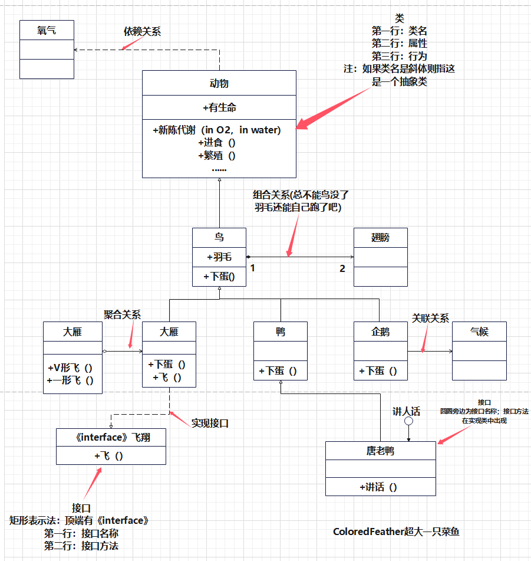
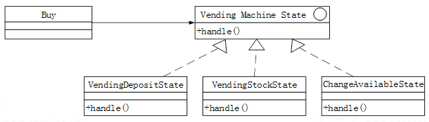

# 【软设】面向对象基础

**(这一章挺重要的，无论大题小题或者面向对象的思想，都会重点考)**

补充一些关系：

| 关系       | 含义     | UML表示        | 特点                                     | 示例         |
| ---------- | -------- | -------------- | ---------------------------------------- | ------------ |
| contains-a | 包含关系 | 实心菱形箭头   | 整体与部分生命周期相关，部分不能独立存在 | 汽车包含引擎 |
| is-a       | 继承关系 | 空心三角形箭头 | 子类继承父类特性，体现层次关系           | 猫是一种动物 |
| has-a      | 关联关系 | 实线箭头       | 对象之间存在关联，可以是单向或双向       | 学生选修课程 |

## 一.面向对象基础

**（你都报考软设了，最好已经是学过java了吧）**

面向对象编程（Object-Oriented Programming，OOP）是一种编程范式，它将对象作为程序的基本单元，将数据和处理数据的方法组织在一起。以下是面向对象基础相关概念的详细介绍：

### 1.对象（Object） 

对象是面向对象编程中的基本运行时实体，它具有属性（数据字段）和方法（行为）。对象可以是具体的物理实体，也可以是抽象的概念。例如，一个学生对象可能包含姓名、年龄和成绩等属性，以及学习、考试等方法。**在编程中，我们会对一个定义一个对象，方便对他的特征(属性)和行为(方法)进行管理，好比你买一个商品，上面会写它的成分或者参数(属性)，还有这个东西怎么使用，能做什么(方法)。**

应用举例：在Java中，我们可以定义一个Student类，然后创建一个Student对象：

```java
public class Student {
    String name;
    int age;
    float score;

    public void study() {
        System.out.println(name + "正在学习");
    }
}

Student s = new Student();
s.name = "张三";
s.age = 20;
s.score = 90.0f;
s.study();
```

### 2.封装（Encapsulation） 

封装是指将对象的实现细节隐藏起来，只暴露出有限的接口与外界进行交互。封装可以保护对象内部数据不被外部直接访问，提高代码的安全性和可维护性。**比如说你买了一个充电器，你只要插上数据线就能充电了，知不知道这个充电头或者充电线什么的具体是怎么工作的对你来说并不重要，你只要拿来就能用就可以了。**

应用举例：在Java中，可以使用private关键字来定义私有属性，然后通过public方法来访问这些属性。

```java
public class Person {
    private String name;

    public String getName() {
        return name;
    }

    public void setName(String name) {
        this.name = name;
    }
}
```

### 3.类（Class） 

类是对象的蓝图，定义了对象的属性和方法。类可以分为以下几种：

- 实体类（Entity Class）：用于表示现实世界中的实体，如人、商品等。
- 控制类（Control Class）：用于控制应用程序的流程，如控制器、管理器等。
- 边界类（Boundary Class）：用于处理与系统外部环境的交互，如界面、API等。

**就好比我刚才说的在编程中，我们会对一个定义一个对象，方便对他的特征(属性)和行为(方法)进行管理，好比你买一个商品，上面会写它的成分或者参数(属性)，还有这个东西怎么使用，能做什么(方法)。有时候定义的对象多了，我们就会对其分类，比如你创建了许多学生对象，有学生A，学生B，学生C等等，这些学生都归属于学生类，换句话来讲，我们可以把学生有的属性都封装在学生类中，这样我们在创建每一个不同个体对象的学生会方便很多。**

应用举例：实体类可以是Student类，控制类可以是CourseManager类，边界类可以是StudentUI类。

### 4.接口（Interface） 

接口是一种抽象类型，用于定义对象的行为规范。接口只包含方法的声明，没有具体的实现。类通过实现接口来遵循特定的行为规范。**例如，`Vehicle`接口可以包含`start`和`stop`方法，`Car`和`Bike`类可以实现这个接口。举个简单的例子，你定义了"eat"这个接口，但是不同的类在实现这个接口的时候会有不一样方法，比如人类吃饭，狗吃骨头，苍蝇吃屎，所以你在写这个接口的时候就不能写死，只能定义了方法，没有实现，只能供类实现。要不然你写死了就会出现人类吃屎，狗吃屎，苍蝇吃屎的情况。**

应用举例：定义一个可比较的接口，然后让实体类实现该接口。

```java
// 定义一个名为Eatable的接口，其中包含一个eat方法
interface Eatable {
    void eat();
}

// 人类实现Eatable接口
class Human implements Eatable {
    @Override
    public void eat() {
        System.out.println("Human is eating food.");
    }
}

// 狗类实现Eatable接口
class Dog implements Eatable {
    @Override
    public void eat() {
        System.out.println("Dog is eating a bone.");
    }
}

// 苍蝇类实现Eatable接口
class Fly implements Eatable {
    @Override
    public void eat() {
        System.out.println("Fly is eating dung.");
    }
}

// 主类，用于测试
public class InterfaceTest {
    public static void main(String[] args) {
        Eatable human = new Human();
        Eatable dog = new Dog();
        Eatable fly = new Fly();

        human.eat(); // 输出: Human is eating food.
        dog.eat();   // 输出: Dog is eating a bone.
        fly.eat();   // 输出: Fly is eating dung.
    }
}
```

### 5.继承（Inheritance）和泛化（Generalization） 

**（补充说明一点：在面向对象编程中，“基类”（也称为"超类"或"父类"）和"子类"（也称为"派生类"或"子类"）是相对的概念）**

继承和泛化是面向对象编程中实现代码复用和建立类之间关系的关键机制。**比如说你有一系列的类，它们都有一些共同的特征和行为，那么你可能会想要避免重复编写相同的代码。继承就像是建立了一个模板，让子类可以继承父类的属性和方法，这样就无需在每个子类中重复定义。泛化则是一种特殊的继承，它强调的是子类是父类的一种特殊情况。**

**继承的应用就像是你在创建一个动物类，然后有不同种类的动物，如狗、猫、鸟等。这些动物都有共同的特征，比如有名字、年龄和生命活动，这些可以放在动物类中。而狗、猫、鸟等则可以继承动物类，并添加它们特有的行为，比如狗会叫，猫会抓老鼠，鸟会飞。**

应用举例：假设我们有一个`Animal`类，它有`eat`和`sleep`方法。`Dog`类和`Cat`类可以继承`Animal`类，并添加它们自己的行为，如`bark`和`purr`。

```java
public class Animal {
    void eat() {
        System.out.println("Animal is eating");
    }

    void sleep() {
        System.out.println("Animal is sleeping");
    }
}

public class Dog extends Animal {
    void bark() {
        System.out.println("Dog barks");
    }
}

public class Cat extends Animal {
    void purr() {
        System.out.println("Cat purrs");
    }
}
```

### 6.重载（Overloading） 

重载是指在同一个类中存在多个同名方法，但这些方法的参数列表（参数的数量、类型或顺序）必须不同。重载允许我们使用同一个方法名执行不同的操作，这取决于传递给方法的参数。**这就像你在一家餐厅可以点不同种类的汉堡，虽然它们都叫“汉堡”，但是根据你选择的配料，你会得到不同的食物。有人可以要双层肉，有人不要洋葱等，具体看你要什么，怎么去实现。**

```java
// 定义一个BurgerShop类
class BurgerShop {
    // 重载的orderBurger方法，没有配料
    void orderBurger() {
        System.out.println("A basic hamburger with no extra toppings.");
    }

    // 重载的orderBurger方法，有一个String类型的参数表示配料
    void orderBurger(String topping) {
        System.out.println("A hamburger with " + topping + " topping.");
    }

    // 重载的orderBurger方法，有两个String类型的参数表示配料
    void orderBurger(String topping1, String topping2) {
        System.out.println("A hamburger with " + topping1 + " and " + topping2 + " toppings.");
    }

    // 重载的orderBurger方法，有一个boolean类型的参数表示是否要双层肉
    void orderBurger(boolean doubleMeat) {
        if (doubleMeat) {
            System.out.println("A hamburger with double meat.");
        } else {
            System.out.println("A hamburger with single meat.");
        }
    }
}

// 主类，用于测试
public class BurgerShopTest {
    public static void main(String[] args) {
        BurgerShop shop = new BurgerShop();

        // 点一个基本汉堡
        shop.orderBurger(); // 输出: A basic hamburger with no extra toppings.

        // 点一个加洋葱的汉堡
        shop.orderBurger("onion"); // 输出: A hamburger with onion topping.

        // 点一个加洋葱和腌黄瓜的汉堡
        shop.orderBurger("onion", "pickle"); // 输出: A hamburger with onion and pickle toppings.

        // 点一个双层肉的汉堡
        shop.orderBurger(true); // 输出: A hamburger with double meat.
    }
}
```

### 7.覆盖（Overriding） 

覆盖是指子类中存在一个与父类中方法签名完全相同的方法，这允许子类提供特定于其类型的实现。当子类对象调用该方法时，将执行子类中的覆盖版本，而不是父类中的版本。**举个简单的例子，比如你在动物类Animal这个父类中定义了"eat"这个接口，但是不同的子类在实现这个接口的时候会有不一样方法，比如猫吃鱼，狗吃骨头，兔子吃胡萝卜，所以应该根据具体的子类对原父类的方法进行覆盖，如果只是单纯的继承没有去适配不同子类就会出现猫吃骨头，狗吃骨头，兔子吃骨头的情况。**

```java
// 定义一个Animal父类
class Animal {
    // 定义一个eat方法
    void eat() {
        System.out.println("Animal is eating something generic.");
    }
}

// 定义一个Cat子类，继承自Animal
class Cat extends Animal {
    // 覆盖eat方法，实现猫吃鱼的行为
    @Override
    void eat() {
        System.out.println("Cat is eating fish.");
    }
}

// 定义一个Dog子类，继承自Animal
class Dog extends Animal {
    // 覆盖eat方法，实现狗吃骨头的行
    @Override
    void eat() {
        System.out.println("Dog is eating a bone.");
    }
}

// 定义一个Rabbit子类，继承自Animal
class Rabbit extends Animal {
    // 覆盖eat方法，实现兔子吃胡萝卜的行为
    @Override
    void eat() {
        System.out.println("Rabbit is eating a carrot.");
    }
}

// 主类，用于测试
public class AnimalTest {
    public static void main(String[] args) {
        Animal myCat = new Cat();
        Animal myDog = new Dog();
        Animal myRabbit = new Rabbit();

        myCat.eat();    // 输出: Cat is eating fish.
        myDog.eat();    // 输出: Dog is eating a bone.
        myRabbit.eat(); // 输出: Rabbit is eating a carrot.
    }
}
```

### 8.动态绑定（Dynamic Binding） 

动态绑定是面向对象编程中的一个核心概念，它允许我们在运行时根据对象的实际类型来决定调用哪个方法。**这就好比你去餐厅点菜，你告诉服务员你想要一杯饮料，但是直到服务员看到你的具体选择（咖啡、茶、果汁等），他才知道应该给你提供什么。在编程中，当你调用一个方法时，动态绑定确保了正确的方法被调用，即使是在引用类型和实际对象类型不同的情况下。**

动态绑定的应用体现在多态性中。当你有一个指向基类的引用，但实际上指向的是一个子类的对象时，动态绑定确保了调用的是子类中重写的方法。

应用举例：假设我们有一个`Animal`类的引用，但实际上指向的是一个`Dog`对象。当我们调用`eat`方法时，由于动态绑定，将调用`Dog`类继承自`Animal`类的`eat`方法。

```java
Animal myAnimal = new Dog();
myAnimal.eat(); // 动态绑定确保调用Dog类的eat方法，即使myAnimal是Animal类型
```

### 9.多态（Polymorphism） 

**多态实质上是将子类的指针对象或者引用对象传递给父类指针对象后，通过这个父类指针对象调用的函数(此函数在父类中声明为虚函数，且在各个子类中重写这个函数)，不是父类中定义的，而是传递进来的子类对象中重写的函数。(软设考试中对于多态分类只出现过过载多态-过载多态:同一个名字在不同的上下文中所代表的含义不同。)**

补充一点：Java中，所有的非静态和非常量方法默认都是虚函数，即使没有显式地使用`virtual`关键字（在Java中，`virtual`是默认行为，不需要关键字）。

多态是指同一个行为具有多个不同表现形式或形态的能力。以下是四种多态：

- 参数多态（Parametric Polymorphism）：允许同一个函数或类对不同类型的参数进行操作，如Java中的泛型。
- 子类型多态（Subtype Polymorphism）：通过继承和接口实现，允许不同子类的对象对同一消息做出响应。
- 过载多态（Ad-hoc Polymorphism）：通过函数重载或运算符重载实现。
- 强制多态（Coercion Polymorphism）：通过类型转换实现。

**1.子类型多态（Subtype Polymorphism）** 当然也可以叫包含多态,子类型多态是指子类对象可以赋值给父类类型的变量，这样就可以通过父类类型的引用调用子类的方法。**这就像一个水杯可以装水，也可以装果汁，只要它们都是液体。**

应用举例：`Animal`类型的引用可以指向`Dog`对象，并调用`Dog`类中覆盖的方法。

```java
Animal animal = new Dog();
animal.makeSound(); // 输出 "Woof, woof!"
```

**2.参数多态（Parametric Polymorphism）** 参数多态允许我们编写可以处理不同数据类型的代码，而不需要为每种类型重写代码。在Java中，这通常通过泛型实现。**这就像一个万能适配器，可以适配不同形状的插头。**

应用举例：一个泛型方法`printArray`可以打印任何类型的数组。

```java
public class Printer {
    public static <E> void printArray(E[] inputArray) {
        for (E element : inputArray) {
            System.out.printf("%s ", element);
        }
        System.out.println();
    }
}
```

**3.强制多态（Coercion Polymorphism）** 强制多态是指将一个数据类型的值强制转换为另一个数据类型，通常是通过类型转换实现的。**这就像你有一个大号的螺丝刀，但是你需要一个中号的，所以你用一个中号的套筒来适配。**

应用举例：将一个`int`类型的值转换为`double`类型。

```java
int num = 10;
double numDouble = (double) num;
```

**4.过载多态（Ad-hoc Polymorphism）** 过载多态是通过函数重载或运算符重载实现的，它允许同一操作名或符号根据上下文执行不同的操作。**这就像在不同的上下文中，同一个词可以有不同的意思。**

应用举例：`String`类的`+`运算符可以用于字符串连接，也可以用于数字相加。

```java
String text = "Hello, " + "world!"; // 字符串连接
int sum = 5 + 10; // 数字相加
```

## 练习

**习题1**

```
采用面向对象方法进行某游戏设计，游戏中有野鸭、红头鸭等各种鸭子边游泳戏水边呱呱叫，不同种类的鸭子具有不同颜色，设计鸭子类负责呱呱叫和游泳方法的实现，显示颜色设计为抽象方法，由野鸭和红头鸭各自具体实现，这一机制称为(1)。当给这些类型的一组不同对象发送同一显示颜色消息时，能实现各自显示自己不同颜色的结果，这种现象称为(2)。
```

问题1:

```
A.继承   B.聚合   C.组合   D.多态
```

问题2:

```
A.覆盖   B.重载   C.动态绑定   D.多态
```

**解析1:**

```
在这个游戏设计中，野鸭和红头鸭都继承自一个鸭子类，这个鸭子类负责实现呱呱叫和游泳的方法。显示颜色被设计为抽象方法，这意味着它必须在子类中实现。继承机制允许子类继承父类的属性和方法，并可以添加或覆盖方法，所以问题1选的是A。
```

**解析2:**

```
多态是面向对象编程中的一个核心概念，它允许不同类的对象通过共同的接口（或超类）进行交互，而每个类可以提供不同的实现方式。在这个例子中，不同种类的鸭子（野鸭、红头鸭）都继承自同一个鸭子类，并重写了显示颜色的方法。当发送显示颜色的消息时，根据对象的实际类型，调用相应的方法，这就是多态性的体现。多态允许同一消息被不同类型的对象以不同的方式响应，所以问题2选的是D。
```

多态和动态绑定的区别：

- **多态**是一个概念，它描述了同一个行为可以有不同的实现这一特性。
- **动态绑定**是实现多态的机制，它描述了在运行时如何确定调用哪个具体的方法。

因此，当我们说“多态”时，我们是在描述一种能力或特性，而当我们说“动态绑定”时，我们是在描述实现这种特性的具体过程。


**习题2**

```
()是一个类与它的一个或多个细化类之间的关系，即一般与特殊的关系。
A.泛化   B.关联   C 聚集   D.组合
```

解析：

```
选A
泛化 (Generalization)：表示类与类之间的继承关系，是一种“is-a”的关系。父类（基类）是一般概念，子类（派生类）是特殊概念。子类继承了父类的属性和方法，并可以添加自己的属性和方法。
关联 (Association)：表示类与类之间的关联关系，是一种“has-a”的关系。表示一个类对象与另一个类对象之间存在某种联系。
聚合 (Aggregation)：是一种特殊的关联关系，表示整体与部分的关系，是一种“has-a”的关系。部分可以离开整体而独立存在。
组合 (Composition)：也是一种特殊的关联关系，表示整体与部分的关系，是一种“contains-a”的关系。部分不能离开整体而独立存在，整体的生命周期决定了部分的生命周期。

举例说明
泛化：例如，"动物"是一个父类，"猫"和"狗"是它的子类。猫和狗都是动物，它们继承了动物的共性（如吃喝、睡觉），同时又具有各自的特性。
关联：例如，"学生"和"课程"之间存在关联关系，一个学生可以选修多门课程，一门课程可以有多个学生。
聚合：例如，"汽车"和"轮胎"之间存在聚合关系，一辆汽车可以有多个轮胎，轮胎可以离开汽车单独存在。
组合：例如，"公司"和"部门"之间存在组合关系，一个公司可以有多个部门，部门不能离开公司独立存在。
```


**习题3**

```
多态分为参数多态、包含多态、过载多态和强制多态四种不同形式，其中( )多态在许多语言中都存在，最常见的例子就是子类型化。
A.参数     B.包含     C.过载     D.强制
```

解析：

```
正确答案是B,包含多态（也称为子类型多态）指的是通过继承实现的多态性，即子类对象可以被视为其父类对象。这种多态在许多编程语言中都存在，常见于面向对象编程。
补充:
多态可以分为两大类：通用多态和特定多态。它们的主要区别在于，通用多态对工作类型没有限制，允许相同代码处理不同类型的值；而特定多态仅适用于有限数量的类型，并且可能对不同类型的值执行不同的代码。通用多态进一步分为参数多态和包含多态；特定多态则包括过载多态和强制多态。

强制多态指的是编译器通过语义操作将操作对象的类型强制转换，以满足函数或操作符的要求。在许多编程语言中，基本类型的大多数操作符在处理不同类型的数据混合运算时，编译器通常会进行强制转换。例如，当进行 int + double 运算时，编译器会将 int 转换为 double，然后执行 double + double 运算，这种转换实现了强制多态，既可以是隐式的，也可以是显式的（通过类型转换）。

过载多态指的是同一名称（如操作符或函数名）在不同上下文中具有不同类型。在编程语言中，大多数基本类型的操作符都是过载多态的，通俗地说，就是 C++ 中的函数重载。这里“overload”可以翻译为“重载”，而“override”则翻译为“覆盖”。

参数多态通过参数化模板，使得一个结构可以接受多种类型参数，从而实现多种类型的支持。

包含多态则允许相同的操作作用于一个类型及其子类型（注意是子类型，而不是子类）。这种多态通常需要在运行时进行类型检查。
```


**习题4**

```
在面向对象方法中，两个及以上的类作为一个类的超类时，称为(1)，使用它可能造成子类中存在(2)的成员。
```

问题1：

```
A.多重继承     B.多态     C 封装     D.层次继
```

问题2：

```
A.动态     B.私有     C.公共     D.二义性
```

解析：

```
多重继承是指一个类有多个父类，正是题目所述的情况。多重继承可能造成混淆的情况，出现二义性的成员。所以这道题选A,D。
补充一点：在面向对象编程中，“基类”（也称为"超类"或"父类"）和"子类"（也称为"派生类"或"子类"）是相对的概念
```


**习题5**

```
以下关于封装在软件复用中所充当的角色的叙述，正确的是()。
A.封装使得其他开发人员不需要知道一个软件组件内部如何工作
B.封装使得软件组件更有效地工作
C.封装使得软件开发人员不需要编制开发文档
D.封装使得软件组件开发更加容易
```

解析：

```
答案：A. 封装使得其他开发人员不需要知道一个软件组件内部如何工作
封装是面向对象编程的一个重要概念，它将数据和操作数据的方法绑定在一起，对外提供一个统一的接口。通过封装，我们可以将一个复杂系统的内部实现细节隐藏起来，只暴露必要的功能给外部。
选项A正确地描述了封装在软件复用中的作用：
隐藏实现细节：封装使得其他开发人员只需要知道如何使用这个组件，而不需要了解其内部实现的具体逻辑。这大大降低了系统的耦合度，提高了代码的可维护性。
提高复用性：由于封装隐藏了实现细节，使得组件可以被重复利用，而无需修改其内部代码。

其他选项分析：
B. 封装使得软件组件更有效地工作：封装本身并不直接影响组件的运行效率，而是通过隐藏实现细节来提高代码的可维护性，从而间接地提高开发效率。
C. 封装使得软件开发人员不需要编制开发文档：封装并不能取代开发文档，开发文档仍然是描述系统设计和功能的重要工具。
D. 封装使得软件组件开发更加容易：封装虽然简化了组件的使用，但并不意味着组件的开发过程会变得更容易。
```


**习题6**

```
UIML中有4种关系:依赖、关联、泛化和实现。(1)是一种结构关系，描述了一组链，链是对象之间的连接;(2)是一种特殊/一般关系，使子元素共享其父元素的结构和行为。
```

问题1：

```
A.依赖     B.关联     C.泛化     D.实现
```

习题2：

```
A.依赖     B.关联     C.泛化     D.实现
```

解析：

```
问题1：B. 关联
关联表示类与类之间的关系，它描述了一组链，这些链是对象之间的连接。关联可以是双向的，也可以是单向的。关联可以是多对一、一对一、一对多或多对多的关系。

问题2：C. 泛化
 泛化是一种继承关系，子类（子元素）继承父类（父元素）的属性和方法。子类可以拥有自己的属性和方法，也可以重写父类的方法。

依赖：表示一个类使用另一个类的服务，是一种较弱的耦合关系。
关联：表示类与类之间的联系，是对象之间的一种引用关系。
泛化：表示类与类之间的继承关系，子类继承父类的属性和方法。
实现：表示类与接口之间的实现关系，类实现接口中的所有方法。
```

补充一点：

**结构关系**：描述了模型元素之间的静态关系，包括关联、聚合、组合、泛化等。

**行为关系**：描述了模型元素之间的动态关系，包括依赖、实现等。


## 总结

**学习这一章最好是已经学习过了Java或者其他OOP语言，学起来不会那么费劲，这些可以算是Java语言的基础，也是OOP的基础。如果学过的应该觉得很轻且，如果很熟悉的情况下注意一下动态绑定和四种多态就可以了。**

## 二.面向对象设计原则

**（全部都要看看，重点放在前七个，起码你看名字能想起来这是个什么东西)**

面向对象的设计原则是一组指导程序员如何设计软件的规则。这些原则有助于创建易于理解、可维护和可扩展的代码。以下是几个核心的面向对象设计原则，我将用通俗易懂的语言来解释它们：

### 1.**单一职责原则（Single Responsibility Principle, SRP）**

**你该干嘛干嘛，做好自己的事情就行。**

- **解释**：就像一个人应该只负责一件事情一样，一个类也应该只负责一件事情。如果一个类承担了太多的职责，那么它就会变得复杂且难以维护。
- **例子**：想象一个厨师，如果他既要烹饪又要负责打扫卫生，那么他的工作就会变得复杂。最好是有一个厨师专门烹饪，另有一个清洁工专门打扫。

### 2.**开闭原则（Open/Closed Principle, OCP）**

**可以扩展，但是不能修改。（屎山代码belike）**

- **解释**：软件实体（如类、模块、函数等）应该对扩展是开放的，但对修改是封闭的。这意味着你可以在不修改原有代码的情况下增加新的功能。
- **例子**：假设你有一个装不同形状玩具的箱子，如果有一天你想增加一个新的形状，你应该能够直接添加新玩具而不需要改变箱子的结构。

### 3.**里氏替换原则（Liskov Substitution Principle, LSP）**

**子类可以替代父类，但是父类不能代替子类（我的就是我的，你的也是我的）！**

- **解释**：子类应该能够替换它们的基类，也就是说，任何使用基类的地方都可以透明地使用子类对象。
- **例子**：如果你有一个橙子，它可以被看作是一个水果。如果你有一个水果沙拉，你可以用任何一种水果（如苹果、香蕉）来代替水果，沙拉仍然是一个水果沙拉。

### 4.**接口隔离原则（Interface Segregation Principle, ISP）**

**多用几个单一的接口比用一个总和的接口好，毕竟什么接口做什么事情最好分清楚。**

- **解释**：不应该强迫客户端依赖它们不使用的方法。换句话说，接口应该小而专注，不应该包含客户端不需要的方法。
- **例子**：想象一个万能工具，它可以做任何事情，但使用起来非常复杂。更好的做法是有一系列专门的小工具，每个只做一件事情，使用起来简单方便。

### 5.**依赖倒置原则（Dependency Inversion Principle, DIP）**

**要依赖于抽象，而不是具体实现；针对接编程，而不要针对实现编程。要一种能通用的思想，而不是一个单一个实现。**

- **解释**：高层模块不应该依赖低层模块，它们都应该依赖于抽象。抽象不应该依赖于细节，细节应该依赖于抽象。
- **例子**：想象一下你正在建房子，你不应该直接关心砖块的具体生产过程，你应该只关心砖块是否满足建房子的标准。

### 6.**组合重用原则（Composite Reuse Principle, CRP）**

**要尽可能用组合，而不是继承。通过继承来实现代码重用可能会在短期内简化代码，但从长远来看，它可能会导致代码结构不灵活，难以维护和扩展。这就是为什么组合通常被认为是比继承更好的重用方式。**

- **解释**：优先使用对象组合，而不是类继承来实现代码的重用。组合可以提供更加灵活的代码结构，减少类之间的耦合。
- **例子**：如果你想要一个具有多种功能的机器，通过组合不同的组件（如发动机、显示屏）来实现，而不是继承一个复杂的基类。

### 7.**迪米特原则（Law of Demeter, LoD）**

**知道的越少越好，知道你自己知道的就好。给你东西会用才是重点，而不是这个东西具体怎么实现。**

- **解释**：一个对象应该对其他对象有尽可能少的了解。也就是说，一个对象应该只与它的直接朋友通信，而不是与陌生人通信。
- **例子**：如果你要开车，你只需要知道如何操作车辆（直接朋友），而不需要知道发动机内部是如何工作的（陌生人）。

再补充几个：

### 8.**重用发布等价原则（Reusability and Release Equivalence Principle, RREP）**

- **解释**：软件的重用粒度应该与其发布粒度一致，这意味着如果某个组件被重用，它应该可以被独立发布和重用。
- **例子**：一个库或框架应该是独立发布的，这样其他开发者可以直接使用它，而不需要依赖整个系统。

### 9.**共同封闭原则（Common Closure Principle, CCP）**

- **解释**：应该将那些会因相同原因而变化的类放在同一个包中，这样当变化发生时，只需要修改一个包。
- **例子**：如果有一组类都是关于用户界面的，那么它们应该放在同一个包中，因为任何界面相关的变化都会影响这些类。

### 10.**共同重用原则（Common Reuse Principle, CRP）**

- **解释**：如果一个类被重用，那么它所在的包中的所有类都应该被重用。
- **例子**：如果你重用了一个工具类，那么这个工具类所在的包中的其他工具类也可能对你有用。

### 11.**无环依赖原则（Acyclic Dependencies Principle, ADP）**

- **解释**：在包的依赖关系中不应该存在循环依赖，这样可以保持包的独立性。
- **例子**：如果包A依赖于包B，包B依赖于包C，那么包C不应该依赖于包A。

### 12.**稳定依赖原则（Stable Dependencies Principle, SDP）**

- **解释**：依赖关系应该指向更稳定的方向，即不稳定的包不应该依赖稳定的包。
- **例子**：核心业务逻辑（稳定的）不应该依赖于易变的用户界面代码（不稳定的）。

### 13.**稳定抽象原则（Stable Abstractions Principle, SAP）**

- **解释**：包的抽象程度应该与其稳定性相匹配，即稳定的包应该是抽象的，而不稳定的包应该是具体的。
- **例子**：一个稳定的框架或库应该提供抽象的接口，而具体的实现细节则可以频繁变动。你要是框架都一直变动那这个项目部就丸辣！

## 例题

**习题1**

进行面向对象系统设计时，针对包中的所有类对于同一类性质的变化;一个变化若对一个包产生影响，则将对该包中的所有类产生影响，而对于其他的包不造成任何影响。这属于()设计原则。

```
A.共同重用   B.开放-封闭   C.接口分离   D.共同封闭
```

解析：

```
A选项，共同重用原则:面向对象编程术语，指一个包中的所有类应该是共同重用的。如果重用了包中的一个类那么也就相当于重用了包中的所有类，与题目描述不符。
B选项，开放-封闭原则:对扩展开放，对修改封闭，与题目描述不符。
C选项，接口隔离原则:使用多个专门的接口比使用单一的总接口要好，与题目描述不符。
D选项，共同封闭原则:包中的所有类对于同一种性质的变化应该是共同封闭的。一个变化若对一个封闭的包产生影响，则将对该包中的所有类产生影响，而对于其他包则不造成任何影响。面向对象设计的原则之一。与题目描述相符，故D选项正确。
```


**习题2**

```
开-闭原则(Open-Closed Principle，OCP)是面向对象的可复用设计的基石。开-闭原则是指一个软件实体应当对(1)开放，对(2)关闭;里氏代换原则(Liskov Subsitution Principle，LSP)是指任何(3)可以出现的地方，(4)一定可以出现。依赖倒转原则(Dependence Inversion Principle，DIP)就是要依赖于(5)而不依赖于(6)，或者说要针对接口编程，不要针对实现编程。
```

问题1：

```
A.修改     B.扩展     C.分析     D.设计
```

问题2：

```
A.修改     B.扩展     C.分析     D.设计
```

问题3：

```
A.变量     B.常量     C.基类对象     D.子类对象
```

问题4：

```
A.变量     B.常量     C.基类对象     D.子类对象
```

问题5:

```
A.程序设计语言     B.建模语言     C 实现     D.抽象
```

问题6：

```
A.程序设计语言     B.建模语言     C 实现     D.抽象
```

解析：

```
B，A，C，D，D，C，这个没什么好说的，很简单，不会做去看设计原则。
```


## 总结

**这些原则帮助我们编写更清晰、更易于管理和扩展的代码。遵循这些原则，可以减少代码的耦合度，提高代码的可重用性，并使未来的修改更加容易。虽然具体写代码的时候可能没办法做到完美，但是能用多少是多少吧，考试的话记住前7个就可以了，感觉顾名思义，应该不难。**

## 三.面向对象开发过程

### 1.面向对象分析（OOA）

**（认定对象(名词);组织对象(抽象成类);对象间的相作用;基于对象的操作。）**

#### 1.1 识别问题和领域

- **需求收集**：通过与项目利益相关者（如用户、客户、项目经理）的沟通，收集关于系统的所有必要信息，包括功能需求、性能需求、用户界面需求等。
- **问题域分析**：分析系统需要解决的问题和其运行的环境，确定系统的边界和主要功能。

#### 1.2 确定对象和类

- **识别对象**：基于收集的需求，识别出问题域中的关键实体，这些实体将成为系统的基础构建块。
- **确定属性**：为每个对象确定其状态，即对象的属性，以及对象能够执行的行为，即方法。
- **定义类**：将具有相似属性和行为的对象归为一类，形成类定义，类是对象的蓝图。

#### 1.3 建立对象间的关系

- **关联**：确定对象之间的连接关系，如一个顾客可以有多笔订单，这就是顾客和订单之间的关联。
- **泛化**：定义对象之间的继承关系，即子类如何继承父类的属性和方法。
- **聚合与组合**：描述对象之间的整体与部分的关系，聚合表示部分可以独立于整体存在，而组合则表示部分不能独立于整体存在。

#### 1.4 定义操作

- **操作识别**：确定每个类应该具备的操作，这些操作是类能够执行的行为。
- **操作规格化**：详细描述每个操作的输入参数、返回值和执行的功能。

### 2.面向对象设计（OOD）

**（识别类及对象;定义属性;定义服务;识别关系;识别包。）**

#### 2.1 系统架构设计

- **分层**：将系统划分为不同的层次，每个层次负责系统的一个特定方面，如用户界面、业务逻辑、数据存储等。
- **组件划分**：将系统分解为多个组件或子系统，每个组件实现系统的一部分功能。

#### 2.2 类的设计

- **细化属性和方法**：根据分析阶段的结果，进一步详细定义类的属性和方法。
- **定义接口**：确定类应该提供的服务接口，接口定义了类与外部世界的交互方式。

#### 2.3 关系细化

- **继承关系**：明确子类如何继承父类的属性和方法，以及如何添加新的属性和方法。
- **关联关系**：细化对象间的关联，包括关联的多重性、导航性等。

#### 2.4 设计模式应用

- **选择设计模式**：根据系统的具体需求，选择合适的设计模式来解决问题，如创建型模式、结构型模式、行为型模式等。

#### 2.5 系统行为设计

- **状态图**：描述对象可能的状态以及状态之间的转换。
- **序列图**：描述对象之间的交互顺序，展示对象如何协作完成特定功能。

### 3.面向对象开发

**（程序设计范型;选择一种OOPL，OOPL是面向对象程序语言。）**

#### 3.1 编码实现

- **选择编程语言**：根据项目需求和设计，选择合适的编程语言来实现系统。
- **编写类和方法**：按照设计文档，编写类的代码，包括属性的定义和方法的实现。

#### 3.2 代码组织

- **模块化**：将代码组织成模块，每个模块负责一个特定的功能，以提高代码的可读性和可维护性。
- **封装**：确保类的内部实现细节对外部隐藏，只通过公共接口暴露必要的功能。

#### 3.3 代码优化

- **性能优化**：对代码进行优化，以提高系统的运行效率，如优化算法、减少资源消耗。
- **代码重构**：在开发过程中不断重构代码，以改善其结构，提高代码质量。

### 4.面向对象测试（OOT）

**（算法层;类层;模板层;系统层）**

#### 4.1 单元测试

- **测试类的方法**：对每个类的方法进行独立测试，确保它们能够按照预期工作。
- **测试类的接口**：验证类的公共接口是否正确实现，是否符合设计规格。

#### 4.2 集成测试

- **测试组件间交互**：将多个类或组件组合在一起进行测试，确保它们能够正确地协同工作。
- **测试接口集成**：验证系统与外部系统或服务的接口集成是否正确。

#### 4.3 系统测试

- **测试整个系统**：对整个系统进行全面的测试，包括功能测试、性能测试、安全性测试等，确保系统满足所有需求。
- **验收测试**：由用户或客户进行的测试，以确认系统满足业务需求，达到可交付的标准。

## 例题

**习题1**

```
面向对象()选择合适的面向对象程序设计语言，将程序组织为相互协作的对象集合，每个对象表示某个类的实例，类通过继承等关系进行组织。
A.分析     B.设计     C.程序设计     D.测试
```

解析：

```
C，在采用面向对象技术开发系统时，主要步骤有面向对象分析、面向对象设计、面向对象程序设计和面向对象测试面向对象分析主要包括:认定对象、组织对象、描述对象间的相互作用、定义对象的操作、定义对象的内部信息面向对象设计是设计分析模型和实现相应源代码。面向对象程序设计选择合适的面向对象程序设计语言，将程序组织为相互协作的对象集合，每个对象表示某个类的实例，类通过继承等关系进行组织。面向对象测试是尽可能早的开始进行系统测试，以发现系统中可能存在的错误并进行修复，进而保证系统质量。
```


**习题2**

```
对采用面向对象方法开发的系统进行测试时，通常从不同层次进行测试。测试类中定义的每个方法属于( )层。
A.算法     B.类     C.模板     D.系统
```

解析：

```
A，算法层，这句话的意思是，测试/类中的每一个方法。
(1)算法层。测试类中定义的每个方法，基本上相当于传统软件测试中的单元测试。所以测试类中的方法属于算法层。选择A选项。
(2)类层。测试封装在同一个类中的所有方法与属性之间的相互作用。在面向对象软件中类是基本模块，因此可以认为这是面向对象测试中所特有的模块测试。
(3)模板层。测试一组协同工作的类之间的相互作用，大体上相当于传统软件测试中的集成测试，但是也有面向对象软件的特点(例如，对象之间通过发送消息相互作用)。
(4)系统层。把各个子系统组装成完整的面向对象软件系统，在组装过程中同时进行测试。
```


## 总结

**考试的话记每一段开头的那些，比如说在面向对象分析阶段：认定对象(名词);组织对象(抽象成类);对象间的相互作用;基于对象的操作。在面向对象设计阶段：识别类及对象;定义属性;定义服务;识别关系;识别包等。**

## 四.UML

**(UML大小题都有考，要记的东西其实蛮多的，包含但不仅限于各种图的元素，特征，用途，关系，图怎么画等等，东西挺多)**

### 1.UML图的概念及分类

#### 1.1 结构图（静态图）

| UML图类型                                 | 定义                                                         | 用途                                                 |
| :---------------------------------------- | :----------------------------------------------------------- | :--------------------------------------------------- |
| 类图（Class Diagram）                     | **描述系统中类的结构，包括类之间的关系、类的属性和操作。**   | 用于表示系统的静态设计视图，帮助理解系统的对象结构。 |
| 对象图（Object Diagram）                  | **描述在类图中所定义类的特定实例的静态快照。**               | 用于表示系统在特定时间点的实例数据结构和关系。       |
| 包图（Package Diagram）                   | 描述如何将类和对象组织成包，以及包之间的关系。               | 用于表示系统的模块化和分层结构。                     |
| 组合结构图（Composite Structure Diagram） | 描述类的内部结构，包括它与它的组成对象的关系。               | 用于表示类的内部结构，尤其是复杂的类。               |
| 构件图（Component Diagram）               | 描述系统中物理软件组件的静态视图，如可执行文件和库。         | **用于表示系统的物理组件及其依赖关系。**             |
| 部署图（Deployment Diagram）              | 描述运行时处理节点和它们之间的关系，以及在这些节点上部署的软件组件。 | **用于表示系统的部署视图，包括硬件和软件的分布。**   |
| 制品图（Artifact Diagram）                | 描述系统的物理文件和它们之间的关系。                         | 用于表示系统构建过程中的文件和配置项。               |

#### 1.2 行为图（动态图）

| UML图类型                                     | 定义                                             | 用途                                   |
| :-------------------------------------------- | :----------------------------------------------- | :------------------------------------- |
| 用例图（Use Case Diagram）                    | 描述系统的功能需求，通过用例和参与者来表示。     | 用于理解和捕获系统的功能和用户交互。   |
| 顺序图（Sequence Diagram）                    | 描述对象之间交互的顺序，强调时间顺序。           | 用于表示对象之间的交互顺序和协作。     |
| 通信图（Collaboration Diagram，也称为协作图） | 描述对象之间的交互和它们之间的关系。             | 用于表示对象之间的消息传递和结构组织。 |
| 定时图（Timing Diagram）                      | 描述对象状态的变化和时间约束。                   | 用于表示对象状态随时间的变化。         |
| 状态图（State Diagram）                       | 描述特定对象的所有可能状态以及状态之间的转移。   | 用于表示对象的生命周期和行为。         |
| 活动图（Activity Diagram）                    | 描述业务流程和工作流中的操作顺序，类似于流程图。 | 用于表示业务流程和工作流中的控制逻辑。 |

### 2.类图

**(简单来讲，类图描述了一组对象，接口，协作和他们之间的关系)**

**类图描述一组对象、接口、协作和它们之间的关系。在OO系统的建模中，最常见的图就是类图。类图给出了系统的静态设计视图，活动类的类图给出了系统的静态进程视图。**

#### 2.1 类图的特征

类图主要用于描述软件系统中的静态结构，它帮助我们理解系统中的类及其相互关系。以下是类图的一些特征：

1. **静态视图**：类图展示了系统在某个特定时刻的状态，不涉及时间维度上的变化。
2. **抽象表示**：类图通过图形化的方式，将复杂的系统分解为更易于理解的部分。

#### 2.2 基本元素

类图主要由以下基本元素组成：

1. **类（Class）**：类是具有相同属性和行为的对象集合。在类图中，类用矩形表示，分为三个部分：类名、属性（变量）和方法（函数）。
   - 类名：位于矩形顶部，通常是名词。
   - 属性：位于类名下方，格式通常是“可见性 名称: 类型”，例如“- name: String”。
   - 方法：位于属性下方，格式通常是“可见性 名称(参数列表): 返回类型”，例如“+ display(): void”。
2. **接口（Interface）**：接口定义了一组抽象的操作，类可以实现接口。在类图中，接口用带有名称的圆角矩形表示。
3. **关系**：类与类之间通过各种关系相互连接，下面会详细介绍。

#### 2.3 关系

类图中的关系主要有以下几种：

1. **继承（Generalization）**：用空心箭头表示，箭头指向父类，表示子类继承父类的属性和方法。
2. **实现（Realization）**：用空心箭头加虚线表示，箭头指向接口，表示类实现了接口。
3. **关联（Association）**：表示不同类之间的连接，可以是单向或双向的。双向关联用实线连接，单向关联用带箭头的实线表示。
4. **聚合（Aggregation）**：表示整体与部分的关系，但部分可以独立于整体存在。用空心菱形加实线表示，菱形指向整体。
5. **组合（Composition）**：也是整体与部分的关系，但部分不能独立于整体存在。用实心菱形加实线表示，菱形指向整体。
6. **依赖（Dependency）**：表示一个类使用另一个类的方法或属性。用带箭头的虚线表示，箭头指向被依赖的类。


#### 2.4 应用

类图在软件开发过程中有广泛的应用，主要包括：

1. **需求分析**：帮助理解系统的功能需求，明确系统中的类及其关系。
2. **设计阶段**：在详细设计阶段，类图用于指导程序员编写代码，明确类的职责和接口。
3. **沟通工具**：类图作为一种图形化表示，便于团队成员之间的沟通和理解。
4. **文档化**：类图可以作为项目文档的一部分，帮助后人理解系统结构。

#### 2.5 （补充）修饰符

修饰符用于定义属性或操作的可见性、范围和性质。常见的修饰符包括：

- **+**：表示公共（public）
- **-**：表示私有（private）
- **#**：表示受保护的（protected）
- **~**：表示包私有的（package-private）

#### 2.6图示

1. **动物**:
   - 动物是所有其他类的父类或基类。
   - 它具有以下属性和方法：
     - +有生命：表示动物是有生命的。
     - +新陈代谢(in O2, in water)：表示动物的代谢过程需要氧气和水。
     - +进食()：一个方法，用于表示动物进食的行为。
     - +繁殖()：一个方法，用于表示动物繁殖的行为。
2. **鸟**:
   - 鸟是从动物继承而来的子类。
   - 它具有以下额外的属性和方法：
     - +羽毛：鸟类特有的特征。
     - +下蛋()：鸟类产卵的方法。
3. **大雁**:
   - 大雁是鸟的一个具体实现。
   - 它实现了《Interface》飞羽接口中的+飞()方法。
   - 具有以下额外的方法：
     - +V形飞()：大雁飞行时通常以V形队形。
     - +一形飞()：另一种可能的飞行方式。
4. **鸭**:
   - 鸭也是鸟的一种。
   - 它也具有+下蛋()方法。
5. **企鹅**:
   - 企鹅同样是鸟的一种。
   - 它同样具有+下蛋()方法。
6. **唐老鸭**:
   - 唐老鸭是鸭子的一种特例。
   - 它除了具有鸭子的特性外，还多了一个+讲话()方法，表明它可以说话。
7. **关联关系**:气候与其他类之间通过虚线箭头连接，表示它们之间存在某种关联关系。
8. **组合关系**:鸟和大雁、鸭、企鹅之间的实心菱形箭头表示组合关系，即这些类是由鸟类组成的。
9. **依赖关系**:羽毛还能自己跑了吧？这句话可能是对某些特定情况的幽默表达，但并不代表实际的依赖关系。
10. **接口**:《Interface》飞羽接口定义了+飞()方法，被大雁实现。




举例：

```
下图所示UML图为(1)，有关该图的叙述中，不正确的是(2)。
```


问题1：

```
A.对象图   B.类图   C.组件图   D.部署图
```

问题2：

```
A.如果B的一个实例被删除，所有包含A的实例都被删除
B.A的一个实例可以与B的一个实例关联
C.B的一个实例被唯一的一个A的实例所包含
D.B的一个实例可与B的另外两个实例关联
```

解析：

```
1.根据图示，本题UML图为类图。注意:对象图的对象名会有:标识，并且对象图的关联关系一般不会出现多重度。因此第一空选择B选项。
组件图是UIML中描述一个系统中的物理方面的图形，它是用来描述构成系统的各个组件、组件提供的接口与需求的接口、端口以及它们之间关系的图。部署图是用来显示系统中软件和硬件的物理架构。
2.根据图示，A和B属于组合关系，A是整体B是部分，A和B的生命周期相同，如果A的一个实例被删除，所有包含B的实例都被删除，其他选项描述正确
```


### 3.用例图

用例图（Use Case Diagram）是UML图的一种，它通过展示系统与外部参与者的交互来描述系统的功能需求。用例图主要用于帮助理解系统的行为，以及用户与系统如何交互。**用例图描述一组用例、参与者及它们之间的关系。**

#### 3.1 用例图的特征

用例图具有以下特征：

1. **用户视角**：它从用户的角度来描述系统应该做什么，而不是系统如何实现这些功能。
2. **功能需求**：它专注于系统的功能需求，而不是系统的内部结构。
3. **高层次的抽象**：用例图提供了一种高层次的抽象，帮助理解系统的主要功能。

#### 3.2 基本元素

用例图主要由以下基本元素组成：

1. **参与者（Actor）**：参与者是与系统交互的外部实体，可以是用户、其他系统或时间触发器等。在用例图中，参与者用一个小人图标表示，并通常在其旁边标注参与者的名称。
2. **用例（Use Case）**：用例是系统的一个功能单元，通常描述了一个特定的功能或行为。在用例图中，用例用一个椭圆表示，并在椭圆内部标注用例的名称。
3. **关系**：用例图中涉及的关系主要包括以下几种：
   - **关联**：表示参与者和用例之间的交互。参与者通常位于用例图的左侧或顶部，通过直线连接到用例。
   - **包含**：表示一个用例包含另一个用例的行为。用带箭头的虚线加“include”标签表示，箭头指向被包含的用例。
   - **扩展**：表示一个用例在特定条件下会扩展另一个用例的行为。用带箭头的虚线加“extend”标签表示，箭头指向被扩展的用例。
   - **泛化**：表示用例之间的继承关系，类似于类图中的继承。用带箭头的实线表示，箭头指向父用例。

#### 3.3 关系

在用例图中，关系主要用于描述参与者和用例之间的交互，以及用例之间的关系：

1. **关联**：如前所述，表示参与者和用例之间的交互。
2. **包含和扩展**：用于表示用例之间的层次关系，可以帮助避免重复并提高用例的重用性。
3. **泛化**：用于表示用例之间的通用行为，类似于面向对象中的继承。

**包含关系:当可以从两个或两个以上的用例中提取公共行为时，应该使用包含关系来表示它们，其中这个提取出来的公共用例**
**称为抽象用例，而把原始用例称为基本用例或基础用例。**

**大功能包含小功能**：比如你使用一些软件的时候，有些需要检查是否有权限，比如你要学习课程或者做测试的时候，这些都要对你的身份进行检查看看你是不是一个合法用户，但是如果在两个大模块中都加入检查权限会使得程序冗余，所以我们一般提取出来，然后作为一个单独的小功能，一般都是大功能指向小功能include。


**扩展关系:如果一个用例明显地混合了两种或两种以上的不同场景，即根据情况可能发生多种分支，则可以将这个用例分为一个基本用例和一个或多个扩展用例，这样使描述可能更加清晰。**

**大功能包含小功能**：比如你去结账的时候，"结账"是一个大功能，而"应用促销码"是一个小功能，你可以用也可以不用，简单来讲，在你需要的时候才会应用到，由小功能指向大功能extend。


**泛化关系:当多个用例共同拥有一种类似的结构和行为的时候，可以将它们的共性抽象成为父用例，其他的用例作为泛化关系中的子用例。在用例的泛化关系中，子用例是父用例的一种特殊形式，子用例继承了父用例所有的结构、行为和关系。**


#### 3.4 应用

用例图在软件开发过程中有以下应用：

1. **需求捕获**：帮助分析师和利益相关者理解系统的功能和用户需求。
2. **系统设计**：指导系统设计，确保设计满足用户的功能需求。
3. **测试**：用例图可以作为测试计划的依据，确保系统的每个功能都被测试到。
4. **沟通工具**：用例图是一种很好的沟通工具，可以帮助项目团队和利益相关者就系统功能达成共识。

#### 3.5 图示


### 4.序列图

顺序图(sequence diagram，序列图)。顺序图是一种交互图(interaction diagram)，交互图展现了一种交互，它由一组对象或参与者以及它们之间可能发送的消息构成。**交互图专注于系统的动态视图。顺序图是强调消息的时间次序的交互图。**

#### 4.1 顺序图的特征

顺序图具有以下特征：

1. **时间顺序**：顺序图按照时间顺序展示对象之间的交互，这有助于理解事件发生的先后顺序。
2. **对象交互**：它专注于对象之间的消息传递，展示了系统在运行时的行为。
3. **生命周期**：顺序图显示了对象在交互过程中的创建和销毁。

#### 4.2 基本元素

顺序图主要由以下基本元素组成：

1. **参与者（Lifelines）**：在顺序图中，每个参与交互的对象都有一条垂直的虚线，称为生命线。生命线表示对象在一段时间内的存在。
2. **对象（Objects）**：对象是参与交互的实体，它们位于生命线的顶端，通常包括对象的名称和类别。
3. **消息（Messages）**：消息表示从一个对象到另一个对象的信息传递。消息可以是同步消息（带实心箭头），异步消息（带开放箭头），或者返回消息（带开放箭头和虚线）。
4. **激活（Activations）**：当对象在处理一个消息时，它的生命线上会出现一个较宽的矩形，表示对象处于活动状态。
5. **创建（Creations）和销毁（Destructions）**：顺序图中可以显示对象的创建和销毁。创建通常用一个带箭头的实线表示，箭头指向新创建的对象；销毁则用带有X标记的结束点表示。

#### 4.3 关系

顺序图中涉及的关系主要包括以下几种：

1. **消息传递**：顺序图中，消息传递是主要的交互方式，它可以是同步或异步的。
2. **对象创建**：表示一个对象在交互过程中创建另一个对象。
3. **对象销毁**：表示一个对象在交互过程中的结束。

#### 4.4 应用

顺序图在软件开发过程中有以下应用：

1. **系统分析**：帮助分析师理解系统内部对象之间的交互逻辑。
2. **系统设计**：指导系统的详细设计和实现，特别是对象之间的接口和交互。
3. **测试**：顺序图可以作为测试用例设计的依据，确保测试覆盖了所有重要的交互路径。
4. **沟通**：顺序图是项目团队之间沟通和确认系统行为的有效工具。

#### 4.5 图示

举个例子这是一张ATM机取款过程的序列图，图中展示了从客户插入银行卡到完成交易的整个过程。以下是详细解释：

1. **参与者**：图的左侧有一个小人图标代表“参与者”，即进行操作的人（客户）。
2. **对象**：在参与者下方有三个矩形框分别标示了三个主要对象：“CardReader”（读卡器）、“ATM”和“CustomerConsole”（顾客控制台）。这些是参与整个交互过程的对象。
3. **激活的生命线**：每个对象的底部有一条虚线，表示该对象被激活的时间段。
4. **消息传递**：
   - 第一步，“参与者”通过“CardReader”发出一个消息“cardInserted()”。这表示客户将银行卡插入了读卡器。
   - 第二步，“CardReader”调用“ATM”创建一个新的会话对象，消息为“create(this)”。
   - 第三步，“ATM”执行会话，消息为“performSession()”。
   - 第四步，“ATM”读取卡片信息，消息为“readCard( )”。
5. **返回值**：第五步，“CardReader”返回卡片信息给“ATM”。
6. **相关动作**：第六步至第九步，“ATM”与“CustomerConsole”之间发生一系列相关的动作，包括显示交易选项、处理客户的输入等。
7. **循环**：从第十步开始进入一个循环，条件是“while customer wants to perform transaction”（当客户想要继续进行交易时），每次循环都涉及一次交易的处理。
8. **结束生命线**：当客户不再需要继续交易时，循环结束，所有对象的生命线也相应地结束。


**这里我插一句嘴，在大题里，这个图是能看出啦每个对象里有什么方法的，比如CardReader调用了ATM的cardInsertd（），说明ATM里面肯定是有这个方法的，相反的，Session调用了CardReader的readCard（）方法，CardReader里肯定有readCard（）方法。**

举例:

```
如下所示的序列图中()表示返回消息，Accunt类必须实现的方法有()。
```


问题1：

```
A.tanslD    B.balance    C.withdraw    D.deposit
```

问题2：

```
A.start()       B.checkBalance()和withdraw()
C.deposit()     D.checkBalance()、withdraw()和deposit()
```

解析：

```
3：balance是Account返回给FundsTransationManger的，表示返回消息，因为checkBalance()、withdraw()和deposit()均是FundsTransationManger指向Account，那么Account里面必须有这些方法。
```


### 5.通讯图

**协作图（Communication Diagrams），也称为通信图或交互图，是统一建模语言（Unified Modeling Language, UML）的一种图形表示方式，用于显示对象之间的动态交互关系。**

#### 5.1 协作图的基本特征

1. **对象与类：**
   - 对象在图中以矩形框表示，内部写上对象的名称。
   - 类则通常不直接出现在协作图中，但可以通过对象来间接体现类的存在。
2. **消息传递：**
   - 消息通过箭头连接两个对象，表示一个对象调用另一个对象的方法或操作。
   - 箭头的方向指向接收消息的对象。
3. **顺序编号：**
   - 为了明确消息的执行顺序，每个消息通常会分配一个唯一的序号。
4. **自关联消息：**
   - 当一个对象给自己发送消息时，会使用一个小圆圈作为起点，然后连接回该对象本身。
5. **激活条：**
   - 表示对象正在处理某个消息的时间段，通常是一条水平线从消息开始延伸至结束。
6. **组合结构：**
   - 可以通过嵌套的消息来表示更复杂的交互场景。

#### 5.2 基本元素

- **对象（Object）：** 图中的主要参与者，代表系统中的一个实体。
- **消息（Message）：** 对象之间进行交互的方式，可以是方法调用、事件通知等。
- **序列号（Sequence Number）：** 用于指示消息执行的顺序。
- **激活条（Activation Bar）：** 显示对象处于活动状态的时间段。

#### 5.3 关系

- **依赖关系（Dependency）：** 一个对象依赖于另一个对象的状态或行为。
- **关联关系（Association）：** 两个对象之间存在某种联系，但不一定需要相互依赖。
- **聚合关系（Aggregation）：** 一种特殊的关联关系，其中一个对象是整体，另一个对象是其部分。
- **继承关系（Inheritance）：** 子类继承了父类的属性和方法。

#### 5.4 应用

协作图主要用于以下几个方面：

1. **分析系统的动态行为：** 通过观察对象间的交互模式，了解系统的运行机制。
2. **设计系统的交互逻辑：** 明确各组件如何协同工作以满足业务需求。
3. **验证设计的正确性：** 与其他类型的UML图相结合，确保整个系统的设计和实现的一致性。

#### 5.5 图示

1. **dispatchForm: Form**
   - 这是整个流程的开始点，表示一个表单（Form）被分发出去。
2. **Order Order**
   - 表单被分发给“Order Order”组件或服务进行处理。
3. **OrderItem**
   - “Order Order”会获取每个订单项（OrderItem）的信息。
4. **Product**
   - 每个订单项（OrderItem）需要获取产品（Product）的相关信息。
5. **Deliver Order**
   - 如果在处理过程中发现某个订单项的产品ID不存在，则进入“Deliver Order”进行进一步处理。
     - 在这里，首先创建一个新的PeddlerID（1.3:create(PeddlerID)），然后添加产品ID（1.4:Add(ProductID)）。

根据不同的情况分为ID存在和不存在的两种。


### 6.活动图

活动图（Activity Diagram）是UML中用于描述业务流程、工作流程或算法的图形表示。它强调的是流程中的控制流，类似于传统的流程图，但是提供了更丰富的符号和概念来描述复杂的行为。**活动图将进程或其他计算结构展示为计算内部一步步的控制流和数据流。活动图专注于系统的动态视图。它对系统的功能建模和业务流程建模特别重要，并强调对象间的控制流程。**

#### 6.1 活动图的基本元素

以下是一些活动图中常用的基本元素：

1. **开始节点（Start Node）**：用一个实心圆表示，是活动图的入口点。
2. **结束节点（End Node）**：用一个实心圆加上一个圆环表示，表示活动图的结束。
3. **活动（Activity）**：用一个圆角矩形表示，代表过程中的一个步骤或动作。
4. **决策节点（Decision Node）**：用一个菱形表示，用于基于某些条件来选择不同的路径。
5. **分支与合并（Fork and Join）**：
   - 分支用一条水平线分割成多条路径，表示并行执行的多个活动。
   - 合并则是分支的逆操作，表示并行活动的汇合。
6. **泳道（Swimlanes）**：水平或垂直的矩形，用于将活动图中的活动按照职责或参与者进行分组。
7. **对象（Object）**：表示在活动中创建或消耗的对象。
8. **控制流（Control Flow）**：用带箭头的直线表示，连接活动图中的各个节点，指示活动的执行顺序。
9. **数据流（Data Flow）**：表示数据在活动间的流动。

#### 6.1 关系

- **转换（Transition）**：从一个节点到另一个节点的控制流。
- **对象流（Object Flow）**：表示对象或数据在活动间的传递。

#### 6.3 应用

活动图在以下场景中非常有用：

1. **业务流程建模**：描述组织的业务流程，如订单处理、客户服务等。
2. **工作流设计**：设计系统的工作流程，如审批流程、任务分配等。
3. **算法描述**：详细描述算法的步骤和决策逻辑。
4. **系统行为分析**：分析系统在执行特定功能时的行为。

#### 6.4 图示


### 7.状态图

状态图（State Diagram）是一种用于描述系统对象在其生命周期内可能经历的各种状态的图形化表示技术。它主要用于捕捉和分析系统的动态行为，特别是在响应不同事件时对象状态的变化情况。状态图由美国国宝Harel于1980年首先提出，现在已经成为国际标准，被广泛运用。**状态图描述一个状态机，它由状态、转移、事件和活动组成。状态图给出了对象的动态视图。它对于接口、类或协作的行为建模尤为重要，而且它强调事件导致的对象行为，这非常有助于对反应式系统建模。**

#### 7.1 状态图的组成

1. **状态（States）**：圆角矩形表示的状态机中的稳定状态。例如，“运行”、“就绪”等都是操作系统的进程状态。
2. **转换（Transitions）**：带箭头的连线表示两个状态之间的转换关系。当某个条件得到满足时，对象会从一个状态转换到另一个状态。
3. **事件（Events）**：触发状态转换的动作或情况。例如，点击按钮可能会使界面从“空闲”状态转换为“活动”状态。
4. **动作（Actions）**：在状态转换过程中执行的操作。例如，在进入新状态之前初始化变量或在离开旧状态时保存数据。
5. **活动（Activities）**：状态内部执行的持续性行为。例如，播放音乐或动画可以在一个状态持续进行。
6. **复合状态（Composite States）**：可以进一步细分为多个子状态的状态。这有助于更细致地描述对象的复杂行为。
7. **初始状态（Initial State）**：状态机的起点，通常用一个黑色的圆点表示。
8. **终止状态（Final State）**：状态机的终点，标志着对象行为的结束，通常用一个黑色圆点外加一圈双线条表示。

#### 7.2 状态图的特点

1. **层次性**：允许创建嵌套状态机，从而能够处理复杂的交互逻辑。
2. **并发性**：支持同时处于多个状态的能力，这对于描述实时系统的并发行为非常有用。
3. **历史状态**：记录对象最后一次所处的状态，以便在返回该状态时恢复先前的上下文。
4. **分支与合并**：允许多个转换路径从一个状态出发，并在适当的时候汇合在一起。

#### 7.3 状态图的应用场景

1. **软件开发**：用于设计用户界面、游戏机制、业务流程等。
2. **硬件设计**：描述数字电路的工作模式和控制流。
3. **系统分析**：帮助理解系统的动态特性和行为模式。 在实际应用中，状态图可以根据项目的具体需求进行调整和完善。通过清晰直观地展示系统的状态转换和事件驱动的关系，状态图为开发者提供了有效的沟通和分析工具。

#### 7.4 事件的常见类型

1. **信号事件（Signal Event）**：

   - 信号事件是由外部实体发送到状态机的消息，通常用于触发状态之间的转换。
   - 在状态图中，信号事件通常用带箭头的直线表示，箭头指向接收信号的状态。
   - 例如，一个状态图可能包含一个信号事件“按钮按下”，它会导致状态机从“待机”状态转换到“运行”状态。

   ```
   [待机] --(按钮按下)--> [运行]
   ```

2. **调用事件（Call Event）**：

   - 调用事件是指状态机中的一个状态调用另一个状态机或操作。
   - 在状态图中，调用事件通常用带箭头的虚线表示，箭头指向被调用的状态或操作。
   - 例如，一个状态可能通过一个调用事件来触发一个“验证用户”的操作。

   ```
   [处理中] --(调用验证)--> [验证用户]
   ```

3. **变换事件（Change Event）**：

   - 变换事件是指当系统的某个变量或属性达到特定值时触发的事件。
   - 在状态图中，变换事件通常用条件表达式表示，例如“[温度 > 100℃]”。
   - 例如，一个状态机可能在温度超过100℃时从“加热”状态转换到“冷却”状态。

   ```
   [加热] --(温度 > 100℃)--> [冷却]
   ```

4. **时间事件（Time Event）**：

   - 时间事件是指经过一定时间后触发的事件。
   - 在状态图中，时间事件通常用“/时间”来表示，例如“/5s”表示5秒后触发。
   - 例如，一个状态机可能在等待5秒后从“等待”状态转换到“超时”状态。

   ```
   [等待] --(5s后)--> [超时]
   ```

#### 7.5 图示

1. 当热水器处于关闭状态（OFF）时，可以执行“打开”操作来开启热水器。此时，如果检测到没有水，会提示添加水。
2. 热水器开启后进入工作状态（On），开始烧水。
3. 当水烧开时，热水器会自动关闭以防止干烧损坏设备。


举例：

**例1**

```
某软件系统限定:用户登录失败的次数不能超过3次。采用如所示的UML状态图对用户登录状态进行建模，假设活动状态是Logging in，那么当Valid Entny发生时，(1)。其中，[tries<3]和tries+ +分别为(2)和(3)。
```


第一问：

```
A.保持在Logging in状态            B.若[tries<3]为true，则Logged in变为下一个活动状态
C.Logged in立刻变为下一 个活动状态  D.若tries=3为true，则Logging Denied变为下一个活动状态
```

第二问：

```
A.状态    B.转换    C.监护条件    D转换后效果
```

第三问：

```
A.状态    B.转换    C 转换后效果  D.监护条件
```

解析：

```
通过状态图图示可知，假设活动状态是Loggingin，那么当Valid Entry发生时，当限制条件【tries=3】会到达Logging Denied状态，当限制条件【tries<3】Logged in状态。针对于第一问的描述，仅有B符合状态图的表示。第一空选B。[tries<3]和tries+ +分别表示监护条件和转换后效果，带有【】表示限制条件，没带【】的具体操作表示一个状态到另外一个状态的转换。第一选B，第二空选C，第三也选C。
```


**例2**

```
以下关于UML状态图的叙述中，不正确的是()。
A.活动可以在状态内执行，也可以在迁移时执行
B.若事件触发一个没有特定监护条件的迁移，则对象离开当前状态
C.迁移可以包含事件触发器、监护条件和状态
D.事件触发迁移
```

解析：

```
A.活动可以在状态内执行，也可以在迁移时执行： 正确。活动可以是状态内部持续进行的操作，也可以是在状态转换时触发的动作。
B.若事件触发一个没有特定监护条件的迁移，则对象离开当前状态： 正确。如果一个事件发生且没有额外的条件限制，那么对象就会根据定义的迁移离开当前状态。
C.迁移可以包含事件触发器、监护条件和状态： 错误。迁移描述的是状态之间的转换，它包含：
事件触发器：触发迁移的事件。
监护条件：迁移发生的附加条件。
动作：迁移发生时执行的动作。 状态是对象的一种情况，而不是迁移的一部分。
D.事件触发迁移： 正确。事件是引起状态转换的主要原因，它可以是外部事件、内部事件或时间事件。
```


**例3**

```
每种设计模式都有特定的意图。(1)模式使得一个对象在其内部状态改变时通过调用另一个类中的方法改变其行为，使这个对象看起来如同修改了它的类。下图是采用该模式的有关TCP连接的结构图实例。该模式的核心思想是引入抽象类(2)来表示TCP连接的状态，声明不同操作状态的公共接口，其子类实现与特定状态相关的行为。当一个(3)对象收到其它对象的请求时，它根据自身的当前状态做出不同的反应。
```


问题1：

```
A.适配器(Adapter)     B.命令(Command)     C.观察者(Visitor)     D.状态(State)
```

问题2：

```
A.TCPConnection     B.state     C.TCPState     D.TCPEstablished
```

问题3：

```
A.TCPConnection     B.state     C.TCPState     D.TCPEstablished
```

解析：

```
问题1：D. 状态(State)模式
状态模式的核心思想就是将一个对象的行为委托给与它当前状态相关的另一个对象来处理。在这个例子中，TCPConnection对象通过状态对象（TCPState的子类）来改变自己的行为，从而实现了根据不同状态执行不同操作的目的。

问题2：C. TCPState
TCPState是一个抽象类，它定义了TCP连接的所有可能状态的公共接口，如Open、Close、Acknowledge等操作。不同的具体状态（如TCPEstablished、TCPListen、TCPClosed）继承自TCPState，并实现与特定状态相关的行为。

问题3：A. TCPConnection
TCPConnection对象是接收请求的对象。当它收到一个请求时，它会根据当前的状态（由state属性指向的TCPState对象表示）来调用相应的状态对象的方法，从而做出不同的响应。

状态模式：
意图：将一个对象的行为封装在一个称为“状态”的对象中，使得对象可以在运行时改变它的行为。
适用场景：一个对象的行为取决于它的状态，并且它必须在运行时改变它的行为。
优点：将状态和行为分离，提高了代码的可维护性。可以很方便地增加新的状态。
缺点：状态过多时，状态机可能会变得复杂。
本例分析：
TCP连接的状态是变化的，不同的状态下，对相同的操作（如Open、Close）会有不同的响应。通过引入TCPState类，将这些状态和行为分离，使得TCPConnection对象可以根据当前状态灵活地改变自己的行为。
```


### 8.构件图

构件图(component diagram)。构件图描述一个封装的类和它的接口、端口，以及由内嵌的构件和连接件构成的内部结构。**构件图用于表示系统的静态设计实现视图。**对于由小的部件构建大的系统来说，构件图是很重要的。构件图是类图的变体。但它们在抽象层次上有所不同。类图强调类的属性和操作，而构件图更关注系统的物理实现，强调组件之间的依赖关系。构件图是更高层次的抽象，一个组件可以包含多个类，而一个类也可以属于多个组件。

#### 8.1 特征

1. **模块化表示**：组件图展示了系统的模块化结构，强调各组件的封装和独立性。
2. **静态视图**：提供系统的静态结构视图，展示组件及其依赖关系。
3. **重用性**：组件图有助于识别可重用的组件，便于系统的扩展和维护。

#### 8.2 基本元素

1. **组件（Component）**：
   - 表示系统的模块或服务，通常用于封装相关的功能和数据。
   - 形状：矩形，通常带有一个小矩形在左上角，表示其提供的接口。
2. **接口（Interface）**：
   - 定义组件对外提供的功能或服务。
   - 形状：圆形或半圆形，通常与组件相连。
3. **依赖关系（Dependency）**：
   - 表示组件之间的关系，一般表示一个组件依赖于另一个组件的接口。
   - 形状：虚线箭头，指向被依赖的组件。
4. **端口（Port）**：
   - 表示组件与外界的交互点，通常与接口相关联。
   - 形状：小方块或小圆圈，位于组件的边界上。

#### 8.3 关系

1. **提供（Provide）**：
   - 表示组件向外界提供的服务。
   - 通过接口表示。
2. **使用（Use）**：
   - 表示组件对其他组件的依赖。
   - 通过依赖关系表示。
3. **实现（Realization）**：
   - 表示组件实现了某个接口。
   - 通常以虚线箭头表示。

#### 8.4 应用

1. **系统架构设计**：组件图用于描述系统的整体架构，明确各个模块的功能及其交互。
2. **组件重用**：通过明确组件及其接口，促进组件的重用，降低开发成本。
3. **部署视图**：在分布式系统中，组件图可以用于展示组件如何在不同节点上进行部署。
4. **文档化**：帮助开发团队及相关利益相关者理解系统的结构，提供清晰的文档化。

组件图是一种非常有效的工具，用于可视化系统的模块化结构和组件之间的关系，有助于设计、实现和维护大型系统。

#### 8.5 图示


举例：

UML构件图(component diagram)展现了一组构件之间的组织和依赖，专注于系统的静态()视图，图中通常包括构件、接口以及各种关系。

A.关联    **B.实现**    C.结构    D.行为

解析：构件图用于表示系统部署、实现时，各个构建之间的关系。

### 9.部署图

部署图(deployment diagram)，部署图描述对运行时的处理节点及在其中生存的构件的配置。部署图给出了架构的静态部署视图，通常一个节点包含一个或多个部署图。

#### 9.1 特征

1. **物理视图**：展示系统的物理硬件和软件部署情况，关注于运行环境。
2. **节点与组件**：清晰描述各个硬件节点及其上部署的软件组件。

#### 9.2 基本元素

1. **节点（Node）**：
   - 代表硬件设备（如服务器、工作站等）。
   - 形状：立方体或矩形。
2. **组件（Component）**：
   - 表示部署在节点上的软件模块或应用。
   - 形状：与组件图中的形状相同。
3. **关系（Association）**：表示节点之间的连接或通信方式，通常用实线表示。
4. **通信路径（Communication Path）**：
   - 表示节点之间的网络连接，展示信息流动。
   - 形状：虚线或带箭头的线。

#### 9.3 关系

1. **部署（Deployment）**：组件与节点之间的关系，表示某个软件组件部署在特定的节点上。
2. **连接（Connection）**：描述不同节点之间的连接关系，如网络通信。

#### 9.4 应用

1. **系统架构设计**：明确系统在不同硬件上的部署方式，帮助识别潜在的瓶颈和单点故障。
2. **运维与管理**：提供清晰的视图，便于系统运维团队管理和维护。
3. **性能分析**：帮助分析系统性能，确保资源的合理分配。
4. **分布式系统**：特别适用于描述分布式系统的组件如何在不同节点上部署和交互。

#### 9.5 图示


**举例：**

**题目1:**

```
UML构件图(component diagram)展现了一组构件之间的组织和依赖，专注于系统的静态()视图，图中通常包括构件、接口以及各种关系。
A.关联    B.实现    C.结构    D.行为
```

**解析1：**

```
构件图用于表示系统部署、实现时，各个构建之间的关系。所以，是系统的静态实现图。选择B。
```

### 10.对象图

**对象图:对象图是类图的实例，几乎使用与类图完全相同的标识。他们的不同点在于对象图显示类的多个对象实例，而不是实际的类。**对象图的对象名会有:标识，并且对象图的关联关系一般不会出现多重度吗，当然如果图中明确标有对象图了你就别杠了。

对象图是UML（统一建模语言）中的一种**静态结构图，它用于描述系统在某个时刻的对象以及它们之间的关系的快照。**对象图提供了关于对象如何相互关联以及在特定时间点具有哪些值的可视化表示。在面向对象的分析与设计中，对象图是一种重要的沟通工具，可以帮助开发人员理解系统的结构和行为。

#### 10.1 对象图的元素

1. **对象**：对象图中的基本元素是对象，代表现实世界中的一个实体。每个对象都有一个名称、类名和一个状态，其中状态由对象的属性及其值来定义。
2. **类**：对象所属的类也可以在对象图中显示出来，以帮助理解对象的类型和特征。
3. **链接**：对象之间的关系通过链接来表示。链接可以是简单的二元关系，如“一对一”、“一对多”等，也可以是更复杂的关系，如聚合或组合。
4. **属性**：对象的属性显示了对象的当前状态。例如，一个银行账户对象可能有余额、利率等属性。
5. **操作**：尽管不如类图那么常见，但在某些情况下，对象图也可能包括对象的操作或方法。

#### 10.2 对象图的作用

- **分析设计**：对象图有助于分析和设计人员在早期阶段理解系统的静态视图。
- **交流协作**：对象图为团队成员提供了一个共同的语言，以便他们能够就系统的设计和实现进行有效的沟通。
- **测试验证**：在系统开发的后期阶段，对象图可以作为测试和验证的工具，确保系统的行为符合预期。

#### 10.3 创建对象图的步骤

1. **确定对象**：首先需要识别出系统中所有相关的对象。
2. **定义关系**：然后，需要确定这些对象之间存在的各种关系，比如依赖、关联、聚合和继承等。
3. **添加细节**：接下来，可以为每个对象添加详细的属性和操作信息。
4. **绘制图形**：最后，使用绘图工具将这些信息以图形化的方式呈现出来。

#### 10.4 使用场景

- **需求分析**：在项目的初始阶段，对象图可以帮助团队捕捉和理解业务需求。
- **系统设计**：在设计阶段，对象图可用于描绘系统的静态结构，指导后续的开发工作。

#### 10.5 图示


举例：

```
UML图中，对象图展现了(1)，(2)所示对象图与下图所示类图不一致。
```


问题1：

```
A.一组对象、接口、协作和它们之间的关系
B.一组用例、参与者以及它们之间的关系
C.某一时刻一组对象以及它们之间的关系
D.以时间顺序组织的对象之间的交互活动
```

问题2：


解析：

```
问题1：
对象图:展现了某一个时刻一组对象以及它们之间的关系。
类图:展现了一组对象、接口、协作和它们之间的关系。
用例图:展现了一组用例、参与者以及它们之间的关系。
序列图:是场景的图形化表示，描述了以时间顺序组织的对象之间的交互活动。
多重度:图示表示的是1个A可以对应多个B，1个B只能对应1个A。
故正确答案选择C。

问题2：
D图错误。
A和B是1对多关系，D图错误
```


## 例题

**例题1**

```
UML中有4种事物:结构事物、行为事物、分组事物和注释事物。类、接口、构件于()事物;依附于一个元素或一组元素之上对其进行约束或解释的简单符号为()事物。
```

问题1：

```
A.结构     B.行为     C.分组     D.注释
```

问题2：

```
A.结构     B.行为     C.分组     D.注释
```

解析：

```
问题1：A. 结构
解释： 类、接口、构件都是用来描述系统的静态结构的，它们定义了系统的组成部分以及这些部分之间的关系。因此，它们属于结构事物。
问题2：D. 注释
解释： 注释事物（或辅助事物）用于对模型元素进行说明、解释或约束。它们通常以注释的形式出现，用来描述模型元素的含义、用途或限制条件。

补充：
(1)结构事物:模型中静态部分。
【类Class】+【接Interface】+【协作Collaboration)+【用例Use Case】+【活动类】+【组件Component)+【结点Node】
(2)行为事物:模型中的动态部分。【交互】+【状态机】
(3)分组事物：可以把分组事物看成是一个"盒子"，模型可以在其中被分解。目前只有一种分组事物，即包(package)。结构事物、动作事物甚至分组事物都有可能放在一个包中。包纯粹是概念上的，只存在于开发阶段，而组件在运行时存在。
(4)注释事物：注释事物是UML模型的解释部分。
```


**例题2**

```
UML图中，对新开发系统的需求进行建模，规划开发什么功能或测试用例，采用(1)最适合。而展示交付系统的软件组件和硬件之间的关系的图是(2)。
```

问题1：

```
A.类图    B.对象图    C.用例图    D.交互图
```

问题2：

```
A.类图    B.部署图    C.组件图    D.网络图
```

解析：

```
问题1：C. 用例图
解释： 用例图是用来描述系统功能的。它从用户的角度出发，描述用户希望系统提供的服务。通过用例图，我们可以清晰地看到系统有哪些功能，每个功能的参与者是谁，以及系统如何响应用户的请求。
问题2：B. 部署图
解释： 部署图用于描述系统运行时的硬件和软件的物理架构。它显示了软件和硬件组件之间的物理关系，以及这些组件之间的通信路径。


UML提供了一系列用于描述系统需求的图形化建模工具，这些工具能够展现系统的静态和动态特性。具体来说：
类图展示了对象、接口、协作及其相互关系，是面向对象建模中最常用的图形，它反映了系统的静态设计视角。
对象图则捕捉了某一特定时刻对象及其关系的静态画面，它是类图中所定义事物的实例化快照，展示了系统的静态设计或进程视角。
用例图揭示了用例、参与者及其相互关系，主要描述系统在环境中的行为，即系统对外提供的服务。用例图用于表达系统需求，指明系统应实现的功能，而不涉及具体实现细节。
交互图用于描述系统的动态行为，展示了对象之间的交互和可能的消息传递。交互图包括序列图、通信图、交互概览图和时序图等，每种图表针对不同的目的和场景。
时序图专注于沿着时间轴展示生命线内部和外部的状态变化。
部署图用于建模系统的物理部署，展现了运行时的处理节点和构件配置。
组件图展示了组件之间的组织结构和依赖关系。
```


**例题3**

```
UML中关联是一个结构关系，描述了一组链。两个类之间()关联。
A.不能有多个
B.可以有多个由不同角色标识的
C.可以有任意多个
D.多个关联必须聚合成一个
```

解析：

```
A. 不能有多个：错误，两个类之间可以有多个关联。
B. 可以有多个由不同角色标识的：正确，这是关联的常见情况。
C. 可以有任意多个：表述过于绝对，虽然可以有多个关联，但不是任意多个，需要根据实际情况确定。
D. 多个关联必须聚合成一个：错误，多个关联可以独立存在，不需要聚合成一个。

举个例子：
考虑一个学生和课程，学生和课程之间存在一种“选修”关系，表示学生选修了某门课程。
学生和课程之间还存在一种“任教”关系，表示学生给某门课程担任助教。
在这个例子中，“选修”和“任教”就是两种不同的关联，它们都有不同的角色（学生和课程）。
```


**例题4**

```
如下所示的UML类图中，Shop和Magazine之间为(1)关系，Magazine和Page之间为(2)关系。UML类图通常不用于对(3)进行建模。
```


问题1：

```
A.关联   B.依赖   C.组合   D.继承
```

问题2：

```
A.关联   B.依赖   C.组合   D.继承
```

问题3：

```
A.系统的词汇   B.简单的协作   C.逻辑数据库模式   D.对象快照
```

解析：

```
关联关系的表示图法，实心棱形表示组合，对象快照是对象图的。第一问选A，第二问选C，第三问选C：
A. 系统的词汇：类图通过定义类和属性来描述系统的词汇，因此非常适合。
B. 简单的协作：虽然类图不能详细地描述复杂的交互过程，但它可以表示类之间的关系，从而为理解简单的协作提供基础。
C. 逻辑数据库模式：类图和数据库模式虽然都描述了系统的结构，但侧重点不同。类图关注对象和类之间的关系，而数据库模式关注数据的组织方式。
D. 对象快照：类图可以表示对象的状态，因此可以用于描述对象快照。
```


## 五.设计模式

设计模式（Design Pattern）是一套被反复使用、多数人知晓的、经过分类编目的、代码设计经验的总结。它代表了最佳的实践，通常被有经验的面向对象的软件开发人员所采用。设计模式是软件开发人员在软件开发过程中面临的一般问题的解决方案。

**工适模解，适桥组装外享代，先类后对象，先创结构后行为。**

| 类别 |                            创建型                            |                            结构型                            |                            行为型                            |
| :--: | :----------------------------------------------------------: | :----------------------------------------------------------: | :----------------------------------------------------------: |
|  类  |                 factory method 工厂方法模式                  |                adapter 适配器模式（类和对象）                |     template method 模板方法模式 interpreter 解释器模式      |
| 对象 | abstract factory 抽象工厂模式<br/> prototype 原型模式<br> singleton 单例模式 builder 构建器模式<br/> | bridge 桥接模式<br/> composite 组合模式<br/> decorator 装饰模式<br/> facade 外观模式<br/> flyweight 享元模式<br/> proxy 代理模式<br/> | chain of responsibility 职责链模式 <br/>command 命令模式<br/> iterator 迭代器模式<br/> mediator 中介者模式<br/> |

### 1. 创建型模式（Creational Patterns）

创建型模式关注对象的创建过程，提供了一种灵活且可复用的方式来实例化对象。它们封装了对象创建的逻辑，使得代码更具可维护性和可扩展性。

**主要特点：**将对象创建的职责封装起来,隐藏了对象的创建细节,提供了创建对象的灵活方式。

#### 1.1 **工厂方法模式（Factory Method）**

- 简要说明：定义一个创建对象的接口，但由子类决定需要实例化哪一个类。工厂方法使得子类实例化的过程推迟到子类中进行。
- 速记关键字：动态生产对象
- 说明：这种模式通过提供一个抽象的工厂接口来创建对象，而具体实现则延迟到子类中。这样可以在不改变客户端代码的情况下扩展新的产品类型。

```java
interface Product {
    void use();
}

// 具体的产品A实现
class ConcreteProductA implements Product {
    public void use() {
        System.out.println("Using Product A");
    }
}

// 具体的产品B实现
class ConcreteProductB implements Product {
    public void use() {
        System.out.println("Using Product B");
    }
}

// 抽象的工厂类，定义了创建产品的方法
abstract class Creator {
    // 工厂方法，由子类实现以创建具体的产品
    public abstract Product factoryMethod();
}

// 具体的工厂A，生产产品A
class CreatorA extends Creator {
    @Override
    public Product factoryMethod() {
        return new ConcreteProductA();
    }
}

// 具体的工厂B，生产产品B
class CreatorB extends Creator {
    @Override
    public Product factoryMethod() {
        return new ConcreteProductB();
    }
}
```

**代码说明**：

- `Product` 接口定义了产品的基本行为。
- `ConcreteProductA` 和 `ConcreteProductB` 是具体的产品实现。
- `Creator` 是一个抽象类，其中定义了 `factoryMethod()`，具体的工厂类（如 `CreatorA` 和 `CreatorB`）实现这个方法，返回不同的 `Product` 实现。

**对象创建**：

- 客户端通过 `Creator` 的子类调用 `factoryMethod()`，而不是直接创建 `Product` 实例，这样可以灵活地创建不同类型的对象。

#### 1.2 **抽象工厂模式（Abstract Factory）**

- 简要说明：**提供一个接口，可以创建一系列相关或相互依赖的对象，无需指定它们具体的类。**
- 速记关键字：生产成系列对象
- 说明：该模式用于创建一组相关的对象，而不暴露它们的创建逻辑。它允许客户程序与实际的产品族分离，从而提高系统的灵活性和可维护性。

```java
interface AbstractProductA {
    void useA();
}

interface AbstractProductB {
    void useB();
}

class ProductA1 implements AbstractProductA {
    public void useA() {
        System.out.println("Using Product A1");
    }
}

class ProductB1 implements AbstractProductB {
    public void useB() {
        System.out.println("Using Product B1");
    }
}

class ProductA2 implements AbstractProductA {
    public void useA() {
        System.out.println("Using Product A2");
    }
}

class ProductB2 implements AbstractProductB {
    public void useB() {
        System.out.println("Using Product B2");
    }
}

interface AbstractFactory {
    AbstractProductA createProductA();
    AbstractProductB createProductB();
}

class Factory1 implements AbstractFactory {
    public AbstractProductA createProductA() {
        return new ProductA1();
    }

    public AbstractProductB createProductB() {
        return new ProductB1();
    }
}

class Factory2 implements AbstractFactory {
    public AbstractProductA createProductA() {
        return new ProductA2();
    }

    public AbstractProductB createProductB() {
        return new ProductB2();
    }
}
```

**代码说明**：

- `AbstractProductA` 和 `AbstractProductB` 定义了两个产品的接口。
- `Factory1` 和 `Factory2` 实现了 `AbstractFactory` 接口，分别返回不同的产品组合。

**对象创建**：

- 客户端使用 `AbstractFactory` 接口的实现类来创建一系列相关的产品对象，而不需要知道具体的产品类。这使得系统可以独立于产品的具体实现。

举例：

```
如下UML类图表示的是(1)设计模式。以下关于该设计模式的叙述中，错误是(2)。
```


问题1：

```
A.工厂方法     B.策略     C抽象工厂     D.观察者
```

问题2：

```
A.提供创建一系列相关或相互依赖的对象的接口，而无需指定这些对象所属的具体类
B.可应用于一个系统要由多个产品系列中的一个来配置的时候
C可应用于强调一系列相关产品对象的设计以便进行联合使用的时候
D.可应用于希望使用已经存在的类，但其接口不符合需求的时候
```

解析：

```
问题1：C. 抽象工厂
这个UML类图展示了抽象工厂模式的经典结构。
AbstractFactory：定义了创建一系列相关或相互依赖对象的接口。
ConcreteFactory：实现了AbstractFactory接口，并创建具体的产品对象。
AbstractProduct：定义了产品对象的类型。
ConcreteProduct：实现了AbstractProduct接口，是具体的产品。

问题2：D. 可应用于希望使用已经存在的类，但其接口不符合需求的时候
这个选项是错误的。
抽象工厂模式的应用场景主要是为了 创建一系列相关或相互依赖的对象，而无需指定它们的具体类。它特别适用于以下情况：
系统需要配置多个产品系列中的一个。
强调一系列相关产品对象的设计以便进行联合使用。
需要隔离具体类的实现，提高系统的灵活性。
选项D 描述的是 适配器模式 的应用场景。适配器模式用于将一个类的接口转换成客户希望的另一个接口。
```


#### 1.3 **构建器模式（Builder）**

- 简要说明：**将一个复杂类的表示与其构造相分离，使得相同的构建过程能够得到不同的表示。**
- 速记关键字：复杂对象构造
- 说明：此模式适用于那些具有多个部件且这些部件的组合方式复杂的对象。通过将对象的构造过程分解为步骤，可以独立地配置和组装不同部分，以创建不同的表现形式。

```java
class Product {
    private String partA;
    private String partB;

    // 构造函数私有，防止外部直接创建
    private Product() {}

    // 提供设置方法
    public void setPartA(String partA) { this.partA = partA; }
    public void setPartB(String partB) { this.partB = partB; }

    // 其他业务方法
    public void show() {
        System.out.println("Product Part A: " + partA + ", Part B: " + partB);
    }
}

class Builder {
    private Product product = new Product();

    // 构建过程的方法
    public Builder buildPartA(String partA) {
        product.setPartA(partA);
        return this;
    }

    public Builder buildPartB(String partB) {
        product.setPartB(partB);
        return this;
    }

    // 构建最终产品的方法
    public Product getResult() {
        return product;
    }
}
```

**代码说明**：

- `Product` 类表示最终构建的对象。
- `Builder` 类提供了一系列的方法来设置 `Product` 的不同部分（如 `buildPartA()` 和 `buildPartB()`）。
- `getResult()` 方法返回构建好的 `Product` 实例。

**对象创建**：

- 客户端通过 `Builder` 类的不同方法来逐步构建复杂对象，最后通过 `getResult()` 获取完整的对象。这种方式使得对象的构建过程更加灵活。

举例：

```
某快餐厅主要制作并出售儿童套餐，一般包括主餐(各类比萨)、饮料和玩具，其餐品种类可能不同，但制作过程相同。前台服务员(Waiter)调度厨师制作套容，欲开发一软件，实现该制作讨程，设计如下所示类图，该设计采用(1)模式将一个复杂对急的构建与它的表示分离，使得同样的构建过程可以创建不同的表示。其中，(2)构造一个使用Builder接口的对象。该模式属于(3)模式，该模式适用于(4)的情况。
```


问题1：

```
A.生成器(Builder)    B.抽象工厂(Abstract Factory)    C.原型(Prototype)    D.工厂方法(Factory Method)
```

问题2：

```
A.PizzaBuilder    B.SpicyPizzaBuilder    C Waiter    D.Pizza
```

问题3：

```
A.创建型对象    B.结构型对象    C.行为型对象    D.结构型类
```

问题4：

```
A.当一个系统应该独立于它的产品创建、构成和表示时
B.当一个类希望由它的子类来指定它所创建的对象的时候
C.当要强调一系列相关的产品对象的设计以便进行联合使用时
D.当构造过程必须允许被构造的对象有不同的表示时
```

解析：

```
本题类图中有明确的buider关键字，是生成器模式。并且题干描述”将一个复杂对象的构建与它的表示分离，使得同样的构建过程可以创建不同的表示是 生成器(构建器)模式的意图 ，第一空选择A选项。
```

生成器模式类图如下：


```
Builder:抽象建造者，为创建一个Product对象各个部件指定抽象接口，把产品的生产过程分解为不同的步骤，从而使具体建造者在具体的建造步骤上具有更多弹性，从而创造出不同表示的产品。
ConcreteBuilder:具体建造者，实现Builder接口，构造和装配产品的各个部件定义并明确它所创建的表示，提供一个返回这个产品的接口。
Director:指挥者，构建一个使用Builder接口的对象。即对应本题waiter，第二空选择C选项。
Product:产品角色，被构建的复杂对象，具体产品建造者，创建该产品的内部表示并定义它的装配过程。包含定义组成组件的类，包括将这些组件装配成最终产品的接口。	
生成器模式是创建型对象模式，第三空选择A选项。
(4)生成器模式的适用场景(复杂对象构造):当创建复杂对象的算法应该独立于该对象的组成部分以及它们的装配方式时。
”当构造过程必须允许被构造的对象有不同的表示时”第四空选择D选项。
”当一个系统应该独立于它的产品创建、构成和表示时”是原型模式的适用场景。
"当一个类希望由它的子类来指定它所创建的对象的时候”是工厂模式的适用场景。
"当要强调一系列相关的产品对象的设计以便进行联合使用时”是抽象工厂模式的适用场景
```

#### 1.4 **原型模式（Prototype）**

- 简要说明：**用原型实例指定创建对象的类型，并通过拷贝这个原型来创建新的对象。**
- 速记关键字：克隆对象
- 说明：当直接创建对象比较耗时或开销较大时，可以使用原型模式。通过复制现有的原型对象来创建新对象，而不是每次都重新创建一个新的对象。

```java
abstract class Prototype implements Cloneable {
    public abstract Prototype clone();
}

class ConcretePrototype extends Prototype {
    private String field;

    public ConcretePrototype(String field) {
        this.field = field;
    }

    public String getField() {
        return field;
    }

    // 实现深拷贝
    @Override
    public Prototype clone() {
        try {
            return (Prototype) super.clone();
        } catch (CloneNotSupportedException e) {
            throw new AssertionError(); // Can never happen
        }
    }
}
```

**代码说明**：

- `Prototype` 是一个抽象类，定义了 `clone()` 方法。
- `ConcretePrototype` 实现了 `clone()` 方法，通过复制现有实例来创建新对象。

**对象创建**：

- 客户端通过调用 `clone()` 方法，创建 `ConcretePrototype` 的副本，而不是通过构造函数来实例化新对象。这种方式可以简化对象创建，尤其是在创建成本较高时。

#### 1.5 **单例模式（Singleton）**

- 简要说明：**保证一个类只有一个实例，并提供一个访问它的全局访问点。**
- 速记关键字：单实例
- 说明：单例模式确保在整个应用程序生命周期内只存在一个类的实例。这通常用于管理共享资源、控制对某些资源的访问等场景。

```java
public class Singleton {
    private static volatile Singleton instance;

    private Singleton() {}

    public static Singleton getInstance() {
        if (instance == null) {
            synchronized (Singleton.class) {
                if (instance == null) {
                    instance = new Singleton();
                }
            }
        }
        return instance;
    }
}
```

**代码说明**：

- `Singleton` 类有一个私有的静态实例 `instance` 和一个私有构造函数，防止外部直接创建实例。
- `getInstance()` 方法检查 `instance` 是否为 `null`，如果是，则创建一个新的 `Singleton` 实例；如果不是，直接返回现有的实例。

**对象创建**：

- 通过 `getInstance()` 方法，确保任何时候都只有一个 `Singleton` 实例被创建，且通过该方法可以全局访问这个实例。

举例：

```
以下关于Singleton(单例)设计模式的叙述中，不正确的是()。
A.单例模式是创建型模式
B.单例模式保证一个类仅有一个实例
C.单例类提供一个访问唯一实例的全局访问点
D.单例类提供一个创建一系列相关或相互依赖对象的接口
```

解析：

```
答案：D. 单例类提供一个创建一系列相关或相互依赖对象的接口

A. 单例模式是创建型模式：正确。单例模式属于创建型模式，它关注对象的创建过程。
B. 单例模式保证一个类仅有一个实例：正确。这是单例模式的核心特点，即保证一个类在整个系统中只有一个实例。
C. 单例类提供一个访问唯一实例的全局访问点：正确。通常，单例类会提供一个静态方法或全局变量来获取这个唯一的实例。
D. 单例类提供一个创建一系列相关或相互依赖对象的接口：错误。这描述的是工厂模式的特点，而不是单例模式。单例模式只关注一个实例的创建，而工厂模式关注一系列对象的创建。
```

### **总结**

| 简要说明     | 速记关键字                                                   | 速记关键字     |
| :----------- | :----------------------------------------------------------- | -------------- |
| 工厂方法模式 | 定义一个用于创建对象的接口，让子类决定实例化哪一个类。       | 动态生产对象   |
| 抽象工厂模式 | 提供一个接口，用于创建相关或依赖对象的家族，而无需明确指定具体类。 | 生产成系列对象 |
| 构建器模式   | 将一个复杂对象的构建与其表示分离，使得同样的构建过程可以创建不同的表示。 | 复杂对象构造   |
| 原型模式     | 用原型实例指定创建对象的类型，并通过复制这个原型来创建新的对象。 | 克隆对象       |
| 单例模式     | 保证一个类仅有一个实例，并提供一个全局访问点。               | 单实例         |

### 2.结构型模式（Structural Patterns）

结构型模式关注类和对象的组合，描述了如何将类和对象组合成更大的结构。它们关注类和对象的组合，以获得更大的结构。

- **主要特点：**描述了如何将类和对象组合成更大的结构,关注类的静态组合和对象的动态组合。

#### 2.1 **适配器模式（Adapter Pattern）**

- 简要说明：**适配器模式允许不兼容的接口协同工作，通过创建一个中间层（适配器）来转换接口。**
- 速记关键字：接口转换
- 说明：在适配器模式中，一个类（适配器）充当了两个不兼容接口之间的桥梁。适配器通过实现目标接口并持有 adaptee（被适配者）的实例，将 adaptee 的接口转换为目标接口，从而使得原本不兼容的类可以一起工作。

```java
// 目标接口，客户期望使用的接口
interface Target {
    void request();
}

// 被适配的类
class Adaptee {
    public void specificRequest() {
        System.out.println("Adaptee's specificRequest");
    }
}

// 适配器类
class Adapter implements Target {
    private Adaptee adaptee;

    public Adapter(Adaptee adaptee) {
        this.adaptee = adaptee;
    }

    @Override
    public void request() {
        adaptee.specificRequest(); // 调用适配者的方法
    }
}

// 客户端代码
public class AdapterPatternDemo {
    public static void main(String[] args) {
        Adaptee adaptee = new Adaptee();
        Target target = new Adapter(adaptee);
        target.request();
    }
}
```

**代码说明**：

- `Target` 是客户端希望使用的接口。
- `Adaptee` 是不兼容的类，提供了 `specificRequest()` 方法。
- `Adapter` 实现了 `Target` 接口，并持有 `Adaptee` 的实例。在 `request()` 方法中调用 `adaptee.specificRequest()`，将适配者的方法转换为客户端可以使用的格式。

例子：驱动新能源汽车的发动机时，电能和光能汽车分别采用不同驱动方法，而客户端希望**使用统一的驱动方法，需定义一个统一的驱动接口屏蔽不同的驱动方法**，该要求适合采用**(适配器模式)**模式。

#### 2.2 **桥接模式（Bridge Pattern）**

- 简要说明：**桥接模式将抽象与其实现解耦，使它们可以独立变化。**
- 速记关键字：解耦实现
- 说明：桥接模式通过将抽象部分（Abstraction）与实现部分（Implementor）分离，使它们可以独立扩展。抽象部分引用实现部分的对象，从而可以在运行时切换实现，而不会影响到抽象部分的客户代码。

```java
// 抽象化角色
abstract class Abstraction {
    protected Implementor implementor;

    public Abstraction(Implementor implementor) {
        this.implementor = implementor;
    }

    public abstract void operation();
}

// 实现化角色接口
interface Implementor {
    void operationImpl();
}

// 具体实现化角色
class ConcreteImplementorA implements Implementor {
    @Override
    public void operationImpl() {
        System.out.println("ConcreteImplementorA operation");
    }
}

// 扩展抽象化角色
class RefinedAbstraction extends Abstraction {
    public RefinedAbstraction(Implementor implementor) {
        super(implementor);
    }

    @Override
    public void operation() {
        System.out.println("RefinedAbstraction operation");
        implementor.operationImpl();
    }
}

// 客户端代码
public class BridgePatternDemo {
    public static void main(String[] args) {
        Implementor implementor = new ConcreteImplementorA();
        Abstraction abstraction = new RefinedAbstraction(implementor);
        abstraction.operation();
    }
}
```

**代码说明**：

- `Abstraction` 是抽象类，持有一个 `Implementor` 对象的引用。
- `Implementor` 是实现接口，定义了 `operationImpl()` 方法。
- `ConcreteImplementorA` 是具体的实现类，提供 `operationImpl()` 的具体实现。
- `RefinedAbstraction` 扩展了 `Abstraction`，在 `operation()` 方法中调用 `implementor.operationImpl()`，使得抽象部分和实现部分可以独立变化。

**举例：**

```
某软件公司欲开发一个绘图软件，要求便用不同的绘图程序绘制不同的图形。该绘图软件的扩展性要求将不断扩充新的图形和新的绘图程序。以绘制直线和图形为例，得到如下图所示的类图。该设计采用(1)模式将抽象部分与其实现部分分离，使它们都可以独立地变化。其中(2)定义了实现类接口，该模式适用于(3)的情况，该式属于(4)式。
```


问题1：

```
A.适配器(Adapten)   B.装饰(Decorator)   C.桥接(Bridge)   D.组合(Composite)
```

问题2：

```
A.Shape   B.Circle和Rectangle   C.V1Drawing和V2Drawing   D.Drawing
```

问题3：

```
A.不希望在抽象和它的实现部分之间有一个固定判定关系
B.想表示对象的部分-整体层次结构
C.想使用一个已经存在的类，而它的接口不符合要求
D.在不影响其他对象的情况下，以动态、透明的方式给单个对象添加职责
```

问题4：

```
A.创建型对象
B.结构型对象
C.行为型对象
D.结构型类
```

解析：

```
根据题干描述，该设计模式将抽象部分与其实现部分分离，使它们都可以独立的变化，指的是桥接模式，并属于结构型模式。第一空选择C选项。
适配器模式将一个类的接口转换成客户希望的另外一个接口，属于结构型模式。
装饰模式在不改变现有对象结构的情况下，动态地给该对象增加一些职责(即增加其额外功能)的模式，属于对象结构型模式。
组合模式组合多个对象形成树形结构以表示具有“整体一部分”关系的层次结构，属于结构型模式。桥接模式是结构型对象模式，所以第四空选择B选项
第二空，B选项描述的是组合模式，C选项描述的是适配器模式，D选项描述的是装饰模式，A选项描述的是桥接模式，本空选择A选项。
本题难度最大的是第二空，根据桥接模式的结构，实现类接口，定义实现类的接口，这个接口不一定要与抽象类的接口完全一致，事实上这两个接口可以完全不同，一般的讲实现类接口仅仅给出基本操作，而抽象类接口则会给出很多更复杂的操作。本题仅仅给出基本操作的是Drawing，第二空选择D选项。
本颖选择C、D、A、B选项
```


#### 2.3 **组合模式（Composite Pattern）**

- 简要说明：**组合模式允许客户端以统一的方式处理单个对象和组合对象，适用于表示树形结构。**
- 速记关键字：树形结构
- 说明：组合模式将对象组合成树形结构以表示“部分-整体”的层次结构。它让客户可以统一对待单个对象和组合对象，从而简化了客户端代码，并且增加和删除子部件也更容易。

```java
// 组件接口
interface Component {
    void operation();
}

// 叶子组件
class Leaf implements Component {
    private String name;

    public Leaf(String name) {
        this.name = name;
    }

    @Override
    public void operation() {
        System.out.println("Leaf " + name + " operation");
    }
}

// 容器组件
class Composite implements Component {
    private List<Component> children = new ArrayList<>();

    @Override
    public void operation() {
        for (Component child : children) {
            child.operation();
        }
    }

    public void add(Component component) {
        children.add(component);
    }

    public void remove(Component component) {
        children.remove(component);
    }
}

// 客户端代码
public class CompositePatternDemo {
    public static void main(String[] args) {
        Composite root = new Composite();
        root.add(new Leaf("Leaf A"));
        root.add(new Leaf("Leaf B"));

        Composite comp = new Composite();
        comp.add(new Leaf("Leaf X"));
        comp.add(new Leaf("Leaf Y"));
        root.add(comp);

        root.operation();
    }
}
```

**代码说明**：

- `Component` 是接口，定义了 `operation()` 方法。
- `Leaf` 是具体的叶子组件，实现了 `operation()` 方法。
- `Composite` 是容器组件，持有一个 `Component` 类型的列表，可以添加或移除子组件。在 `operation()` 方法中，遍历并调用所有子组件的 `operation()` 方法，实现统一处理。

#### 2.4 **装饰器模式（Decorator Pattern）**

- 简要说明：**装饰器模式动态地给一个对象添加一些额外的职责，而不改变其结构。**
- 速记关键字：动态扩展
- 说明：装饰器模式通过创建一个装饰类来包装原始对象，并在保持接口不变的情况下增加新功能。装饰类和原始类实现相同的接口，使得装饰后的对象可以替代原始对象。

```java
// 组件接口
interface Component {
    void operation();
}

// 具体组件
class ConcreteComponent implements Component {
    @Override
    public void operation() {
        System.out.println("ConcreteComponent operation");
    }
}

// 装饰器抽象类
abstract class Decorator implements Component {
    protected Component component;

    public Decorator(Component component) {
        this.component = component;
    }

    @Override
    public void operation() {
        component.operation(); // 调用组件的方法
    }
}

// 具体装饰器
class ConcreteDecoratorA extends Decorator {
    public ConcreteDecoratorA(Component component) {
        super(component);
    }

    @Override
    public void operation() {
        super.operation();
        addedBehavior(); // 添加额外的行为
    }

    private void addedBehavior() {
        System.out.println("ConcreteDecoratorA addedBehavior");
    }
}

// 客户端代码
public class DecoratorPatternDemo {
    public static void main(String[] args) {
        Component component = new ConcreteComponent();
        Component decorator = new ConcreteDecoratorA(component);
        decorator.operation();
    }
}
```

**代码说明**：

- `Component` 是接口，定义了 `operation()` 方法。
- `ConcreteComponent` 是具体组件，实现了 `operation()`。
- `Decorator` 是抽象装饰器类，持有一个 `Component` 实例，重写了 `operation()` 方法，通过调用被装饰对象的方法来实现装饰。
- `ConcreteDecoratorA` 继承自 `Decorator`，在 `operation()` 中调用父类的方法，并添加额外的行为。

#### 2.5 **外观模式（Facade Pattern）**

- 简要说明：**外观模式提供了一个统一的接口，用来访问子系统中的一群接口。**
- 速记关键字：简化接口
- 说明：外观模式定义了一个高层接口，使得子系统更容易使用。它将客户端与子系统的复杂性分离，使得客户端只需与一个简单的接口交互，而不必直接与多个复杂的子系统接口交互。

```java
// 子系统类
class SubsystemA {
    public void operationA() {
        System.out.println("SubsystemA operationA");
    }
}

class SubsystemB {
    public void operationB() {
        System.out.println("SubsystemB operationB");
    }
}

class SubsystemC {
    public void operationC() {
        System.out.println("SubsystemC operationC");
    }
}

// 外观类
class Facade {
    private SubsystemA subsystemA = new SubsystemA();
    private SubsystemB subsystemB = new SubsystemB();
    private SubsystemC subsystemC = new SubsystemC();

    public void operation() {
        subsystemA.operationA();
        subsystemB.operationB();
        subsystemC.operationC();
    }
}

// 客户端代码
public class FacadePatternDemo {
    public static void main(String[] args) {
        Facade facade = new Facade();
        facade.operation();
    }
}
```

**代码说明**：

- `SubsystemA`, `SubsystemB`, 和 `SubsystemC` 是子系统类，各自提供自己的操作。
- `Facade` 类聚合了这些子系统，提供一个简单的接口 `operation()`，简化了客户端与子系统的交互。

#### 2.6 **享元模式（Flyweight Pattern）**

- 简要说明：**享元模式通过共享尽可能多的相似对象来减少内存使用。**
- 速记关键字：共享实例
- 说明：享元模式旨在减少创建对象的数量，从而降低内存占用和提高性能。它通过共享相似对象的内部状态来实现这一点，而外部状态则由客户端管理。

```java
// 享元接口
interface Flyweight {
    void operation(String extrinsicState);
}

// 具体享元类
class ConcreteFlyweight implements Flyweight {
    private String intrinsicState;

    public ConcreteFlyweight(String intrinsicState) {
        this.intrinsicState = intrinsicState;
    }

    @Override
    public void operation(String extrinsicState) {
        System.out.println("Intrinsic State = " + intrinsicState);
        System.out.println("Extrinsic State = " + extrinsicState);
    }
}

// 享元工厂类
class FlyweightFactory {
    private Map<String, Flyweight> flyweights = new HashMap<>();

    public Flyweight getFlyweight(String key) {
        if (!flyweights.containsKey(key)) {
            Flyweight flyweight = new ConcreteFlyweight(key);
            flyweights.put(key, flyweight);
        }
        return flyweights.get(key);
    }
}

// 客户端代码
public class FlyweightPatternDemo {
    public static void main(String[] args) {
        FlyweightFactory factory = new FlyweightFactory();
        Flyweight flyweight1 = factory.getFlyweight("X");
        Flyweight flyweight2 = factory.getFlyweight("Y");

        flyweight1.operation("First Call");
        flyweight2.operation("Second Call");
    }
}
```

**代码说明**：

- `Flyweight` 是享元接口，定义了 `operation()` 方法。
- `ConcreteFlyweight` 是具体的享元类，保存内部状态，并在 `operation()` 中处理外部状态。
- `FlyweightFactory` 管理享元对象，确保共享相似对象，避免重复创建。通过 `getFlyweight()` 方法返回已存在的享元对象或创建新的对象。

#### 2.7 **代理模式（Proxy Pattern）**

- 简要说明：**代理模式为其他对象提供一种代理以控制对这个对象的访问。**
- 速记关键字：间接访问
- 说明：代理模式使用一个代理对象来代替实际的对象，以控制对原始对象的访问。代理可以添加额外的功能，如权限控制、延迟加载、缓存等，而不改变原始对象的接口。

```java
// Subject接口
interface Subject {
    void request();
}

// RealSubject类
class RealSubject implements Subject {
    @Override
    public void request() {
        System.out.println("RealSubject request");
    }
}

// Proxy类
class Proxy implements Subject {
    private Real
```

**代码说明**：

- `Subject` 是接口，定义了 `request()` 方法。
- `RealSubject` 是实际对象，实现了 `request()` 方法，提供核心功能。
- `Proxy` 类实现了 `Subject` 接口，持有 `RealSubject` 的引用，通过代理控制对 `RealSubject` 的访问。

### **总结**

| 设计模式名称 | 简要说明                                                 | 速记关键字     |
| :----------- | :------------------------------------------------------- | :------------- |
| 适配器模式   | **允许将一个类的接口转换成客户期望的另一个接口。**       | 接口转换       |
| 桥接模式     | **将抽象部分与实现部分分离，使它们可以独立变化。**       | 分离抽象与实现 |
| 组合模式     | 将对象组合成树形结构以表示“部分-整体”的层次结构。        | 部分整体层次   |
| 装饰器模式   | **动态地给一个对象添加一些额外的职责，而不改变其接口。** | 动态添加功能   |
| 外观模式     | **为子系统中的一组接口提供一个一致的界面。**             | 统一接口       |
| 享元模式     | 运用共享技术有效地支持大量细粒度的对象。                 | **对象共享**   |
| 代理模式     | 为其他对象提供一个代理以控制对这个对象的访问。           | 控制对象访问   |

### 3.行为型模式（Behavioral Patterns）

行为型模式关注对象之间的交互和职责分配，描述了对象之间怎样相互协作完成单个对象无法完成的任务。

- **主要特点：**描述了对象之间怎样相互协作完成单个对象无法完成的任务,关注对象之间的通信。

#### 3.1 **责任链模式（Chain of Responsibility Pattern）**

- 简要说明：职责链模式使多个对象都有机会处理请求，从而避免了请求发送者和接收者之间的耦合，简单来讲就是**使多个对象都有机会处理请求，从而避免了请求发送者和接收者之间的耦合关系。将这些对象连成一条链，并沿着这条链传递该请求，直到有一个对象处理它为止。**
- 速记关键字：请求处理链
- 说明：在职责链模式中，多个对象依次处理同一个请求，每个对象都包含对下一个对象的引用。请求在这些对象之间传递，直到有一个对象处理它为止。

```java
// 抽象处理者
abstract class Handler {
    protected Handler successor;

    public void setSuccessor(Handler successor) {
        this.successor = successor;
    }

    public abstract void handleRequest(String request);
}

// 具体处理者
class ConcreteHandler1 extends Handler {
    @Override
    public void handleRequest(String request) {
        if (request.equals("ConcreteHandler1")) {
            System.out.println("ConcreteHandler1 handled the request.");
        } else if (successor != null) {
            successor.handleRequest(request);
        }
    }
}

class ConcreteHandler2 extends Handler {
    @Override
    public void handleRequest(String request) {
        if (request.equals("ConcreteHandler2")) {
            System.out.println("ConcreteHandler2 handled the request.");
        } else if (successor != null) {
            successor.handleRequest(request);
        }
    }
}

// 客户端代码
public class ChainOfResponsibilityPatternDemo {
    public static void main(String[] args) {
        Handler handler1 = new ConcreteHandler1();
        Handler handler2 = new ConcreteHandler2();
        handler1.setSuccessor(handler2);

        handler1.handleRequest("ConcreteHandler1");
        handler1.handleRequest("ConcreteHandler2");
    }
}
```

**代码说明**：`Handler` 类是处理请求的抽象类，它持有对下一个处理者的引用。`ConcreteHandler1` 和 `ConcreteHandler2` 是具体的处理者类，根据请求的类型决定是否处理请求或将其传递给下一个处理者。客户端创建处理者链并发出请求，处理者沿着链传递请求。

举例：

```
在某系统中，不同级别的日志信息记录方式不同，每个级别的日志处理对象根据信息级别高低，采用不同方式进行记录。每个日志处理对象检查消息的级别，如果达到它的级别则进行记录，否则不记录;然后将消息传递给它的下一个日志处理对象。针对此需求，设计如下所示类图。该设计采用(1)模式**使多个前后连接的对象都有机会处理请求，从而避免请求的发送者和接收者之间的耦合关系。**该模式属于(2)模式，该模式适用于(3)。
```


第一问：

```
A.责任链(Chain of Responsibility)    B.策略(Strategy)    C.过滤器(Filter)    D.备忘录(Memento)
```

第二问：

```
A.行为型类    B.行为型对象    C.结构型类    D.结构型对象
```

第三问：

```
A.不同的标准过滤一组对象，并通过逻辑操作以解耦的方式将它们链接起来    B.可处理一个请求的对象集合应被动态指定
C.必须保存一个对象在某一个时刻的状态，需要时它才能恢复到先前的状态    D.一个类定义了多种行为，并且以多个条件语句的形式出现
```

解析：

```
根据“使多个前后连接的对象都有机会处理请求，从而避免请求的发送者和接收者之间的耦合关系”这句话来推断是责任链设计模式，然后根据责任链的相关内容来填2，3。
```

#### 3.2 **命令模式（Command Pattern）**

- 简要说明：**命令模式将请求封装为一个对象，从而允许用户使用不同的请求、队列或日志请求，并支持可撤销的操作,比如说搞股票。**
- 速记关键字：请求封装
- 说明：命令模式将请求的发送者和接收者解耦，请求被封装成一个命令对象，这个对象可以被存储、传递和调用，使得请求的发送者不需要知道接收者的具体实现。

```java
// 命令接口
interface Command {
    void execute();
}

// 具体命令
class ConcreteCommand implements Command {
    private Receiver receiver;

    public ConcreteCommand(Receiver receiver) {
        this.receiver = receiver;
    }

    @Override
    public void execute() {
        receiver.action();
    }
}

// 接收者类
class Receiver {
    public void action() {
        System.out.println("Receiver action");
    }
}

// 调用者类
class Invoker {
    private Command command;

    public void setCommand(Command command) {
        this.command = command;
    }

    public void invoke() {
        command.execute();
    }
}

// 客户端代码
public class CommandPatternDemo {
    public static void main(String[] args) {
        Receiver receiver = new Receiver();
        Command command = new ConcreteCommand(receiver);
        Invoker invoker = new Invoker();
        invoker.setCommand(command);
        invoker.invoke();
    }
}
```

**代码说明**：`Command` 接口定义了执行命令的方法。`ConcreteCommand` 封装了对 `Receiver` 的调用，`Receiver` 实际执行操作。`Invoker` 类用于设置命令并调用它。客户端创建命令对象并通过调用者执行命令，实现了请求的封装。

举例：

```
股票交易中，股票代理(Broker)根据客户发出的股票操作指示进行股票的买卖操作，设计如下所示类图。该设计采用(1)模式将一个请求封装为一个对象，从而使得可以用不同的请求对客户进行参数化;对请求排队或记录清求日志，以及支持可撤销的操作。其中，(2)声明执行操作的接口。该模式属于(3)模式，该模式适用于(4)。
```


问题1：

```
A.命令(Command)    B.观察者(Observer)    C.状态(State)    D.中介者(Mediator)
```

问题2：

```
A.Operation    B.sellOperation/BayOperation/ViewOperation   C Broker   D Stock
```

问题3：

```
A.结构类型    B.结构型对象    C.创建类型    D.行为型对象
```

问题4:

```
A.一个对象必须通知其他对象，而它又不能假定其他对象是谁
B.抽象出待执行的动作以参数化某对象
C.一个对象的行为决定于其状态且必须在运行时刻根据状态改变行为
D.一个对象引用其他对象并且直接与这些对象通信而导致难以复用该对象
```

解析：

```
根据题干情景描述”将一个请求封装为一个对象，从而使得以用不同的请求对客户进行参数化;对请求排队或记录请求日志，以及支持可撤销的操作”，此时使用的是命令模式。第一空选择A选项。其标准类图和基本情况如下:
命令模式的意图是:将一个请求(方法调用)封装为一个对象，从而可以用不同的请求对客户进行参数化，将请求排队或记录请求日志，支持可撤销的操作。
```


```
Command:抽象命令类，声明执行操作的一个接口。
ConcreteCommand:具体命令类，将一个接收者对象绑定于一个动作。实现Execute方法，以调用接收者的相关操作(Action)
Invoker:调用者，要求一个命令对象执行一个请求。
Receiver:接收者，知道如何执行关联请求的相关操作。
Client:客户应用程序，创建一个具体命令类对象，并且设定它的接收者。
其中作为声明接口的应该是最高层次，根据图示应该为Operation，第二空选择A选项。
命令模式属于行为型对象模式，第三空选择D选项。
命令模式适用于:
(1)抽象出待执行的动作以参数化某对象。
(2)在不同的时刻指定、排列和执行请求。
(3)支持取消操作。
(4)支持修改日志。
(5)用构建在原语操作上的高层操作构造一个系统。
所以第四空选B：
A. 一个对象必须通知其他对象，而它又不能假定其他对象是谁：这更符合观察者模式的特点，通过定义一种一对多的依赖关系，当一个对象的状态发生改变时，所有依赖于它的对象都得到通知并被自动更新。
B. 抽象出待执行的动作以参数化某对象：这正是命令模式的典型应用场景。将一个请求封装成一个对象，可以将请求作为参数传递，实现解耦和灵活。
C. 一个对象的行为决定于其状态且必须在运行时刻根据状态改变行为：这更符合状态模式的特点，通过将对象的状态封装在一个对象中，使得对象可以在不同的状态下表现出不同的行为。
D. 一个对象引用其他对象并且直接与这些对象通信而导致难以复用该对象：这通常可以通过引入中间层或外观模式来解决，而不是直接使用命令模式。
```

#### 3.3 **迭代器模式（Iterator Pattern）**

- 简要说明：迭代器模式提供一种方法顺序访问一个聚合对象中各个元素，而不暴露其内部的表示。
- 速记关键字：统一遍历
- 说明：迭代器模式允许遍历聚合对象的元素，而不需要暴露其内部结构。它定义了一个迭代器接口，用于在聚合对象内部进行遍历。

```java
// 迭代器接口
interface Iterator {
    boolean hasNext();
    Object next();
}

// 聚合接口
interface Aggregate {
    Iterator createIterator();
}

// 具体聚合
class ConcreteAggregate implements Aggregate {
    private Object[] items;

    public ConcreteAggregate(Object[] items) {
        this.items = items;
    }

    @Override
    public Iterator createIterator() {
        return new ConcreteIterator(this);
    }

    public Object[] getItems() {
        return items;
    }
}

// 具体迭代器
class ConcreteIterator implements Iterator {
    private ConcreteAggregate aggregate;
    private int current = 0;

    public ConcreteIterator(ConcreteAggregate aggregate) {
        this.aggregate = aggregate;
    }

    @Override
    public boolean hasNext() {
        return current < aggregate.getItems().length;
    }

    @Override
    public Object next() {
        if (!hasNext()) {
            throw new NoSuchElementException();
        }
        return aggregate.getItems()[current++];
    }
}

// 客户端代码
public class IteratorPatternDemo {
    public static void main(String[] args) {
        Object[] items = {"Item 1", "Item 2", "Item 3"};
        Aggregate aggregate = new ConcreteAggregate(items);
        Iterator iterator = aggregate.createIterator();

        while (iterator.hasNext()) {
            Object item = iterator.next();
            System.out.println(item);
        }
    }
}
```

**代码说明**：`Iterator` 接口定义了遍历聚合对象的方法。`Aggregate` 接口提供创建迭代器的方法。`ConcreteAggregate` 实现了聚合逻辑并返回具体的迭代器。`ConcreteIterator` 负责遍历聚合中的元素而不暴露其内部表示。客户端使用迭代器按顺序访问元素。

#### 3.4 **中介者模式（Mediator Pattern）**

- 简要说明：**中介者模式定义一个对象来封装一组对象之间的交互，使得对象之间不需要显式地相互引用，从而降低它们之间的耦合**。
- 速记关键字：交互封装
- 说明：中介者模式通过引入一个中介者对象来协调多个对象之间的交互，这些对象通过中介者进行通信，而不是直接相互引用。

```java
// 中介者接口
interface Mediator {
    void send(String message, Colleague colleague);
}

// 抽象同事类
abstract class Colleague {
    protected Mediator mediator;

    public Colleague(Mediator mediator) {
        this.mediator = mediator;
    }
}

// 具体同事类
class ConcreteColleague1 extends Colleague {
    public ConcreteColleague1(Mediator mediator) {
        super(mediator);
    }

    public void send(String message) {
        mediator.send(message, this);
    }

    public void notify(String message) {
        System.out.println("ConcreteColleague1 gets message: " + message);
    }
}

class ConcreteColleague2 extends Colleague {
    public ConcreteColleague2(Mediator mediator) {
        super(mediator);
    }

    public void send(String message) {
        mediator.send(message, this);
    }

    public void notify(String message) {
        System.out.println("ConcreteColleague2 gets message: " + message);
    }
}

// 具体中介者
class ConcreteMediator implements Mediator {
    private ConcreteColleague1 colleague1;
    private ConcreteColleague2 colleague2;

    public void setColleague1(ConcreteColleague1 colleague1) {
        this.colleague1 = colleague1;
    }

    public void setColleague2(ConcreteColleague2 colleague2) {
        this.colleague2 = colleague2;
    }

    @Override
    public void send(String message, Colleague colleague) {
        if (colleague == colleague1) {
            colleague2.notify(message);
        } else {
            colleague1.notify(message);
        }
    }
}

// 客户端代码
public class MediatorPatternDemo {
    public static void main(String[] args) {
        ConcreteMediator mediator = new ConcreteMediator();

        ConcreteColleague1 colleague1 = new ConcreteColleague1(mediator);
        ConcreteColleague2 colleague2 = new ConcreteColleague2(mediator);

        mediator.setColleague1(colleague1);
        mediator.setColleague2(colleague2);

        colleague1.send("How are you?");
        colleague2.send("Fine, thanks!");
    }
}
```

**代码说明**：`Mediator` 接口定义了中介者的行为。`Colleague` 类是所有同事类的抽象基类，持有对中介者的引用。`ConcreteColleague1` 和 `ConcreteColleague2` 实现了具体的同事类，通过中介者发送和接收消息。`ConcreteMediator` 实现了中介者的具体逻辑，协调同事之间的通信。客户端创建中介者和同事，并通过中介者进行消息传递。

举例：

```
在某系统中，不同组(GROUP)访问数据的权限不同，每个用户(User)可以是一个或多个组中的成员，每个组包含零个或多个用户。现要求在用户和组之间设计映射，将用户和组之间的关系由映射进行维护，得到如下所示的类图。该设计采用(1)模式用一个对象来封装系列的对象交互，使用户对象和组对象不需要显式地相互引用，从而使其耦合松散，而且可以独立地改变它们之间的交互。该模式属于(2)模式，该模式适用(3)。
```


第一问：

```
A.状态(State)     B.策略(Strategy)     C.解释器(Interpreter)     D.中介者(Mediator)
```

第二问：

```
A.创建型类     B.创建型对象     C.行为型对象     D.行为型类
```

第三问：

```
A.需要使用一个算法的不同变体
B.有一个语言需要解释执行，并且可将句子表示为一个抽象语法树
C.一个对象的行为决定于其状态且必须在运行时刻根据状态改变行为
D.一个对象引用其他对象并且直接与这些对象通信而导致难以复用该对象
```

解析：

```
问题一：D. 中介者(Mediator)模式
中介者模式的核心是引入一个中介对象来协调多个对象之间的交互，减少对象之间的耦合。
在本例中，中介对象（可能是User和Group的父类或一个独立的类）负责维护用户和组之间的映射关系，当需要查询用户所属的组或组包含的用户时，都通过中介对象来实现。
中介者模式使得User和Group对象不需要直接引用对方，降低了它们之间的耦合度，提高了系统的可维护性。
问题二：C. 行为型对象
行为型模式关注对象之间的交互和职责的分配。
中介者模式通过定义一个对象来封装一系列的对象交互，从而简化对象之间的交互，属于行为型模式。
问题三：D. 一个对象引用其他对象并且直接与这些对象通信而导致难以复用该对象
当多个对象之间存在复杂的交互关系时，如果直接让它们相互引用，会导致代码耦合度高，难以维护和复用。
中介者模式通过引入一个中介对象，将对象之间的交互封装起来，使得对象之间不再直接耦合，从而提高了系统的可复用性。

针对于题干和图示来看，不同组(GROUP)访问数据的权限不同，每个用户(User)可以是一个或多个组中的成员，每个组包含零个或多个用户。现要求在用户和组之间设计映射，将用户和组之间的关系由映射进行维护，在组和用户之间用UserGroupMapper实现两者的交互，两者之间不直接交互，用一个对象来封装系列的对象交互;使用户对象和组对象不需要显式地相互引用，从而使其耦合松散，而且可以独立地改变它们之间的交互，是典型关于中介者模式的描述和应用。中介者模式属于行为型对象模型，可以适用于一组对象以定义良好但是复杂的方式进行通信，产生的相互依赖关系结构混乱且难以理解。
```


#### 3.5 **备忘录模式（Memento Pattern）**

- 简要说明：备忘录模式捕获一个对象的内部状态，并在该对象之外保存这个状态，以便稍后恢复它。
- 速记关键字：状态保存
- 说明：备忘录模式允许在不暴露对象实现细节的情况下保存和恢复对象之前的状态，通常用于实现撤销操作。

```java
// 备忘录类
class Memento {
    private String state;

    public Memento(String state) {
        this.state = state;
    }

    public String getState() {
        return state;
    }
}

//发起者类（Originator）
class Originator {
    private String state;

    public void setState(String state) {
        this.state = state;
    }

    public String getState() {
        return state;
    }

    public Memento saveStateToMemento() {
        return new Memento(state);
    }

    public void getStateFromMemento(Memento memento) {
        state = memento.getState();
    }
}

// 管理者类（Caretaker）
class Caretaker {
    private List<Memento> mementoList = new ArrayList<>();

    public void add(Memento state) {
        mementoList.add(state);
    }

    public Memento get(int index) {
        return mementoList.get(index);
    }
}

// 客户端代码
public class MementoPatternDemo {
    public static void main(String[] args) {
        Originator originator = new Originator();
        Caretaker caretaker = new Caretaker();

        originator.setState("State #1");
        originator.setState("State #2");
        caretaker.add(originator.saveStateToMemento());

        originator.setState("State #3");
        caretaker.add(originator.saveStateToMemento());

        originator.setState("State #4");
        System.out.println("Current State: " + originator.getState());

        originator.getStateFromMemento(caretaker.get(0));
        System.out.println("First saved State: " + originator.getState());
        originator.getStateFromMemento(caretaker.get(1));
        System.out.println("Second saved State: " + originator.getState());
    }
}
```

**代码说明**：`Memento` 类用于存储对象的内部状态。`Originator` 类管理自己的状态，并能保存和恢复状态。`Caretaker` 类负责保存多个备忘录对象并提供访问。客户端演示了如何保存和恢复状态。

#### 3.6 **观察者模式（Observer Pattern）**

- 简要说明：**观察者模式定义了一种一对多的依赖关系，当一个对象的状态发生改变时，所有依赖于它的对象都将得到通知并自动更新。**
- 速记关键字：状态通知
- 说明：观察者模式允许对象在状态改变时通知其他对象（观察者），而不需要明确知道哪些对象需要被通知。

```java
// 观察者接口
interface Observer {
    void update(String message);
}

// 被观察者接口
interface Subject {
    void attach(Observer observer);
    void detach(Observer observer);
    void notifyObservers(String message);
}

// 具体被观察者
class ConcreteSubject implements Subject {
    private List<Observer> observers = new ArrayList<>();

    @Override
    public void attach(Observer observer) {
        observers.add(observer);
    }

    @Override
    public void detach(Observer observer) {
        observers.remove(observer);
    }

    @Override
    public void notifyObservers(String message) {
        for (Observer observer : observers) {
            observer.update(message);
        }
    }
}

// 具体观察者
class ConcreteObserver implements Observer {
    private String name;

    public ConcreteObserver(String name) {
        this.name = name;
    }

    @Override
    public void update(String message) {
        System.out.println(name + " received: " + message);
    }
}

// 客户端代码
public class ObserverPatternDemo {
    public static void main(String[] args) {
        ConcreteSubject subject = new ConcreteSubject();

        Observer observer1 = new ConcreteObserver("Observer 1");
        Observer observer2 = new ConcreteObserver("Observer 2");

        subject.attach(observer1);
        subject.attach(observer2);

        subject.notifyObservers("Hello, Observers!");

        subject.detach(observer1);

        subject.notifyObservers("Second notification");
    }
}
```

**代码说明**：`Observer` 接口定义了更新的方法，`Subject` 接口管理观察者的注册和通知。`ConcreteSubject` 实现了具体的被观察者逻辑，而 `ConcreteObserver` 则实现了具体的观察者。当被观察者状态改变时，它会通知所有注册的观察者。

举例：

**例1**

下图所示为观察者(Observer)模式的抽象示意图，其中(1)知道其观察者，可以有任何多个观察者观察同一个目标;提供注册和删除观察者对象的接口。此模式体现的最主要的特征是(2)。


问题1：

```
A.Subject     B Observer     C.Concrete Subject     D Concrete Observer
```

问题2：

```
A.类应该对扩展开放，对修改关闭
B.使所要交互的对象尽量松耦合
C.组合优先于继承使用
D.仅与直接关联类交互
```

解析：

```
问题1：A. Subject
Subject（主题）：在观察者模式中，Subject扮演着被观察者的角色。它维护着一个观察者列表，可以动态地添加或删除观察者。当Subject的状态发生变化时，它会通知所有的观察者。
Observer（观察者）：观察者订阅Subject，当Subject发生变化时，观察者会被通知并做出相应的反应。

问题2：B. 使所要交互的对象尽量松耦合
观察者模式的核心思想是将对象之间的耦合降低，使它们之间保持松散的关联。
Subject和Observer之间通过接口进行交互，而不是直接引用对方，这样可以减少它们之间的依赖，提高系统的可扩展性和可维护性。

本体补充：
Subject(目标)知道它的观察者，可以有任何多个观察者观察同一个目标;提供注册和删除观察者对象的接口。
Observer(观察者)定义一个更新接口，在一个被观察对象改变时应被通知。
Concrete Subject(具体被观察对象)存储具体观察者，Concrete Observer有兴趣的状态。当其状态改变时，发送一个通知给其所有的观察者对象。
Concrete Observer(具体观察者)维护一个对Concrete Subject对象的引用观察者模式的最主要特征是使所要交互的对象尽量松耦合。
```


**例2**

（1）设计模式允许一个对象在其状态改变时，通知依赖它的所有对象。该设计模式的类图如下图，其中，(2)在其状态发生改变时，向它的各个观察者发出通知。


问题1：

```
A.命令( Command)     B.责任链(Chain of Responsibility)     C.观察者( Observer)     D.迭代器(lterator)
```

问题2：

```
A.Subject     B.ConcreteSubject     C.Observer     D.ConcreteObserver
```

解析：

```
问题1：C. 观察者(Observer)
根据给出的类图和描述，这个设计模式的核心是：一个对象（Subject）的状态发生变化时，会通知所有依赖它的对象（Observer）。这种一对多的依赖关系，以及状态变化时的通知机制，正是观察者模式的典型特征。
Subject：被观察者，当其状态发生变化时，会通知所有的观察者。
Observer：观察者，当被观察者状态发生变化时，会收到通知并做出相应的反应。

问题2：B.Concrete Subject
Subiect是抽象的被观察对象，了解其多个观察者，任意数量的观察者可以观察一个对象，提供一个接口用来绑定以及分离观察者对象。
Concrete Subject是具体被观察对象，存储具体观察者Concrete Observer有兴趣的状态。当其状态改变时，发送一个通知给其所有的观察者对象，
Observer是抽象的观察者，定义一个更新接口，在一个被观察对象改变时应被通知。
Concrete Observer是具体观察者，维护一个对Concrete Subiect对象的引用。

这个问题2其实取决于具体的题目要求和上下文。如果题目要求你选择最能体现被观察者通知行为的类，那么 ConcreteSubject 是更好的选择。如果题目要求你选择定义了观察者模式核心接口的类，那么 Subject 是更好的选择。
```


#### 3.7 **状态模式（State Pattern）**

- 简要说明：状态模式允许对象在内部状态改变时改变其行为，看起来好像改变了类一样。
- 速记关键字：行为状态化
- 说明：状态模式将每个状态封装为一个类，并将状态转换逻辑分布在状态类中，使得状态转换更加清晰，并且可以独立扩展。

```java
// 状态接口
interface State {
    void handle(Context context);
}

// 具体状态
class ConcreteStateA implements State {
    @Override
    public void handle(Context context) {
        System.out.println("This is State A");
        context.setState(new ConcreteStateB());
    }
}

class ConcreteStateB implements State {
    @Override
    public void handle(Context context) {
        System.out.println("This is State B");
        context.setState(new ConcreteStateA());
    }
}

// 上下文类
class Context {
    private State state;

    public Context(State state) {
        this.state = state;
    }

    public void setState(State state) {
        this.state = state;
    }

    public void request() {
        state.handle(this);
    }
}

// 客户端代码
public class StatePatternDemo {
    public static void main(String[] args) {
        Context context = new Context(new ConcreteStateA());
        
        context.request();
        context.request();
        context.request();
        // 输出将会在状态A和B之间交替
    }
}
```

**代码说明**：`State` 接口定义了状态的行为，具体状态类实现了不同的状态逻辑。`Context` 类持有当前状态并在请求时委托给当前状态的处理方法。通过状态对象的切换，`Context` 的行为会随之改变。

举例：

```
自动售货机根据库存、存放货币量、找零能力、所选项目等不同，在货币存入并进行选择时具有如下行为:交付产品不找零;交付产品并找零;存入货币不足而不提供任何产品;库存不足而不提供任何产品。这一业务需求适合采用(1)模式设计实现，其类图如下图所示，其中()是客户程序使用的主要接口，可用状态来对其进行配置。此模式为(2)，体现的最主要的意图是(3）。
```



题目1：

```
A.观察者(Observer)   B.状态(State)   C.策略(Strategy)   D.访问者(Visitor)
```

题目2：

```
A.Vending Machine State   B.Buy   C.Vending Deposit State   D.Vending Stock State
```

题目3：

```
A.创建型对象模式   B.结构型对象模式   C.行为型类模式   D.行为型对象模式
```

题目4：

```
A.当一个对象状态改变时所有依赖它的对象得到通知并自动更新
B.在不破坏封装性的前提下，捕获对象的内部状态并在对象之外保存
C.一个对象在其内部状态改变时改变其行为
D.将请求封装为对象从而可以使用不同的请求对客户进行参数化
```

解析：

```
题目1: B. 状态(State)
自动售货机的行为取决于不同状态（如货币存入、库存、找零能力等）。当售货机状态变化时，其行为也随之变化，比如：

库存不足时不交付产品；
存入的货币不足时不提供产品；
可以找零时交付产品并找零。
这类根据状态改变行为的需求符合状态模式的特征。状态模式允许对象在其内部状态改变时改变其行为，避免了大量的条件语句（如 if-else 或 switch-case），每种状态都有自己的处理逻辑，使代码更具扩展性和可维护性。

因此，采用 状态模式 是最合适的。

题目2: B. Buy
在类图中，Buy 类是客户操作的入口。用户通过 Buy 类来进行购买操作，它会调用 Vending Machine State 的 handle() 方法，而 Vending Machine State 又是状态模式中的上下文，它代表售货机的当前状态。不同状态下，handle() 方法会委托给具体的状态类（如 VendingDepositState、VendingStockState 等）来执行相应的逻辑。

因此，Buy 是客户程序使用的主要接口。

题目3: D. 行为型对象模式
设计模式可以分为三大类：

创建型模式：处理对象的创建（如工厂方法、单例等）。
结构型模式：处理对象或类的组合（如适配器、装饰器等）。
行为型模式：处理对象之间的交互和职责分配。
状态模式是一种行为型设计模式，因为它的主要目的是处理对象的行为变化——对象的行为会随着状态的变化而不同。此外，状态模式是基于对象的设计模式，因为状态是通过不同的状态类（对象）来实现的。

题目4:C. 一个对象在其内部状态改变时改变其行为
状态模式的核心意图是让对象在其内部状态发生变化时，可以自动改变其行为，而无需修改对象本身。这种模式通过将每个状态的行为封装到独立的状态类中，使得系统能够根据当前状态来选择行为，避免了冗长的条件判断语句，遵循了面向对象的开闭原则（对修改关闭，对扩展开放）。
选项 C 精确描述了状态模式的主要意图，即“一个对象在其内部状态改变时改变其行为”，而且它与题目中的需求（售货机在不同状态下的不同操作）完全吻合。
```

#### 3.8 **策略模式（Strategy Pattern）**

- 简要说明：策略模式定义了算法家族，分别封装起来，使它们之间可以相互替换，此模式让算法的变化独立于使用算法的客户，比如说商场打折之类的。
- 速记关键字：算法封装
- 说明：策略模式允许在运行时选择算法的行为，它将每个算法封装起来，并使它们可以互换，从而让算法的变化不会影响到使用算法的客户端。

```java
// 策略接口
interface Strategy {
    int doOperation(int num1, int num2);
}

// 具体策略
class OperationAdd implements Strategy {
    @Override
    public int doOperation(int num1, int num2) {
        return num1 + num2;
    }
}

class OperationSubtract implements Strategy {
    @Override
    public int doOperation(int num1, int num2) {
        return num1 - num2;
    }
}

class OperationMultiply implements Strategy {
    @Override
    public int doOperation(int num1, int num2) {
        return num1 * num2;
    }
}

// 上下文类
class Context {
    private Strategy strategy;

    public Context(Strategy strategy) {
        this.strategy = strategy;
    }

    public int executeStrategy(int num1, int num2) {
        return strategy.doOperation(num1, num2);
    }
}

// 客户端代码
public class StrategyPatternDemo {
    public static void main(String[] args) {
        Context context = new Context(new OperationAdd());
        System.out.println("10 + 5 = " + context.executeStrategy(10, 5));

        context = new Context(new OperationSubtract());
        System.out.println("10 - 5 = " + context.executeStrategy(10, 5));

        context = new Context(new OperationMultiply());
        System.out.println("10 * 5 = " + context.executeStrategy(10, 5));
    }
}
```

**代码说明**：`Strategy` 接口定义了算法的行为，各具体策略类实现不同的算法。`Context` 类持有一个策略对象，并在运行时通过该对象执行算法。这使得算法可以在运行时更换。

#### 3.9 **模板方法模式（Template Method Pattern）**

- 简要说明：模板方法模式在一个方法中定义一个算法的骨架，将一些步骤延迟到子类中实现。
- 速记关键字：算法骨架
- 说明：模板方法模式在一个抽象类中定义了一个操作中的算法骨架，将算法的步骤固定下来，但允许子类重定义某些步骤的实现。

```java
// 抽象类，定义了算法的骨架
abstract class Game {
    // 模板方法，定义了算法的步骤，final防止子类覆盖
    public final void play() {
        initialize();
        startPlay();
        endPlay();
    }

    // 步骤1：初始化游戏，具体实现由子类提供
    abstract void initialize();

    // 步骤2：开始游戏，具体实现由子类提供
    abstract void startPlay();

    // 步骤3：结束游戏，具体实现由子类提供
    abstract void endPlay();
}

// 具体子类，实现了Cricket游戏的具体步骤
class Cricket extends Game {
    @Override
    void initialize() {
        System.out.println("Cricket Game Initialized! Start playing.");
    }

    @Override
    void startPlay() {
        System.out.println("Cricket Game Started. Enjoy the game!");
    }

    @Override
    void endPlay() {
        System.out.println("Cricket Game Finished!");
    }
}

// 具体子类，实现了Football游戏的具体步骤
class Football extends Game {
    @Override
    void initialize() {
        System.out.println("Football Game Initialized! Start playing.");
    }

    @Override
    void startPlay() {
        System.out.println("Football Game Started. Enjoy the game!");
    }

    @Override
    void endPlay() {
        System.out.println("Football Game Finished!");
    }
}

// 客户端代码
public class TemplateMethodPatternDemo {
    public static void main(String[] args) {
        Game game = new Cricket();
        game.play();
        
        game = new Football();
        game.play();
    }
}
```

**代码说明**：`Game` 抽象类定义了算法的骨架，具体子类提供各个步骤的实现。模板方法确保算法的执行顺序，并允许子类重定义某些步骤。客户端演示了如何使用不同的游戏类。

#### 3.10 **访问者模式（Visitor Pattern）**

- 简要说明：访问者模式表示一个作用于某对象结构中的各元素的操作，它可以在不改变各元素的类的前提下定义作用于这些元素的新操作。
- 速记关键字：操作扩展
- 说明：访问者模式允许将操作添加到对象结构中的元素，而无需修改这些元素的类。它通过将操作封装在访问者对象中，并将访问者对象传递给元素对象来工作。

```java
// 访问者接口
interface Visitor {
    void visit(ConcreteElementA element);
    void visit(ConcreteElementB element);
}

// 具体访问者
class ConcreteVisitor implements Visitor {
    public void visit(ConcreteElementA element) {
        System.out.println("ConcreteVisitor: Visiting ConcreteElementA");
        element.operationA();
    }

    public void visit(ConcreteElementB element) {
        System.out.println("ConcreteVisitor: Visiting ConcreteElementB");
        element.operationB();
    }
}

// 元素接口
interface Element {
    void accept(Visitor visitor);
}

// 具体元素A
class ConcreteElementA implements Element {
    public void accept(Visitor visitor) {
        visitor.visit(this);
    }

    public void operationA() {
        System.out.println("ConcreteElementA operation");
    }
}

// 具体元素B
class ConcreteElementB implements Element {
    public void accept(Visitor visitor) {
        visitor.visit(this);
    }

    public void operationB() {
        System.out.println("ConcreteElementB operation");
    }
}

// 对象结构类
class ObjectStructure {
    private List<Element> elements = new ArrayList<>();

    public void attach(Element element) {
        elements.add(element);
    }

    public void detach(Element element) {
        elements.remove(element);
    }

    public void accept(Visitor visitor) {
        for (Element element : elements) {
            element.accept(visitor);
        }
    }
}

// 客户端代码
public class VisitorPatternDemo {
    public static void main(String[] args) {
        ObjectStructure structure = new ObjectStructure();
        structure.attach(new ConcreteElementA());
        structure.attach(new ConcreteElementB());

        ConcreteVisitor visitor = new ConcreteVisitor();
        structure.accept(visitor);
    }
}
```

**代码说明**：`Visitor` 接口定义了对不同元素的访问操作。具体访问者实现了这些操作，而 `Element` 接口允许元素接受访问者。对象结构类管理元素并接受访问者，从而允许扩展操作而不修改元素类。

#### 3.11 解释器模式（Interpreter Pattern）

**定义**：解释器模式通过定义一个语言的文法表示和解释器，使得可以使用这种表示来解释该语言中的句子。

**速记关键字**:解释该语言中的句子

**应用场景**：适用于需要实现简单语言解析时，例如编写表达式解析器或简单语言的解释器。

```java
// 抽象表达式
interface Expression {
    boolean interpret(String context);
}

// 终结符表达式
class TerminalExpression implements Expression {
    private String data;

    public TerminalExpression(String data) {
        this.data = data;
    }

    @Override
    public boolean interpret(String context) {
        return context.contains(data);
    }
}

// 非终结符表达式
class OrExpression implements Expression {
    private Expression expr1 = null;
    private Expression expr2 = null;

    public OrExpression(Expression expr1, Expression expr2) {
        this.expr1 = expr1;
        this.expr2 = expr2;
    }

    @Override
    public boolean interpret(String context) {
        return expr1.interpret(context) || expr2.interpret(context);
    }
}

// 客户端代码
public class InterpreterPatternDemo {
    public static void main(String[] args) {
        Expression isMale = getMaleExpression();
        System.out.println("John is male? " + isMale.interpret("John"));
        System.out.println("Martha is male? " + isMale.interpret("Martha"));
    }

    public static Expression getMaleExpression() {
        Expression robert = new TerminalExpression("Robert");
        Expression john = new TerminalExpression("John");
        return new OrExpression(robert, john);
    }
}

```

**代码解释**：

1. **抽象表达式**：定义一个接口 `Expression`，包含一个 `interpret` 方法，用于解释给定上下文。
2. **终结符表达式**：`TerminalExpression` 类实现了 `Expression` 接口，具体解释终结符的逻辑。
3. **非终结符表达式**：`OrExpression` 类也实现了 `Expression` 接口，用于组合两个表达式的逻辑，通过逻辑或（OR）连接。
4. **客户端代码**：在 `InterpreterPatternDemo` 类中，创建了表达式实例，并测试了某些名字是否符合预设条件。

### **总结**

| 设计模式名称 | 简要说明                                                     | 速记关键字   |
| :----------- | :----------------------------------------------------------- | :----------- |
| 职责链模式   | **使多个对象都有机会处理请求，从而避免了请求发送者和接收者之间的耦合。** | 请求链处理   |
| 命令模式     | **将请求封装为一个对象，从而可以使用不同的请求、队列或日志来参数化其他对象。** | 请求封装     |
| 迭代器模式   | **提供一种方法顺序访问一个聚合对象中各个元素，而又不暴露其内部的表示。** | 遍历对象     |
| 中介者模式   | **用一个中介对象来封装一系列的对象交互。**                   | 对象交互封装 |
| 备忘录模式   | **在不破坏封装的前提下，捕获一个对象的内部状态，并在该对象之外保存这个状态。** | 对象状态保存 |
| 观察者模式   | **当一个对象的状态发生改变时，自动通知所有依赖于它的对象。** | 状态变化通知 |
| 状态模式     | **允许一个对象在其内部状态改变时改变其行为。**               | 对象行为改变 |
| 策略模式     | **定义一系列的算法，把它们一个个封装起来，并且使它们可以互相替换。** | 算法封装替换 |
| 模板方法模式 | 定义一个操作中的算法的骨架，而将一些步骤延迟到子类中。       | 算法骨架     |
| 访问者模式   | **表示一个作用于某对象结构中的各元素的操作，它使你可以在不改变各元素类的前提下定义作用于这些元素的新操作。** | 元素操作扩展 |
| 解释器模式   | 解释器模式通过定义一个语言的文法表示和解释器，使得可以使用这种表示来解释该语言中的句子。 | 解释语言句子 |

## 练习

**习题1**

```
一组对象以定义良好但是复杂的方式进行通信，产生的相互依赖关系结构混乱且难以理解。采用(1)模式，用一个中介对象来封装一系列的对象交互，从而使各对象不需要显式地相互引用，使其耦合松散。而且可以独立地改变它们之间的交互。此模式与(2)模式是相互竞争的模式，主要差别是:前者的中介对象封装了其他对象间的通信，而后者通过引入其他对象来分布通信。
```

问题1：

```
A.解释器(Interpreter)     B.策略(Strategy)     C.中介者(Mediator)     D.观察者(Observer)
```

问题2：

```
A.解释器(Interpreter)     B.策略(Strategy)     C.中介者(Mediator)     D.观察者(Observer)
```

解析：

```
问题1：C. 中介者(Mediator)模式
中介者模式的核心就是引入一个中介对象来协调多个对象之间的交互，从而降低对象之间的耦合度。它通过封装一系列的对象交互，使各个对象不需要显式地相互引用，使得系统更加灵活和易于维护。
问题2：D. 观察者(Observer)模式
中介者就是一个处于众多对象，并恰当地处理众多对象之间相互之间的联系的角色。中介者模式与观察者模式是相互竞争的模式。
策略模式Strategy):定义一系列算法，把它们一个个封装起来，并且使它们之间可互相替换，从而让算法可以独立于使用它的用户而变化。
解释器模式(interpreter):给定一种语言，定义它的文法表示，并定义一个解释器，该解释器用来根据文法表示来解释语言中的句子。
观察者模式(Observer):定义对象间的一种一对多的依赖关系，当一个对象的状态发生改变时，所有依赖于它的对象都得到通知并自动更新。

这里容易混淆，比如说“前者的中介对象封装了其他对象间的通信，而后者通过引入其他对象来分布通信。”，但是给这道题还是主要是为了复习一下中介者和观察者模式，不要颠倒是非。中介者模式：通过引入一个中介对象来集中管理多个对象之间的通信，从而降低耦合度。观察者模式：通过定义一对多的依赖关系，当一个对象的状态发生变化时，所有依赖于它的对象都得到通知。记住这个才是重点。
```


**习题2**

```
为图形用户界面(GUI)组件定义不同平台的并行类层次结构，适合采用()模式。
A.享元(Flyweight)
B.抽象工厂(Abstract Factory)
C.外观(Facade))
D.装饰器(Decorator)
```

解析：

```
答案：B. 抽象工厂(Abstract Factory)模式
抽象工厂模式非常适合用于为图形用户界面(GUI)组件定义不同平台的并行类层次结构。这是因为：
产品族：不同平台的GUI组件可以看作是一个产品族。例如，在Windows、macOS和Linux上，Button、TextField等组件在外观和行为上都可能有所不同。
创建一系列相关或相互依赖的对象：抽象工厂模式能够创建一系列相关或相互依赖的对象，而不会指定具体的类。这对于创建不同平台的GUI组件非常有用，因为这些组件之间往往存在着紧密的联系。
隐藏实现细节：抽象工厂模式通过提供一个接口来创建一组相关或相互依赖的对象，隐藏了具体实现的细节。这使得客户端代码可以独立于具体平台，从而实现平台无关性。

A. 享元模式：主要用于减少对象的数量，适用于对象大量且大部分状态可以外部化的情况，与本题场景不符。
C. 外观模式：提供一个统一的接口，用来访问子系统中的一组接口。虽然也可以用于简化接口，但并不适合创建不同平台的类层次结构。
D. 装饰器模式：动态地给一个对象添加一些额外的职责。虽然可以用于扩展对象的功能，但并不适合创建不同的产品族。
```


**习题3**

```
(1)模式将一个复杂对象的构建与其表示分离，使得同样的构建过程可以创建不同的表示。以下(2)情况适合选用该模式.
(A)抽象复杂对象的构建步骤
(B)基于构建过程的具体实现构建复杂对象的不同表示
(C)一个类仅有一个实例
(D)一个类的实例只能有几个不同状态组合中的一种
```

问题1：

```
A.生成器(Builder)     B.工厂方法(Factory Method)     C.原型(Prototype)     D.单例(Singleton)
```

问题2：

```
A.(A)(B)     B.(B)(C)     C.(C)(D)     D.(A)(D)
```

解析：

```
问题1：
答案：A. 生成器(Builder)模式
生成器模式的核心就是将一个复杂对象的构建与其表示分离。通过定义一个Director类来负责控制构建过程，而Builder类则负责具体构建部件。这种方式使得我们可以通过不同的Builder来创建不同的表示，而又不改变构建过程。

问题2：
答案：A. (A)(B)
(A)抽象复杂对象的构建步骤： 生成器模式通过Builder类将复杂对象的构建步骤抽象出来，使得我们可以灵活地组合这些步骤，创建不同的表示。
(B)基于构建过程的具体实现构建复杂对象的不同表示： 通过实现不同的Builder类，我们可以为同一个构建过程提供不同的具体实现，从而创建出不同表示的对象。
```


**习题4**

```
下列设计模式中，(1)模式既是类结构型模式，又是对象结构型模式。此模式与(2)模式类似的特征是，都给另一个对象提供了一定程度上的间接性，都涉及到从自身以外的一个接口向这个对象转发请求。
```

问题1：

```
A.桥接(Bridge)     B.适配器(Adapter)     C.组成(Composite)     D.装饰器(Decorator)
```

问题2：

```
A.桥接(Bridge)     B.适配器(Adapter)     C.组成(Composite)     D.装饰器(Decorator)
```

解析：

```
问题1：B. 适配器(Adapter)
适配器模式 既可以作为类结构型模式，也可以作为对象结构型模式。
类结构型模式的适配器：通过继承实现，将一个类的接口转换成客户希望的另一个接口。
对象结构型模式的适配器：通过组合实现，将一个类的接口转换成客户希望的另一个接口。
其他选项分析：
桥接(Bridge)：主要用于将抽象部分与它的实现部分分离，属于结构型模式，但更侧重于抽象和实现的解耦。
组成(Composite)：将对象组合成树形结构以表示“部分-整体”的层次结构，属于结构型模式。
装饰器(Decorator)：动态地给一个对象添加一些额外的职责，属于结构型模式。

问题2：A. 桥接(Bridge)
适配器模式和桥接模式都具有以下共同特征：
间接性：都引入了一个中间层，使得客户端与目标对象之间不再直接耦合。
转发请求：都涉及到将客户端的请求转发给另一个对象。
区别在于：
适配器模式 主要用于解决接口不兼容的问题，将一个类的接口转换成客户端需要的接口。
桥接模式 主要用于将抽象部分与它的实现部分分离，使得它们可以独立变化。
总结
适配器模式的目的是为了适配接口，而桥接模式的目的是为了解耦抽象和实现。
虽然两者在实现上有一些相似之处，但它们的应用场景和解决的问题是不同的。
```


**习题5**

```
(1)设计模式能使一个对象的状态发生改变时通知所有依赖它的监听者。(2)设计模式限制类的实例对象只能有一个。适配器(Adapter)设计模式可以用于(3)。用于为一个对象添加更多功能而不使用子类的是(4)设计模式
```

问题1：

```
A.责任链     B.命令     C 抽象工厂     D.观察者
```

问题2：

```
A.原型     B.工厂方法     C.单例     D.生成器
```

问题3：

```
A.将已有类的接口转换成和目标接口兼容
B.改进系统性能
C.将客户端代码数据转换成目标接口期望的合适的格
D.使所有接口不兼容类可以一起工作
```

问题4：

```
A.桥接     B.适配器     C.组合     D.装饰器
```

解析：

```
问题1：D. 观察者
观察者模式的核心就是定义了一种一对多的依赖关系，让多个观察者对象同时监听一个主题对象。当主题对象的状态发生变化时，所有观察者都会得到通知并自动更新。

问题2：C. 单例
单例模式保证一个类只有一个实例，并且提供一个全局访问点来获取这个实例。

问题3：A. 将已有类的接口转换成和目标接口兼容
适配器模式的目的是将一个类的接口转换成客户端所期望的另一个接口。

问题4：D. 装饰器
装饰器模式动态地给一个对象添加一些额外的职责。它提供了一种灵活的方式来给一个对象添加功能，而不需要子类化。
```


## 总结

**设计模式是软件开发中非常重要的工具，它们提供了一套经过验证的解决方案，可以帮助开发者解决常见的软件设计问题。通过合理地应用设计模式，可以提高代码的可读性、可维护性、可扩展性和可重用性。这个东西我感觉还是偏实践多点如果要深造的话。这一章的内容相当之多，如果没怎么开发过的话要做好题平时就要多多练习了。**
