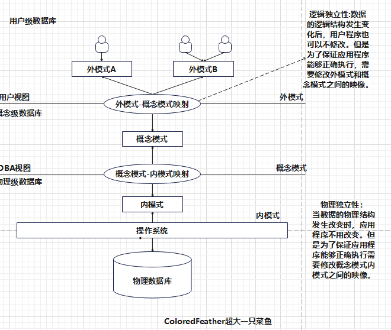
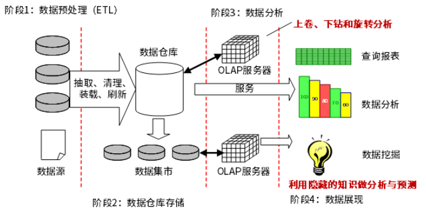
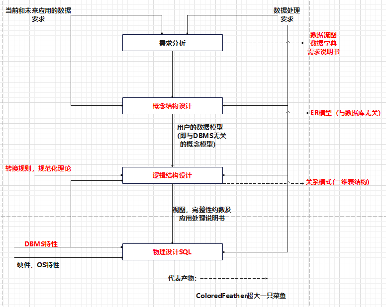
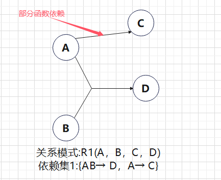
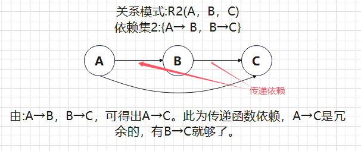
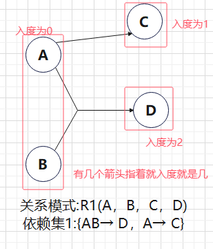
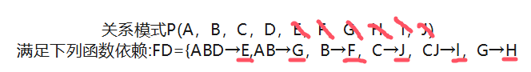
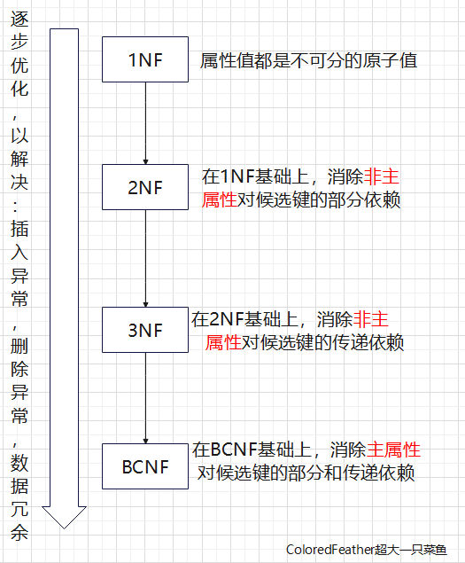
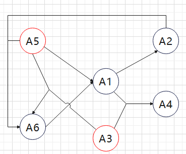
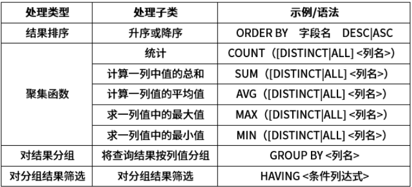

# 【软设】数据库系统

## 一.数据库体系结构

### 1. 集中式数据库

#### (1) 三级模式

简化用户操作,**具体的话就是视图**。

**模式（概念模式）**：定义整个数据库的结构，包括数据类型、关系、约束等，是数据库设计的核心，**具体来说就是数据库中的每一个表**。

**内模式**：描述数据的物理存储结构，涉及文件的存储、索引等细节，**落实到具体就是每一个具体的文件**。

**举个简单的例子：外模式可以是销售部门查看的销售报告视图，模式定义销售数据的表结构，内模式则涉及如何在磁盘上存储这些表。**

#### (2) 两层映像

**外模式-模式映像**：将外部用户视图与数据库模式连接，**保证用户程序对外模式的调用不受模式变化的影响。**

**模式-内模式映像**：将数据库模式与内模式连接，**使得物理存储的变化不会影响逻辑结构。**

#### (3) 逻辑独立性

逻辑结构的变化不需要用户程序的修改，提升了系统的灵活性和可维护性。

举个例子： 假设图书馆的管理系统最初设计时，书籍的分类是根据ISBN号码来进行的。随着时间的推移，图书馆决定采用更为通用的Dewey Decimal Classification（杜威十进制分类法）来重新分类书籍。也就是说尽管书籍的分类方法（逻辑结构）发生了变化，但是使用该系统的用户（比如图书管理员和读者）并不需要修改他们操作系统的程序或界面。系统设计者可以在后台更改分类逻辑，而用户界面和操作流程保持不变。这样，系统的灵活性和可维护性得到了提升，因为逻辑结构的变化没有影响到用户层面的操作。

#### (4) 物理独立性

内部存储结构的变化对用户的逻辑结构无影响，便于系统优化。

举个例子：图书馆的书籍数据最初存储在一台服务器的硬盘上。随着时间的推移，图书馆决定升级存储设备，将数据迁移到更快速、更可靠的固态硬盘上。也就是说尽管书籍数据的存储介质（物理结构）发生了变化，但是这一变化对用户的逻辑结构（即用户如何查看和检索书籍信息）没有任何影响。用户仍然可以通过相同的界面和流程来查询和借阅书籍。这种物理存储结构的变化不会影响到用户的使用体验，便于系统进行硬件升级和优化，而无需对用户界面或应用程序进行修改。



### 2. 分布式数据库的透明性

#### (1) 分片透明

用户无须了解数据的分片过程，系统处理数据的分布，应用程序可与集中式数据库相同。

举个例子：用户查询一个包含大量数据的表时，系统会自动将查询拆分到不同的分片上并行执行，用户无需关心数据是如何分片的。当数据量增长时，系统可以自动添加新的分片来提高性能，用户无需修改应用程序。

#### (2) 复制透明

数据在网络中被复制的细节对用户透明，系统自动处理复制数据的更新，保证数据的一致性。

举个例子：在电子商务网站中，订单数据会被复制到多个节点上，以提高读性能和容错性。当用户查询订单信息时，系统会从最近的副本中读取数据，用户无需关心数据的复制过程。当订单数据发生更新时，系统会自动将更新同步到所有副本，保证数据的一致性。

#### (3) 位置透明

用户不需要知道数据的具体存储位置，数据的访问不受存储位置的限制。

举个例子：在云数据库中，数据可以存储在全球各地的不同数据中心。用户在访问数据时，系统会自动选择离用户最近的数据中心，以减少网络延迟。当数据中心发生故障时，系统会自动将请求路由到其他数据中心，保证服务的连续性。

#### (4) 局部映像透明性（逻辑透明）

提供用户与局部数据库之间的映像，使得不同数据模型和操作语言的转换由系统完成，简化用户操作。

举个例子：在异构数据库系统中，不同的数据库可能使用不同的数据模型和查询语言。通过局部映像透明性，用户可以使用统一的接口来访问所有数据库，无需了解底层数据库的差异。

### 3. 分布式数据库特点

**数据独立性**：除了逻辑和物理独立性，还包括数据分布独立性，确保应用程序不受数据分布变化的影响。

**集中与自治共享结合的控制结构**：局部DBMS能够自治，同时又能与集中控制机制协同工作，确保全局应用的协调。

**适当增加数据冗余度**：存储数据的多个副本提高了可靠性和可用性，即使某个结点发生故障，其他副本仍可提供数据。

**全局的一致性、可串行性和可恢复性**：确保分布式系统的操作是安全的，能够在故障后恢复到一致状态。

### 4.（补充）常见的分布式数据库系统与分布式数据库面临的挑战

#### 1. Hadoop HBase

- 特点：
  - **NoSQL数据库**，基于Hadoop的键值存储系统。
  - **大规模稀疏数据存储**，适合海量数据的存储和实时读写。
  - **高可用性**，通过HDFS的冗余机制保证数据可靠性。
  - **水平扩展性**，可以线性扩展以满足不断增长的数据存储需求。
- 优缺点：
  - **优点：** 大规模数据存储、高可用性、低成本。
  - **缺点：** 强一致性支持较弱，复杂的SQL查询性能较差。

#### 2. MongoDB

- 特点：
  - **NoSQL文档型数据库**，使用灵活的JSON格式存储数据。
  - **高性能**，支持丰富的查询操作和索引。
  - **水平扩展性**，可以轻松地增加节点来提高性能。
  - **高可用性**，通过副本集和分片实现数据冗余和故障恢复。
- 优缺点：
  - **优点：** 灵活的数据模型、高性能、易于使用。
  - **缺点：** ACID事务支持有限，大规模数据下的复杂查询性能可能下降。

#### 3. Cassandra

- 特点：
  - **NoSQL列族数据库**，擅长处理大规模结构化和非结构化数据。
  - **高可用性**，通过多副本和故障转移机制保证数据可靠性。
  - **高性能**，支持并发的读写操作。
  - **水平扩展性**，可以线性扩展以满足不断增长的数据存储需求。
- 优缺点：
  - **优点：** 高可用性、高性能、灵活的数据模型。
  - **缺点：** ACID事务支持有限，复杂查询性能较差。

#### 4.其他常见分布式数据库系统

- **TiDB:** 新SQL数据库，兼具关系型数据库的ACID特性和NoSQL数据库的水平扩展能力。
- **CockroachDB:** 新SQL数据库，强调强一致性和高可用性。
- **Amazon DynamoDB:** 全托管NoSQL数据库服务，提供灵活的容量和性能扩展。
- **Google Cloud Spanner:** 全托管的新SQL数据库服务，提供强一致性和全球分布式事务。

| 特点     | HBase          | MongoDB            | Cassandra                  | TiDB       | CockroachDB | DynamoDB           | Spanner        |
| -------- | -------------- | ------------------ | -------------------------- | ---------- | ----------- | ------------------ | -------------- |
| 数据模型 | 键值           | 文档               | 列族                       | 关系型     | 关系型      | 键值               | 关系型         |
| ACID特性 | 弱             | 弱                 | 弱                         | 强         | 强          | 弱                 | 强             |
| 扩展性   | 好             | 好                 | 好                         | 好         | 好          | 好                 | 好             |
| 性能     | 高             | 高                 | 高                         | 高         | 高          | 高                 | 高             |
| 使用场景 | 大规模稀疏数据 | 灵活的应用程序数据 | 大规模结构化和非结构化数据 | OLTP、OLAP | OLTP、OLAP  | 灵活的应用程序数据 | 全球分布式事务 |

#### 5.分布式数据库面临的挑战

- 数据一致性：
  - 如何保证分布在多个节点上的数据的一致性，特别是当网络分区发生时。
  - CAP理论：一致性（Consistency）、可用性（Availability）、分区容忍性（Partition tolerance）三者不可兼得。
- 分布式事务：
  - 如何保证分布式事务的ACID特性，即原子性、一致性、隔离性、持久性。
  - 两阶段提交、三阶段提交等协议存在性能瓶颈和复杂性问题。
- 性能优化：
  - 如何提高分布式数据库的查询性能，特别是对于大规模数据集的查询。
  - 数据分区、索引、查询优化等技术是提高性能的关键。
- 数据管理：
  - 如何管理分布在多个节点上的数据，包括数据的备份、恢复、迁移等。
  - 数据的异构性、分布式锁、全局序列号等问题需要解决。
- 运维复杂性：
  - 分布式数据库的部署、配置、管理比集中式数据库更加复杂。
  - 需要考虑节点故障、网络故障等各种异常情况。

**解决这些挑战**需要采用多种技术和策略，包括：

- **一致性协议：** 两阶段提交、三阶段提交、Paxos、Raft等。
- **数据分区：** Range分区、Hash分区等。
- **副本机制：** 主从复制、多主复制等。
- **分布式锁：** 悲观锁、乐观锁、分布式锁服务等。
- **分布式事务协调器：** ZooKeeper、etcd等。

通过深入研究和实践，可以有效地解决分布式数据库面临的挑战，构建高性能、高可用、可靠的分布式数据库系统。

### 习题

**习题1**

```
数据库系统通常采用三级模式结构:外模式、模式和内模式。这三级模式分别对应数据库的()。
A、基本表、存储文件和视图
B、视图、基本表和存储文件
C、基本表、视图和存储文件
D、视图、存储文件和基本表
```

解析：

```
上面讲过了，外模式对应的是视图，模式对应的是基本表，内模式对应的是存储文件，所以这道题选B。
```


**习题2**

```
采用三级结构/两级映像的数据库体系结构，如果对数据库的一张表创建聚簇索引，改变的是数据库的()。
A、用户模式
B、外模式
C、模式
D、内模式
```

解析：

```
A、用户模式：创建索引不会改变用户对数据的视图，因此不会影响用户模式。
B、外模式：外模式同样是用户对数据的视图，创建索引不会改变用户的视图。
C、模式：模式描述了数据库的逻辑结构，而聚簇索引改变了表的物理存储方式，虽然不影响逻辑结构，但从广义上讲，影响了数据库的整体组织方式，因此可以认为改变了模式。
D、内模式：聚簇索引直接改变了表的物理存储方式，因此必然改变了内模式。所以选D更准确些。
```


**习题3**

```
数据的物理独立性和逻辑独立性分别是通过修改()来完成的。
A、外模式与内模式之间的映像、模式与内模式之间的映像
B、外模式与内模式之间的映像、外模式与模式之间的映像
C、外模式与模式之间的映像、模式与内模式之间的映像
D、模式内模式之间的映像、外模式与模式之间的映像
```

解析：

```
逻辑独立性是由外模式与模式之间的映像，数据的物理独立性是由模式内模式之间的映像，所以本题选D。
```


**习题4**

```
当某一场地故障时，系统可以使用其他场地上的副本而不至于使整个系统瘫痪。这称为分布式数据库的()。
A、共享性
B、自治性
C、可用性
D、分布性
```

解析：

```
正确答案：C、可用性
可用性（Availability）：是指系统能够在规定时间内提供指定功能的能力。在分布式数据库中，通过在多个节点上存储数据的副本，当某个节点发生故障时，系统可以从其他节点获取数据，从而保证系统的持续可用性。

A、共享性：强调的是数据在多个站点之间的共享，与故障转移和可用性关系不大。
B、自治性：指每个站点在一定程度上具有独立管理的能力，与整体系统的可用性关系不大。
D、分布性：是分布式数据库的一个基本特征，指数据分布在多个节点上，但不能直接等同于系统的可用性。

当某一场地故障时，系统可以切换到其他场地上的副本，保证服务不中断，这正是分布式数据库高可用性的体现。通过冗余和故障转移机制，分布式数据库可以提高系统的可靠性，避免单点故障。
```


**习题5**

```
在分布式数据库中有分片透明、复制透明、位置透明和逻辑透明等基本概念，其中(1)是指局部数据模型透明，即用户或应用程序无需知道局部使用的是哪种数据模型;(2)是指用户
或应用程序不需要知道逻辑上访问的表具体是如何分块存储的。
```

问题1：

```
A、分片透明   B、复制透明   C、位置透明   D、逻辑透明
```

问题2：

```
A、分片透明   B、复制透明   C、位置透明   D、逻辑透明
```

解析：

```
问题1：
题干描述： 局部数据模型透明，即用户或应用程序无需知道局部使用的是哪种数据模型。
分析： 这个概念强调的是用户对数据模型的感知，即用户不需要关心底层数据存储的具体细节。
答案： D、逻辑透明。逻辑透明是指用户不需要知道分布式数据库系统的内部实现细节，如通信协议、并发控制等，也包括数据模型的细节。

问题2：
题干描述： 用户或应用程序不需要知道逻辑上访问的表具体是如何分块存储的。
分析： 这个概念强调的是用户对数据分片的感知，即用户不需要关心表是如何被分块存储到不同的节点上。
答案： A、分片透明。分片透明是指用户不需要知道数据是如何被分片的，与数据分块存储的透明性最为相关。

逻辑透明：用户不需要关心分布式数据库系统的内部实现细节，包括数据模型。
分片透明：用户不需要关心数据是如何被分片的。
位置透明：用户不需要知道数据的物理位置。
复制透明：用户不需要知道数据是如何被复制的。
反正就是你什么透明就是你不需要关心的东西就是了。
所以，两个问题的答案分别是D和A。 
```


**习题6**

```
确定系统边界和关系规范化分别在数据库设计的()阶段进行。
A.需求分析和逻辑设计
B.需求分析和概念设计
C.需求分析和物理设计
D.逻辑设计和概念设计
```

解析：

```
回答：A.需求分析和逻辑设计
系统边界：
系统边界是指系统与外部环境的分界线，即系统内部和外部之间的接口。
确定系统边界 的目的是明确系统需要处理哪些数据，以及与哪些外部系统进行交互。这需要在需求分析阶段与用户充分沟通，了解业务需求，从而确定系统的范围。

关系规范化：
关系规范化是通过分解关系模式来消除数据冗余、提高数据一致性的一种技术。
关系规范化 的目的是保证数据的一致性和完整性，避免数据异常。这个过程通常在逻辑设计阶段进行，即在将概念模型转换为关系模型的过程中。

各选项分析：
A. 需求分析和逻辑设计： 正确。如上所述，确定系统边界在需求分析阶段，而关系规范化在逻辑设计阶段。
B. 需求分析和概念设计： 部分正确。确定系统边界在需求分析阶段是正确的，但概念设计阶段主要关注的是建立一个与具体技术无关的信息世界模型，关系规范化更多的是在逻辑设计阶段考虑的问题。
C. 需求分析和物理设计： 错误。物理设计关注的是如何将逻辑模型映射到具体的物理存储上，与关系规范化无关。
D. 逻辑设计和概念设计： 错误。关系规范化是逻辑设计阶段的任务，而概念设计阶段主要关注的是建立概念模型。
```


**习题7**

```
在数据库概念结构设计阶段，需要(1)阶段形成的(2)作为设计依据。
```

问题1：

```
A.需求分析     B.逻辑结构设计      C.物理结构设计     D.数据库运行和维护
```

问题2：

```
A.程序文档、数据字典和数据流图。
B.需求说明文档、程序文档和数据流图
C.需求说明文档、数据字典和数据流图
D.需求说明文档、数据字典和程序文档
```

解析：

```
问题1：A.需求分析
概念结构设计是基于用户需求，将现实世界中的信息抽象为信息世界模型的过程。因此，需求分析阶段产生的需求说明是最直接的设计依据。

问题2：C.需求说明文档、数据字典和数据流图
需求说明文档： 详细描述了系统的功能、性能、约束等需求，是概念模型的核心依据。
数据字典： 描述了系统中所有数据元素的定义、含义、取值范围等，为概念模型提供详细的数据定义。
数据流图： 描述了数据在系统中的流动和处理过程，有助于理解系统的业务流程，为概念模型提供动态视图。
```


## 二.数据仓库

（简单记一下数据仓库的特点就可以了，这个不是很重要）

### 1.什么是数据仓库？

数据仓库（Data Warehouse）是一个面向主题的、集成的、时变的、非易失性的数据集合，用于支持管理人员的决策。简单来说，它是一个为分析和决策而优化的数据库。



### 2.数据仓库的特点

- **面向主题：** 数据仓库围绕特定的业务主题组织数据，例如销售、财务、客户等，方便用户针对特定主题进行分析。
- **集成：** 将来自多个数据源的数据整合到一个统一的存储中，消除数据冗余和不一致性。
- **时变的：** 数据仓库存储历史数据，以便进行趋势分析和预测。
- **非易失性：** 数据一旦进入数据仓库，通常不会被修改或删除，以保证数据的完整性和一致性。

### 3.数据仓库的架构

- **数据源：** 包括各种类型的数据库、文件、日志等。
- **ETL过程：** Extract（抽取）、Transform（转换）、Load（加载）的过程，将数据从源系统抽取出来，进行清洗、转换、集成，然后加载到数据仓库中。
- **数据仓库：** 存储经过处理的、面向主题的数据。
- **数据超市：** 针对特定业务部门或用户群创建的数据子集，提供更细粒度的数据分析。
- **OLAP服务器：** 提供在线分析处理功能，支持复杂的查询和分析。
- **数据挖掘工具：** 从数据中挖掘出潜在的模式、趋势和规则。
- **前端工具：** 提供用户友好的界面，支持用户进行数据查询、分析和可视化。

### 4.数据仓库的应用

- **商业智能：** 通过数据分析，帮助企业了解市场趋势、客户行为、竞争对手情况等，支持决策。
- **数据挖掘：** 发现数据中的隐藏知识，如关联规则、分类、聚类等。
- **绩效管理：** 跟踪和评估企业绩效，发现问题并提出改进建议。
- **风险管理：** 识别潜在风险，制定应对措施。

### 5.数据仓库与传统数据库的区别

| 特征         | 传统数据库           | 数据仓库             |
| ------------ | -------------------- | -------------------- |
| 目的         | 事务处理             | 分析决策             |
| 数据         | 当前数据             | 历史数据             |
| 访问方式     | 联机事务处理（OLTP） | 联机分析处理（OLAP） |
| 查询类型     | 简单查询             | 复杂查询             |
| 数据更新频率 | 高                   | 低                   |
| 数据量       | 相对较小             | 相对较大             |

### 6.数据仓库的建设

- **需求分析：** 明确业务需求，确定数据仓库的范围和目标。
- **概念设计：** 建立业务概念模型，定义数据仓库的主题、维度和度量。
- **逻辑设计：** 将概念模型转换为逻辑模型，确定表的结构和关系。
- **物理设计：** 确定数据的物理存储方式，包括分区、索引等。
- **数据加载：** 将数据从源系统加载到数据仓库中。
- **元数据管理：** 管理数据仓库中的元数据，包括数据来源、结构、质量等信息。

数据仓库作为企业的数据资产，为决策提供有力支持。通过构建数据仓库，企业可以更好地了解业务状况，提高决策效率，挖掘商业价值。

## 三.数据库设计过程

### 1. 需求分析

在这一阶段，主要目标是理解用户的需求，包括数据存储、处理和查询的要求。通过与用户的沟通，识别数据维度和处理需求。

- **活动**：
  - 收集用户需求
  - 分析数据流和处理过程
  - 确定数据的来源和去向
- **产物**：
  - **数据流图（DFD）**：可视化数据流动和处理过程。
  - **数据字典**：包含数据项的定义、类型和用途的详细说明。
  - **需求说明书**：概述用户需求、功能要求和系统约束的文档。

### 2. 概念结构设计

这一阶段基于需求分析的结果，进行概念结构设计，主要目的是创建一个高层次的模型，描述数据的基本结构和关系。

- **活动**：
  - 确定实体、属性和关系
  - 创建ER图（实体-关系图）
- **产物**：
  - **ER模型**：图形化表示数据实体、它们的属性以及实体之间的关系，帮助开发团队理解数据结构。

### 3. 逻辑结构设计

在此阶段，基于概念结构设计的ER模型，进行逻辑结构设计，目的是将概念模型转化为数据库能够实现的逻辑结构。

- **活动**：
  - 应用规范化理论，消除数据冗余
  - 确定数据类型、约束和索引
  - 选择合适的数据模型
- **产物**：
  - 数据模型：具体的逻辑设计，可能包括：
    - **关系模式**：表示为二维表，包括表名、字段名、数据类型及约束。
    - **对象模型**：定义对象的属性和方法，适用于对象数据库。

### 4. 物理结构设计

这一阶段将逻辑结构转化为物理存储结构，以优化性能。

- **活动**：

  - 选择存储设备和数据库管理系统（DBMS）

    设计物理文件的存储结构

    确定索引策略和数据访问路径

- **产物**：

  - **物理模型**：描述数据的实际存储方式，包括文件结构、索引和存储路径。

### 5. 实施与测试

在这一阶段，设计被转化为实际数据库，并进行测试以确保系统满足需求。

- **活动**：
  - 数据库创建与配置
  - 数据导入和测试
  - 性能优化
- **产物**：
  - **数据库实例**：实际创建并配置的数据库，包含所有数据和结构。
  - **测试报告**：记录测试结果，确保系统性能和稳定性。

### 6. 维护

数据库投入使用后，需要进行日常的维护和更新，以应对用户需求变化和技术升级。

- **活动**：
  - 定期备份与恢复
  - 监控性能和安全性
  - 数据库升级与调整
- **产物**：
  - **维护文档**：记录维护过程、更新和改进的细节。

图示：



### 总结

简单总结一下各阶段：

**需求分析:数据流图、数据自定、需求说明书。**

**概念结构设计过程:ER模型。**

**逻辑结构设计过程:获得产物数据模型，典型的数据模型有关系模式、对象模型等，其中关系模式可以理解为二维表。**

这里面最重要的是E-R图，后面详细的内容会在大题部分讲到。

### 四.代数关系

### 1. 并 ∪

- **定义**：将两个关系的元组合并，并去除重复行。
- 例子：
  - 表A: { (1, "Alice"), (2, "Bob") }
  - 表B: { (2, "Bob"), (3, "Charlie") }
  - **A ∪ B 的结果**：{ (1, "Alice"), (2, "Bob"), (3, "Charlie") }

### 2. 交 ∩

- **定义**：返回两个关系中重复的元组。
- 例子：
  - 表A: { (1, "Alice"), (2, "Bob") }
  - 表B: { (2, "Bob"), (3, "Charlie") }
  - **A ∩ B 的结果**：{ (2, "Bob") }

### 3. 差 −

- **定义**：返回前一个关系中去除与后一个关系相同的元组。
- 例子：
  - 表A: { (1, "Alice"), (2, "Bob") }
  - 表B: { (2, "Bob"), (3, "Charlie") }
  - **A − B 的结果**：{ (1, "Alice") }

### 4. 笛卡尔积 ×

- **定义**：返回两个关系的所有元组组合，结果的列数为两个关系的属性列数之和，行数为两个关系的元组行数的乘积。
- 例子：
  - 表A: { (1, "Alice") }
  - 表B: { (2, "Bob"), (3, "Charlie") }
  - **A × B 的结果**：{ (1, "Alice", 2, "Bob"), (1, "Alice", 3, "Charlie") }

### 5. 投影 π

- **定义**：从关系中选择特定的属性列。
- 例子：
  - 表A: { (1, "Alice"), (2, "Bob") }
  - 投影属性：选择第1列
  - **π_1(A) 的结果**：{ (1), (2) }

### 6. 选择 σ

- **定义**：从关系中筛选符合特定条件的元组。
- 例子：
  - 表A: { (1, "Alice"), (2, "Bob") }
  - 条件：选择名字为"Alice"的元组
  - **σ(name="Alice")(A) 的结果**：{ (1, "Alice") }

### 7. 自然连接 ⋈

- **定义**：返回两个关系中同名属性列值相同的元组，结果的列数为两者属性列数之和减去重复列。
- 例子：
  - 表A: { (1, "Alice", 101), (2, "Bob", 102) }
  - 表B: { (1, "Alice", "A"), (2, "Charlie", "B") }
  - **A ⋈ B 的结果**：{ (1, "Alice", 101, "A") }

**连接条件：** 自然连接是基于两个关系中具有相同属性名的列进行连接的，连接条件是这些同名属性的值相等。

**重复列：** 在自然连接的结果中，重复的列通常只保留一列，这是为了避免冗余。

## 五.规范化理论

规范化理论是关系数据库设计中的一套方法论，其目标是通过对关系模式进行分解，消除数据冗余、插入异常、删除异常和更新异常，从而达到数据一致性和完整性的目的。

### 1.非规范化存在的问题

当关系模式不满足规范化要求时，会出现以下问题：

- **数据冗余：** 相同的数据在多个地方重复存储，浪费存储空间，增加数据维护的复杂性。
- **插入异常：** 无法为部分依赖的属性插入新元组。
- **删除异常：** 删除一个元组可能导致其他相关数据的丢失。
- **更新异常：** 更新一个属性值时，需要更新多个元组，容易产生不一致。

### 2.规范化过程

#### 2.1 部分函数依赖和传递函数依赖

##### 2.1.1 部分函数依赖

在正式开始之前首先你要先弄懂什么是主键，主属性和非主属性，就举下面这个例子关系模式:R1(A，B，C，D)，依赖集1:{AB→ D，A→ C}里

**主键：AB**。因为根据函数依赖，AB可以唯一确定D和C，满足主键的定义（唯一标识一条记录）。

**主属性：A，B**。它们是组成主键AB的属性。

**非主属性：C，D**。它们不属于主键，但依赖于主键。

因为A单独能推出C，所以存在部分函数依赖。为了消除可以分解成

- **R2(A, C):** 包含属性A和C，表示A决定C。
- **R3(AB, D):** 包含属性AB和D，表示AB决定D。



##### 2.1.2 传递依赖

举个例子比如说有关系模式R2(A,B,C)，依赖集{A→ B，B→C}，里面就存在传递依赖A→C，A→C是冗余的。属性C可以通过A间接得到，它的存在使得关系模式中包含了冗余信息。为了解决传递依赖引起的问题，通常需要对关系模式进行分解，使其满足更高的范式，如第三范式。在这个例子中，可以将关系R2分解为两个关系：R1(A, B)，R2(B, C)，不过这个要后面才懂了。



#### 2.2 Armstrong公理

Armstrong公理是一组推理规则，用于在关系数据库中推导出新的函数依赖。这些规则基于已知的函数依赖，帮助我们更深入地理解数据之间的关系，从而进行更合理的关系模式设计。

##### 2.2.1 Armstrong公理的三个基本规则

1. **自反律 (Reflexivity):**
   - 如果Y是X的子集，那么X→Y，毕竟Y本来就是属于X的东西，所以X能推出来Y也很正常。
   - **例子：** 如果属性集{A, B}包含属性A，那么{A, B}→A。
   - **含义：** 一个属性集总是决定其自身的子集。
2. **增广律 (Augmentation):**
   - 如果X→Y，那么XZ→YZ，两边都加个Z，很正常。
   - **例子：** 如果{A}→{B}，那么{A, C}→{B, C}。
   - **含义：** 在一个函数依赖的两侧同时增加相同的属性集，函数依赖仍然成立。
3. **传递律 (Transitivity):**
   - 如果X→Y且Y→Z，那么X→Z。
   - **例子：** 如果{A}→{B}且{B}→{C}，那么{A}→{C}。
   - **含义：** 如果X决定Y，Y决定Z，那么X也决定Z。

##### 2.2.2 从基本规则推导出的其他规则

除了这三个基本规则，还有一些其他重要的规则可以从它们推导出来：

- **合并规则:** 如果X→Y且X→Z，那么X→YZ。
- **伪传递规则:** 如果X→Y且WY→Z，那么XW→Z。
- **分解规则:** 如果X→Y且Z⊆Y，那么X→Z。

##### 2.2.3 Armstrong公理的应用

- **函数依赖的闭包:** 给定一组函数依赖，我们可以利用Armstrong公理推导出所有可以从这些函数依赖中得到的函数依赖，这个集合称为函数依赖的闭包。
- **关系模式的设计:** 在设计关系模式时，我们可以利用Armstrong公理来分析函数依赖，发现潜在的冗余和异常，从而设计出更合理的关系模式。
- **范式理论:** Armstrong公理是范式理论的基础，通过分析函数依赖，我们可以判断关系模式是否满足不同的范式，从而评估关系模式的质量。

**举例**

假设我们有一个关系模式R(A, B, C, D)，且已知函数依赖集F={A→B, B→C}。

- **根据自反律：** A→A，B→B，C→C，D→D。
- **根据增广律：** AC→BC，AB→BC。
- **根据传递律：** A→C。

#### 2.3 规范化过程

首先还是要说一下，主键，主属性和非主属性的问题：

1、将关系模式的函数依赖关系用“有向图”的方式表示。(建议不做)，图画出来的话会容易看很多，但其实不是很方便。



2、找入度为0的所有属性，并以该属性集合为起点，尝试遍历有向图，若能正常遍历图中所有结点，则该属性集即为关系模式的候选键。

注意:不能被其他属性推导的属性，就是入度为0的属性。



3、若入度为0的属性集不能遍历图中所有结点，则需要尝试性的将一些中间结点(既有入度，也有出度的结点)并且入度为0的属性集中，直至该集合能遍历所有结点，此时的属性集合为候选键。F={A1→A2，A2→A3，A2→A4]

##### 1.第一范式（1NF）

- 每个属性都是不可分割的原子值。
- 每一行都是唯一的。
- 每一列都有一个唯一的名称。

##### 2.第二范式（2NF）

- 满足1NF。
- 每个非主属性完全函数依赖于候选键。

##### 3.第三范式（3NF）

- 满足2NF。
- 每个非主属性不传递依赖于候选键。

##### 4.巴斯-科德范式（BCNF）

- 满足3NF。
- 对于关系中的每一个函数依赖X→Y，X必须是候选键。



**示例：**

假设有一个关系STUDENT，包含属性SNO（学号）、SNAME（姓名）、CNO（课程号）、GRADE（成绩）。如果存在函数依赖SNO→SNAME，SNO,CNO→GRADE，则该关系不满足3NF，因为GRADE传递依赖于SNO。可以将该关系分解为两个关系：

- STUDENT(SNO, SNAME)
- SC(SNO, CNO, GRADE)

这样，就消除了传递依赖，满足了3NF。

### 3.模式分解

当一个关系不满足高阶范式时，需要对其进行分解，将一个关系分解为多个关系，使得每个分解后的关系都满足更高的范式。

- **无损连接分解：** 分解后的关系的自然连接等于原来的关系。
- **依赖保持分解：** 分解后的关系能够保持原来的函数依赖。

### 4.规范化的优缺点

- 优点：
  - 减少数据冗余，节省存储空间。
  - 提高数据一致性，减少异常。
  - 简化数据库设计和维护。
- 缺点：
  - 增加了查询的复杂性，可能需要连接多个表才能获取完整信息。
  - 过度规范化可能导致系统性能下降。

### 习题

**例题1**

```
给定关系R(U，Fr)，其中，属性集U={A，B，C，D}，函数依赖集Fr={A→BC，B→D};关系S(U，Fs)其中，属性集U={A，C，E}，函数依赖集Fs={A→C，C→E}。R和S的主键分别为(1)。关于Fr和Fs的叙述，正确的是(2)。
```

问题1：

```
A.A、A     B.AB、A     C.A、AC     D.AB、AC
```

问题2：

```
A.Fr蕴含A→B、A→C，但Fr不存在传递依赖
B.FS蕴含A→E，Fs存在传递依赖，但Fr不存在传递依赖
C.Fr、FS分别蕴含A→D，A→E，故Fr、Fs都存在传递依赖
D.Fr蕴含A→D，Fr存在传递依赖，但是Fs不存在传递依赖
```

解析：

```
答案是A,C
在给定关系R(U，Fr)，其中，属性集U={A，B，C，D}，有函数依赖集Fr,Fr={A→BC，B→D},由其关系可得A本身可以推出B,B可以推出D，也就是A可以推出D，A一个元素就可以推出其他三个元素了，且入度为0，所以R的主键是A，但是在Fr中存在传递依赖A推导D。在关系S(U，Fs)其中，属性集U={A，C，E}，有函数依赖集Fs={A→C，C→E}，A可以推出C，C可以推出E，存在传递依赖A可以推出E，所以Fs也存在传递依赖。
```


**例题2**

```
设有关系模式R(A1，A2，A3，A4，A5，A6)，其中:函数依赖集F={A1→A2，A1A3→A4，A5A6→A1，A2A5→A6，A3A5→A6)，则(1)是关系模式R的一个主键，R规范化程度最高达到(2)。
```

问题1：

```
A.A1A4     B.A2A4     C.A3A5     D.A4A5
```

问题2：

```
A.1NF     B.2NF     C.3NF     D.BCNF
```

解析：

画个图会容易看很多：



从图中可以看到只有A3和A5的入度为0，所以A3A5是关系模式R的一个主键，A3和A5是主属性，其他的是非主属性。所以第一题选C.A3A5。所有属性完全依赖于候选键A3A5，该关系模式满足2NF,因为存在A1单独推出A2，可A5A6可以推出A1，所以存在A5A6推出A2的传递依赖，所以不满足3NF所以第二空选B。

具体一点如下：

```
1. 确定主键
首先，找出关系模式R的候选键。我们可以通过分析函数依赖来找到主键。

函数依赖集F：
A1→A2
A1A3→A4
A5A6→A1
A2A5→A6
A3A5→A6

通过推导，可以得到：

从 A5A6 可以推导出 A1。
从 A1 可以推导出 A2。
从 A1A3 可以推导出 A4。
通过 A5 和 A6 可以推导出 A2、A4。

因此，候选键可以是 A5A6，因为它能够通过函数依赖推导出其他所有属性。

所以，答案1是 C. A3A5 不是主键，A. A1A4 也不是，最小的主键是 A5A6，不过选项里没有直接的选项。

2. 规范化程度
关系模式R的规范化程度取决于其函数依赖和主键。判断R的规范化程度：

1NF：无重复组和多值属性。
2NF：消除了部分依赖，即所有非主属性完全依赖于主键。
3NF：消除了传递依赖，即非主属性不依赖于其他非主属性。
BCNF：每个非平凡的函数依赖X→Y，X是超键。

所有属性完全依赖于候选键A3A5，该关系模式满足2NF,因为存在A1单独推出A2，可A5A6可以推出A1，所以存在A5A6推出A2的传递依赖，所以不满足3NF。

因此，最高规范化程度是 2NF。

所以，答案2是 B. 2NF。
```

### 总结

规范化理论是关系数据库设计的重要基础，通过规范化可以提高数据库的质量和性能。但在实际应用中，需要综合考虑系统的具体需求，选择合适的规范化程度。过度的规范化可能会导致系统性能下降，而过低的规范化又会带来数据冗余和异常的问题。

**注意：**

- 规范化不是万能的，在某些情况下，为了提高性能，可能需要适当放松规范化要求。
- 规范化是一个迭代的过程，可能需要多次调整和优化。
- 除了规范化，还需要考虑其他因素，如数据分布、查询模式等，来设计数据库。

## 六.SQL语言

(如果学过一门常见SQL语句比如说MySQL，理解起来就会方便很多)

### 1.SQL 查询语句概述

SQL（Structured Query Language）是用于与数据库交互的语言。基本的查询语句格式如下：

```mysql
SELECT [ALL | DISTINCT] <目标表达式>[, <目标表达式>]
FROM <表名>[, <表名>]..
[WHERE <条件表达式>]
[ORDER BY <列名>[ASC | DESC]];
```

**SELECT**：指定要查询的列。

**ALL**：返回所有记录（默认）。

**DISTINCT**：去除重复记录。

**FROM**：指定要查询的表。

**WHERE**：筛选条件。

**ORDER BY**：指定排序列，ASC为升序，DESC为降序。

### 2.分组查询

分组查询的基本格式如下：

```mysql
SELECT <目标表达式>
FROM <表名>
[WHERE <条件表达式>]
GROUP BY <列名1>[, <列名2>...]
[HAVING <条件表达式>];
```

**GROUP BY**：将结果按指定列分组。

**HAVING**：在分组后对结果进行筛选。



### 3.权限控制语句

权限控制用于管理用户对数据库对象的访问权限。常见的权限控制语句包括：

```mysql
GRANT <权限> ON <对象> TO <用户>;
REVOKE <权限> ON <对象> FROM <用户>;
```

**GRANT**：授予用户权限。

**REVOKE**：撤销用户权限。

### 4.示例

比如说有一个学生表如下：

**表名**：`students`
**字段**：

- `id`（学生ID，整数）
- `name`（学生姓名，字符串）
- `age`（学生年龄，整数）
- `class`（班级，字符串）

例题1：查询所有学生的姓名和年龄，但只返回不重复的记录，并按姓名升序排序。

```mysql
SELECT DISTINCT name, age
FROM students
WHERE age > 18
ORDER BY name ASC;
```

例题2：统计每个班级的学生数量，并只返回学生数量超过5的班级。

```mysql
SELECT class, COUNT(*) AS student_count
FROM students
GROUP BY class
HAVING student_count > 5;
```

例题3：计算所有学生的平均年龄，并返回结果。

```mysql
SELECT AVG(age) AS average_age
FROM students;
```

例题4：授予用户`user1`对`students`表的查询权限。

```mysql
GRANT SELECT ON students TO user1;
```

例题5：查询每个班级的最大年龄和最小年龄，并按班级名称排序。

```mysql
SELECT class, MAX(age) AS max_age, MIN(age) AS min_age
FROM students
GROUP BY class
ORDER BY class;
```

（其实我自己一开始学MySQL的时候感觉CURD挺简单的，这里也没有提到索引检索什么的，后面学到理解架构就老实了，不过软设不考）

## 七.并发控制

### 1. 事务特性（ACID）

事务是一个逻辑操作单元，ACID特性保证了事务的可靠性。ACID包含四个基本特性：

- **原子性（Atomicity）**： 事务要么全部完成，要么全部不执行。即使在发生错误的情况下，系统也会保证事务的状态不会处于部分完成的状态。
- **一致性（Consistency）**： 事务在执行前后，数据库的状态必须保持一致。任何事务的执行都必须使数据库从一个一致状态转换到另一个一致状态。
- **隔离性（Isolation）**： 事务之间的执行互不干扰，即使并发执行，结果也应与顺序执行相同。隔离级别决定了一个事务在对数据进行修改时，其他事务能否看到这些修改。
- **持久性（Durability）**： 一旦事务提交，其对数据库的改变是永久性的，即使系统崩溃也不会丢失。

### 2. 并发问题

并发控制是为了保证在多个事务并发执行时，数据库的一致性和完整性。并发执行可能会引发以下问题：

#### 2.1 脏读

**脏读（Dirty Read）**： 事务A读取了事务B尚未提交的数据，如果B回滚，A读取到的数据是无效的。

| 事务A               | 事务B |
| ------------------- | ----- |
| 开始                |       |
| 更新账户余额为500元 | 开始  |
|                     | 提交  |
|                     | 回滚  |
| 读取账户余额        |       |

- **脏读情况**：事务A读取了事务B尚未提交的更新（余额500元），如果事务B回滚，事务A读取到的数据是无效的。

------

#### 2.2 不可重复读示例

**不可重复读（Non-repeatable Read）**： 事务A在执行过程中多次读取同一数据，但在两次读取之间，事务B修改并提交了数据，导致A的结果不一致。

| 事务A                  | 事务B               |
| ---------------------- | ------------------- |
| 开始                   |                     |
| 读取账户余额（1000元） | 开始                |
|                        | 更新账户余额为800元 |
|                        | 提交                |
| 读取账户余额           |                     |

- **不可重复读情况**：事务A在两次读取账户余额时，第一次读取到1000元，第二次读取时余额已被事务B更新为800元，导致不一致。

------

#### 2.3 幻读示例

**幻读（Phantom Read）**： 事务A在查询数据时，事务B插入了新数据并提交，导致A再次查询时返回不同的结果。

| 事务A                   | 事务B                  |
| ----------------------- | ---------------------- |
| 开始                    |                        |
| 查询账户（返回0条）     | 开始                   |
|                         | 插入新账户（账户ID=1） |
|                         | 提交                   |
| 再次查询账户（返回1条） |                        |

- **幻读情况**：事务A第一次查询没有找到任何账户（0条记录），但在第二次查询时发现了事务B插入的新账户（1条记录），这就是幻读。

### 3. 封锁协议

封锁协议用于管理并发事务，确保数据库的一致性和完整性。常见的封锁协议有：

- **共享锁（Shared Lock）**： 允许多个事务读取同一资源，但不允许任何事务对其进行修改。共享锁适用于读取操作。
- **排他锁（Exclusive Lock）**： 允许一个事务对资源进行修改，并阻止其他事务读取或修改该资源。排他锁适用于写入操作。

**封锁协议的两种类型**

1. **两段锁协议（Two-Phase Locking, 2PL）**：
   - **扩展阶段（Growing Phase）**：事务可以获得锁，但不能释放锁。
   - **收缩阶段（Shrinking Phase）**：事务可以释放锁，但不能再获得锁。
   - 这种协议可以保证事务的隔离性，但可能导致死锁。
2. **乐观锁（Optimistic Locking）**：
   - 适用于并发冲突较少的场景。事务在读取数据时不加锁，而在提交时检查数据是否被其他事务修改过。
   - 如果没有修改，事务提交成功；否则，事务回滚并重试。

**简单来讲:**

**共享锁(S锁):若事务T对数据对象A添加了S锁，则只允许T读取A，但不能修改A。并且其他事务只能对A加S锁，不能加X锁。**

**排他锁(X锁):若事务T对数据对象A添加了X锁，则只允许T读取和修改A，其他事务不能再对A加任何锁。**

### 总结

ACID特性确保了数据库事务的可靠性，而并发控制则解决了在多个事务并发执行时可能出现的一致性问题。封锁协议是实现并发控制的常用手段，合理的锁策略能够有效地提高数据库的性能与安全性。
