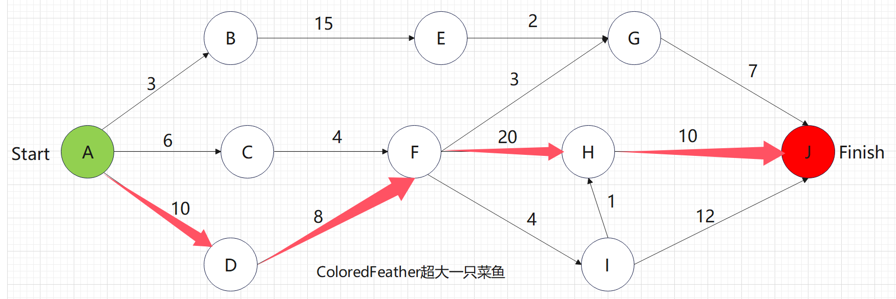

# 【软设】项目管理

**(要会根据Gantt和Pert图求关键路径，可以看3.3的示例来了解Pert图)**

## 一.进度管理

**进度管理** 是项目管理的重要组成部分，旨在确保项目在规定的时间范围内完成。进度管理不仅包括项目活动的规划，还包括监控和控制项目活动的进度，及时应对可能的延误。

### 1. 进度管理的核心过程

- **活动定义**：将项目分解为可管理的活动，确定每个活动的任务和输出。
- **活动排序**：分析活动之间的依赖关系，确定活动执行的顺序。
- **活动资源估算**：估算每个活动所需的资源，包括人力、物资和设备。
- **活动持续时间估算**：根据资源估算和历史数据，确定每个活动的持续时间。
- **进度表开发**：通过网络图、甘特图（Gantt）或其他工具，制定进度计划。
- **进度控制**：持续监控项目的进展，确保项目按计划进行，并在必要时采取纠正措施。

### 2.Gantt 图

**Gantt 图**（甘特图）是项目管理中常用的工具，用于展示项目活动的时间安排。它使用水平条状图来表示任务的开始、结束时间和持续时间。

#### 2.1 Gantt 图的特性

- **横轴**：表示时间，可以是天、周或月。
- **纵轴**：列出项目的活动或任务。
- **条形图**：显示每个活动的开始、结束时间及其持续时间。

#### 2.2 Gantt 图的优点

- 直观展示项目进度，简单易读。
- 易于识别任务的起始和结束时间。

#### 2.3 示例 Gantt 图

| 活动名称 | 开始时间  | 持续时间（天） | 结束时间   |
| -------- | --------- | -------------- | ---------- |
| 确定项目 | 2023/9/8  | 6              | 2023/9/14  |
| 市场考察 | 2023/9/14 | 8              | 2023/9/22  |
| 成本核算 | 2023/9/22 | 6              | 2023/9/28  |
| 数据分析 | 2023/9/28 | 5              | 2023/10/3  |
| 编写方案 | 2023/10/3 | 6              | 2023/10/9  |
| 提交审批 | 2023/10/9 | 3              | 2023/10/12 |

### 3.PERT 图

**PERT 图**（Program Evaluation and Review Technique，程序评估与审查技术）是用于项目规划和控制的网络图工具，适用于复杂的项目。它通过图形化的方式展示任务之间的依赖关系，并估算项目的最早完成时间。

#### 3.1 PERT 图的特性

- **节点**：表示项目中的活动。
- **箭头**：表示活动之间的依赖关系。
- **估算时间**：采用三点估算法，包括乐观时间、最可能时间和悲观时间，来计算活动的期望持续时间。

补充：

#### 3.2 求关键路径和任务的时间浮动空间

在 PERT 图中，进行项目的进度管理时，通常会使用两种关键的时间参数来评估项目的进度：**最早开始时间（ES）** 和 **最晚结束时间（LF）**。这两种时间是通过 **正向计算** 和 **反向计算** 来获得的。

1. **正向找最大值（最早时间）**
   - 正向计算用于求出每个节点的最早开始时间（ES）和最早结束时间（EF）。
   - 正向计算从项目的开始节点出发，逐步往前推进。每个节点的最早开始时间取决于前面节点的最早结束时间，而最早结束时间则是最早开始时间加上该活动的持续时间。
   - 规则：对于每个节点的最早开始时间，要选择前置节点中最大的最早结束时间作为当前节点的最早开始时间。
2. **反向找最小值（最晚时间）**
   - 反向计算用于求出每个节点的最晚开始时间（LS）和最晚结束时间（LF）。
   - 反向计算从项目的结束节点开始，逐步往回倒推。每个节点的最晚结束时间取决于后续节点的最晚开始时间，而最晚开始时间则是最晚结束时间减去该活动的持续时间。
   - 规则：对于每个节点的最晚结束时间，要选择后继节点中最小的最晚开始时间作为当前节点的最晚结束时间。

##### 3.2.1 具体求法解释

###### 正向找最大值（最早开始时间和最早结束时间）

- 从起点开始进行正向计算。
- 例如从节点 `A` 开始，`A` 的最早开始时间为 0，持续时间为 5 天，则最早结束时间为 `0 + 5 = 5`。
- 然后向下一个节点推进，例如从 `A` 到 `B` 的活动，`B` 的最早开始时间为 `A` 的最早结束时间，即 5。`B` 的活动持续时间为 7 天，则 `B` 的最早结束时间为 `5 + 7 = 13`。
- 继续往后直到结束节点，记录下每个节点的最早开始和最早结束时间。

###### 反向找最小值（最晚开始时间和最晚结束时间）

- 从终点 `H` 开始进行反向计算。
- `H` 的最晚结束时间等于项目的总工期，比如这里为 48 天。
- 然后向前推进，例如 `H` 到 `F`，则 `F` 的最晚结束时间为 `H` 的最晚开始时间减去 `H` 到 `F` 的持续时间，即 `48 - 10 = 38` 天。
- 继续往前，直到回到起始节点。

##### 3.2.2 图中正向和反向求解过程

### 

##### 3.2.2.1 正向找最大值（ES 和 EF）

- **A**：最早开始时间 0，持续 5，最早结束时间 5。
- **B**：最早开始时间 5，持续 2，最早结束时间 7。
- **C**：最早开始时间 5，持续 8，最早结束时间 13。
- **D**：最早开始时间 13，持续 10，最早结束时间 23。
- **E**：最早开始时间 13，持续 5，最早结束时间 18。
- **F**：最早开始时间 23，持续 10，最早结束时间 33。
- **G**：最早开始时间 23，持续 15，最早结束时间 38。
- **H**：最早开始时间 38，持续 10，最早结束时间 48。
- 所求关键路径A,C,D,G,H。

##### 3.2.2.2 反向找最小值（LS 和 LF）

- **H**：最晚结束时间 48，最晚开始时间 38。
- **F**：最晚结束时间 38，最晚开始时间 28。
- **D**：最晚结束时间 23，最晚开始时间 13。
- **E**：最晚结束时间 23，最晚开始时间 18。
- **G**：最晚结束时间 38，最晚开始时间 23。
- **C**：最晚结束时间 13，最晚开始时间 5。
- **B**：最晚结束时间 13，最晚开始时间 11。
- **A**：最晚结束时间 5，最晚开始时间 0。
- 倒过来找就是了，反向找最小基本总时差除了开头就不能有，不能闲着。

##### 3.2.2.3 穷举法与工期是否可推迟理解

**如果是在做选择题的话要求关键路径，找那个最大的先试一下，看看所给的题干能不能拼凑出来这条路径，注意一定是要连续的，不能断的，别东一块西一块的，一定是要一条从头到尾完整的路径。具体可以看3.3示例，写的很完整不懂一定要看。**

#### 3.3 示例 PERT 图

**PERT 图有很多种，但核心求解的方法都是一样的，比如下图是一个软件项目的活动图，其中顶点表示项目里程碑，连接顶点的边表示包含的活动，边上的权重表示活动的持续时间(天)，则关键路径长度为( 1 )天。在该活动图中，活动( 2 )晚16天开始不会影响工期。**

1. **A、20         B、25          C、27         D、48**

2. **A、AC         B、BE         C、FI           D、IH**

**解析：像第一空是选择的话来求关键路径的话其实很好解题，你可以在选项里面找那个最大的，然后看图能不能有路径能拼出来这个数，如果可以那就是这个选项没错了。如下图所示：**

**可以得出关键路径10+8+20+10=48，所以选D。**

**第二个空根据上图，在红色路径上的就不能延期，如果没有就有延期的可能，AC,DF,FH,IH，关键路径是48天。走AC的话在F点与关键路径有交汇，需在18天内完成，但是如果AC延迟16天，那么A到关键点F就需要6+4+16=26,超过了18天，A排除。走BE，最终交汇点会在J上，总关键路径为48天，而从A到B到E到G到J需要3+15+2+7=27天，如果延迟16天即27+16=43天小于48天，所以BE推迟16天开始不会影响工期。FI和IH一样，如果是IH关键路径是20，而从F到I到H需要5天，只能推迟15天工期，不能推迟20天，而如果在J汇合，走FIHJ，关键路径是30，而走FIHJ需要15天，所以也只能推迟15天工期，走FIJ只能推迟14天。**

**所求关键路径即是完成整个流程所需的最短时间，关键路径上的流程不可延迟开工，否则会影响整个项目的进度。那为什么其他的流程就可以延期呢？举个例子，比如下图的A,D,F和A,C,F，因为两者聚焦点都是F的驱动，如果C和D没有完成则无法进行F任务，而因为DF是在关键路径上的，而CF不是，完成ADF需要18天，而完成ACF只需要10天，可以剩下来8天，那么即便推迟8天再开工也不会影响整个项目的进度，只要赶得上就可以了，这便是判断能否拖延施工而影响工期的一个办法。**

**如果看不懂我换个表达：**

PERT 图的关键路径求解是通过计算每个路径的持续时间，从而找到最长的路径，因为该路径上的所有活动没有任何时间浮动，任何延迟都会影响项目的总工期。如下图所示，该图是一个软件项目的活动图，其中顶点表示项目的里程碑，边表示活动，边上的权重表示活动的持续时间（天）。关键路径的总长度为 **48 天**。

在该活动图中，活动 **BE** 可以延迟 **16 天** 而不会影响项目的总工期。

**关键路径分析**

1. **关键路径**：关键路径是图中路径总持续时间最长的一条路径。通过计算每条路径的持续时间：
   - 路径 ACDFHJ 的总持续时间为 6 + 4 + 8 + 20 + 10 = **48 天**。
   - 路径 BEGJ 的总持续时间为 3 + 15 + 2 + 7 = **27 天**。
   - 路径 FIHJ 的总持续时间为 4 + 1 + 20 + 10 = **35 天**。
2. **结论**：
   - 关键路径是 ACDFHJ，持续时间为 **48 天**。
   - 活动 **BE**（路径 BEGJ）最早完成的时间是 27 天。因此，**BE** 可以最多延迟 48 - 27 = **16 天** 而不影响工期。

### 4.对比

|     特性     | Gantt 图                                                     | PERT 图                                                      |
| :----------: | ------------------------------------------------------------ | ------------------------------------------------------------ |
|   **用途**   | 进度计划和任务时间安排                                       | 任务依赖关系分析和关键路径分析                               |
|  **复杂性**  | 简单易用，适合小型项目                                       | 适合大型复杂项目，依赖关系更复杂                             |
| **显示内容** | 任务的时间安排和持续时间                                     | 活动的依赖关系和关键路径                                     |
|   **优点**   | **Gantt图能够清晰地描述每个任务从何时开始，到何时结束，任务的进程情况以及各个任务之间的并行关系。** | **PERT图不仅给出了每个任务的开始时间、结束时间和完成该任务所需的时间，还给出了任务之间的关系，即哪些任务完成之后才能开始另外的一些任务，以及如期完成整个工程的关键路径。松弛时间则反映了某些任务是可以推迟其开始时间或延长其所需完成的时间。** |
|   **缺点**   | **Gantt图不能清晰地反映出各任务之间的依赖关系，难以确定整个项目的关键所在，也不能反映计划中有潜力的部分。** | **Pert图不能反映任务之间的并行关系。**                       |

#### 4.1 应用举例

1. **Gantt 图示例**：假设一个软件开发项目分为需求分析、设计、编码和测试四个阶段，每个阶段的时间跨度如下：

| 活动名称 | 开始时间   | 持续时间（天） | 结束时间   |
| -------- | ---------- | -------------- | ---------- |
| 需求分析 | 2024-10-01 | 10             | 2024-10-11 |
| 设计     | 2024-10-12 | 15             | 2024-10-27 |
| 编码     | 2024-10-28 | 20             | 2024-11-17 |
| 测试     | 2024-11-18 | 12             | 2024-11-30 |

甘特图可以显示每个阶段的时间安排，帮助项目经理控制进度。

1. **PERT 图示例**：假设同一项目的设计和编码阶段分别有不同的依赖关系，如设计阶段包含多个子任务，编码任务依赖于这些子任务的完成，通过 PERT 图可以分析出最早的完成时间和关键路径。

### 补充习题

**E1:下图是一个软件项目的活动图，其中顶点表示项目里程碑，连接顶点的边表示包含活动，则里程碑()在关键路径上，若在实际项目进展中，活动AD在活动AC开始3天后才开始，而完成活动DG过程中，由于有临时事件发生，实际需要15天才能完成，则完成该项目的最短时间比原计划多了()天。**

A1:在软件项目的活动图中，从开始结点到结束结点，耗时最长的一条路径称为关键路径。在本题中，关键路径为:A-C-G-J-K。所以备选答案中的C是属于关键路径上的里程碑。题目中提到“活动AD在活动AC开始3天后才开始，而完成活动DG过程中，由于有临时事件发生，实际需要15天才能完成”，所以可以将AD活动由原来的10天延长至13天，而DG活动由原来的10天延长至15天，此时计算出来的关键路径比原来长了3天，所以整个项目的最短工期会延长3天。

### 总结

**Gantt 图** 适合可视化项目的进度，尤其是任务的开始和结束时间；**PERT 图** 更适合分析项目任务之间的依赖关系和关键路径。在项目进度管理中，合理选择和使用这些工具有助于提升项目的成功率，确保项目按时完成。

## 二.风险管理

**(风险不能完全消除但是可以尽可能的降低，记住风险曝光度的取决因素是由风险大小以及风险概率一同决定的)**

在软件项目管理中，风险管理是确保项目成功的重要环节之一。它旨在识别、评估、应对和监控可能影响项目目标实现的不确定因素。以下是风险管理中的几个核心内容：

### 1. 风险的特征

风险具有以下几个关键特征：

- **不确定性**：风险总是基于未来的不可预测性，因此无法完全确定其发生的可能性。
- **影响**：风险一旦发生，可能对项目的范围、时间、成本和质量产生负面影响。
- **可管理性**：通过有效的风险管理策略，虽然不能完全消除风险，但可以将其影响降到可接受的水平。

### 2. 风险的类别

风险可以按不同维度分类，常见的风险类别包括：

#### 2.1 技术风险

技术风险通常与技术决策或项目中使用的新技术有关。如果技术难题无法克服，可能导致项目无法按期完成，或者无法实现既定的功能目标。

- **示例**：一个项目决定使用一个全新的、未经验证的技术框架，但后期发现该框架不支持项目的核心功能需求，从而影响开发进度。

#### 2.2 项目管理风险

项目管理风险源于不当的项目计划、资源分配不合理或进度安排不当等问题。

- **示例**：项目在计划阶段低估了开发所需的时间和资源，导致项目中期不得不压缩测试时间，最终影响了软件质量。

#### 2.3 人员风险

人员风险与团队成员的可用性、能力以及团队协作相关。团队关键成员的流失或技能不足会严重影响项目的进展。

- **示例**：团队中某个关键开发人员突然离职，导致项目中断或开发效率大幅下降。

#### 2.4 外部风险

外部风险源自外部环境的变化，包括法律法规的改变、客户需求变更、市场环境的波动等。

- **示例**：某项目开发过程中，由于行业新规定的出台，项目必须重新调整产品以满足合规要求，进而导致项目延期。

#### 2.5 操作和支持风险

这类风险与项目完成后的运营和维护相关。若项目部署后缺乏适当的支持和维护计划，系统可能在实际运营中频繁出现故障。

- **示例**：在项目部署后，未准备充分的支持团队无法及时解决出现的系统问题，导致客户满意度下降。

#### 2.6 风险识别方法

风险识别是风险管理的第一步。常见的识别方法包括：

- **头脑风暴法**：召集团队集思广益，列出潜在的风险。
- **德尔菲法**：通过专家匿名回答和反馈，达成一致意见，识别项目风险。
- **SWOT分析**：分析项目的优势、劣势、机会和威胁，识别潜在风险。

### 3. 风险曝光度

**风险曝光度**（Risk Exposure，RE）是评估某一特定风险对项目潜在影响的度量。它通常根据两个因素来计算：

- **发生概率**（Probability, P）：风险发生的可能性。
- **影响程度**（Impact, I）：风险发生时对项目的负面影响。

风险曝光度的公式为：
$$
风险曝光度 (RE)=发生概率 (P)×影响程度 (I)
$$
例如，如果某技术风险的发生概率为 30%（0.3），而其影响程度为 100 万元（假设影响为财务损失），则该风险的曝光度为： RE=0.3×1,000,000=300,000RE = 0.3 \times 1,000,000 = 300,000RE=0.3×1,000,000=300,000

这意味着该风险的潜在影响相当于 30 万元。

### 4. 风险管理的步骤

风险管理通常包括以下步骤：

1. **风险识别**：识别项目中可能存在的各种风险。
2. **风险分析**：评估每个风险的发生概率和影响程度，计算风险曝光度。
3. **风险应对**：为每个风险制定应对策略，如规避、转移、缓解或接受。
4. **风险监控**：定期监控风险的变化，并根据实际情况调整应对策略。

### 5. 风险应对策略

常见的风险应对策略包括：

- **规避**：通过改变项目计划或范围，避免风险发生。
- **转移**：通过购买保险或外包，将风险的影响转移给第三方。
- **缓解**：采取措施降低风险的发生概率或减小其影响。
- **接受**：如果风险的影响较小或不可避免，可以选择接受并准备应急方案。

### 6. 实例分析

假设一个软件项目正在开发一款线上支付平台。项目团队识别出以下风险：

- **技术风险**：系统的安全加密技术使用了较新的算法，尚未在大规模应用中验证。如果加密算法无法通过安全测试，将导致项目延期。
- **管理风险**：项目计划中的时间安排过于紧凑，给测试和质量保证的时间过少，可能导致最终交付的产品质量不达标。
- **外部风险**：某些国家正在修改相关法律，可能要求平台遵守新的数据隐私规定，影响上线计划。

在这些风险中，团队可以通过风险管理步骤，分别制定应对措施，并实时监控这些风险，以确保项目能够顺利进行。

风险管理是一项持续的工作，通过有效的风险识别、分析和应对，可以大大降低项目失败的可能性，提高项目的成功率。

### 总结

**风险无可避免，也不能完全消除，但是预防可以降低风险带来的损失和破坏。风险控制是辅助项目组处理风险策略的一种方式，风险避免是最好的风险控制策略。**

## 三.成本管理

**成本管理** 是项目管理中的关键组成部分，旨在确保项目在规定的预算内完成。成本管理包含以下几个核心过程：

### 1.成本管理与成本控制

#### 1.1 主要步骤

- **成本估算**：通过历史数据、专家判断等方法，估算项目所需的资金。
- **成本预算**：将估算的费用分配到具体的项目阶段和活动中，并生成详细的成本计划。
- **成本控制**：监控项目执行中的实际成本，比较预算与实际支出，确保项目不超支，必要时采取调整措施。

#### 1.1 估算方法

- **类比估算**：根据类似项目的历史数据进行估算，快速但精度较低。
- **参数化估算**：使用统计模型，基于项目规模或其他参数计算成本，精度较高。
- **自下而上估算**：逐步估算每个项目活动的成本，并将其汇总为项目总成本，精度较高但耗时。

#### 1.2 成本管理工具

- **挣值管理 (Earned Value Management, EVM)**：通过比较已完成工作量的计划成本、实际成本和进度，判断项目是否在预算和时间表内。
- **成本基线**：成本基线是项目预算的参照点，用于评估实际支出的偏差。

#### 1.3 成本控制的关键

- **成本跟踪**：通过定期更新项目的实际支出，比较与预算的偏差，分析原因并采取纠正措施。
- **变更管理**：确保任何可能影响成本的变更都经过审批并重新评估其对项目预算的影响。

### 2.COCOMO II 模型

**COCOMO II (Constructive Cost Model II)** 是一种用于软件开发项目的成本估算模型，特别适合用于大型项目。它通过考虑项目规模、复杂性、团队能力、开发环境等多个因素，估算项目的开发成本和工时。

#### 2.1COCOMO II 模型的各个模型层次

COCOMO II 模型包括三个主要的估算模型，分别适用于不同阶段的开发过程。这些模型提供了不同的估算方法，帮助项目管理者在项目生命周期的各个阶段进行成本预测。

##### 1. 应用组装模型

- **适用阶段**：项目的初始阶段，特别是应用程序开发的概念阶段。
- 估算方法：该模型基于**对象点**（Object Points）的概念，主要用于面向对象的开发。
  - **对象点**：是对软件功能和界面的基本单元进行评估的指标，通常包括用户界面对象、报表、和数据库表等。
  - **估算公式**：估算的工时与对象点的数量成比例，使用调整因子来反映项目的复杂性和团队的经验等影响因素。
- **优点**：快速、灵活，适合于需求尚未完全明确的项目。

##### 2. 早期设计阶段模型

- **适用阶段**：项目的设计阶段，设计方案已初步形成。
- 估算方法：结合**功能点和代码行**数的估算，适合于对功能和复杂性有更清晰认识的项目。
  - **功能点**：一种功能性指标，表示软件系统所提供功能的数量和复杂性，考虑输入、输出、查询、文件和接口的数量。
  - **代码行数**（KLOC）：基于预计的代码行数来评估开发工时。
  - **估算公式**：采用类似于基本 COCOMO 的公式，但考虑了功能点和代码行的影响，同时引入多个调整因子（如可靠性、团队能力等）。
- **优点**：能够提供更准确的估算，适合复杂度较高的项目。

##### 3. 体系结构模型

- **适用阶段**：项目的体系结构设计阶段，项目架构已经确定。
- 估算方法：主要基于**代码行**数（KLOC）的估算，适用于对系统架构和复杂性有清晰理解的情况。
  - **代码行数**：估算工作量与项目的代码行数成比例，同时考虑系统的复杂性和团队的生产力。
  - **估算公式**：使用基于 KLOC 的基本 COCOMO 公式，结合各种调整因子，以适应项目的具体需求和环境。
- **优点**：适合大型项目的开发，能够提供详细的工时和成本预测。

#### 2.2 主要组成部分

COCOMO II 包含三个模型层次，适用于不同阶段的成本估算：

- **初级模型 (Application Composition Model)**：适用于项目早期的估算，基于项目功能点和其他初始数据。
- **中级模型 (Early Design Model)**：适用于项目设计阶段，考虑了更多的环境因素。
- **详细模型 (Post-Architecture Model)**：适用于项目架构确定后的估算，详细考虑了规模和各类影响因素。

COCOMO II 模型公式

COCOMO II 的估算公式基于开发规模 (Size) 和多个影响因子，估算开发工时 (Effort, E)，公式如下：

$$
E = A \times (Size)^B \times \prod_{i=1}^{n} EM_i
$$
​	

- **E**：估算的开发工时 (单位：人月)  
- **A**：常数，表示基本的生产力系数  
- **Size**：项目的规模，通常以代码行数 (KLOC) 表示  
- **B**：规模指数，表示随项目规模增长的非线性关系  
- **EM_i**：影响项目复杂性的调整因子

#### 2.3 表格示例

| 项目因素     | 影响因素描述                   | 影响等级             |
| ------------ | ------------------------------ | -------------------- |
| 产品复杂性   | 项目的复杂性和新技术的使用     | 低、普通、高、非常高 |
| 开发人员经验 | 团队成员的经验和技术水平       | 低、普通、高、非常高 |
| 工具支持     | 开发工具和平台的自动化程度     | 低、普通、高、非常高 |
| 需求稳定性   | 项目需求在开发过程中变化的频率 | 低、普通、高、非常高 |
| 软件可靠性   | 项目对可靠性和故障容忍度的要求 | 低、普通、高、非常高 |

#### 2.4 模型的应用

1. **早期阶段估算**：项目在初期往往缺乏详细设计和实现细节，COCOMO II 可以基于功能点和初始规模做出大致估算。
2. **开发阶段估算**：当设计逐渐明确时，可以通过更详细的影响因子调整估算值，使成本预测更加精准。
3. **项目控制与优化**：通过定期更新实际数据并对比模型输出，项目经理可以及时调整预算和资源分配。

基本COCOMO是一种静态的单值模型，它使用以每千源代码行数(KLoC)来度量的程序大小来计算软件开发的工作量(及成本)。COCOMO可以应用于三种不同的软件项目:有机项目-相对较小、较简单的软件项目，由较小的有经验的团队来完成，需求较少并且没有过份严格的限定中度分离项目-指中等规模(大小及复杂度)的软件项目，由不同经验水平的人组成的团队来完成，需求中即有严格的部分也有不太严格的部分。嵌入式项目-指软件项目必须依赖于一套紧凑的硬件、软件以及符合操作限制。

### 总结

**成本管理** 是项目管理中的一个关键环节，涉及成本估算、预算和控制等多方面工作，旨在确保项目按预算执行。**COCOMO II 模型** 提供了一种用于软件开发项目成本估算的系统化方法，通过不同阶段的复杂性和影响因素调整，帮助项目管理者更好地预测开发成本和工时，并支持项目的持续管理和优化。**考试的话记住三个模型层次中不同模型的评估方法即可(应用组装模型（对象点），早起设计阶段模型（功能点，代码行）和体系结构模型（代码行）的内容)。**

## 四.沟通管理

**沟通管理** 是项目管理中的重要一环，旨在确保项目信息能够及时、准确、且有效地在团队成员和利益相关方之间传递。沟通管理的好坏直接影响项目的成功率。

### 1. 沟通管理的核心过程

沟通管理通常包括以下几个过程：

- **沟通规划**：识别项目信息需求，确定谁需要接收哪些信息、通过什么方式传递以及传递的频率。
- **信息分发**：确保项目信息及时传达给相关人员，并且所有信息保持一致和透明。
- **沟通控制**：监控沟通流程，确保信息流动顺畅，并在必要时进行调整，处理沟通中的障碍或误解。

### 2. 沟通管理的要素

- **沟通方式**：根据项目的不同阶段和目标，沟通可以通过书面、口头、面对面、视频会议、电子邮件等方式进行。
- **沟通渠道**：指的是团队成员或利益相关者之间的信息传递路径。有效的沟通渠道能够确保信息传递的高效和准确性。
- **沟通频率**：团队应根据项目的需求和节奏设定适当的沟通频率，既要保持信息流通，又要避免频繁的会议打断正常工作。

### 3. 沟通的类型

- **正式沟通**：通过会议记录、报告、合同等形式进行的书面沟通，具有权威性和记录保存功能。
- **非正式沟通**：通过电子邮件、简短的面对面交流等形式，通常在项目日常工作中广泛使用，帮助快速解决问题。
- **垂直沟通**：在项目组织的层级结构中，从上至下或从下至上进行的信息传递。通常涉及项目经理与团队成员之间的沟通。
- **水平沟通**：在同级别团队成员之间的信息交流，用于团队合作和问题解决。

### 4. 沟通路径

在项目团队中，沟通路径的数量是决定沟通复杂性的重要因素。沟通路径可以根据团队规模来计算。当团队人数增加时，沟通路径的数量呈指数增长，这对管理和信息流动提出了挑战。

沟通路径的公式是：
$$
\text{沟通路径数} = \frac{n(n-1)}{2}
$$
其中，**n** 是团队成员的数量。

### 5.有主程序员和无主程序员的沟通路径计算

在软件开发项目中，沟通路径的设计与团队的组织结构有关，尤其是“有主程序员”和“无主程序员”的组织方式，会直接影响沟通的复杂性。越是庞大的项目越是需要主程序员以便沟通。

#### 5.1 **有主程序员的沟通路径**

有主程序员的团队组织方式类似于“主-从”结构，主程序员负责总体架构设计和协调工作，而其他开发人员负责具体模块的开发。在这种模式下，开发人员之间的直接沟通较少，大部分沟通通过主程序员进行。

对于有主程序员的团队，沟通路径主要集中在以下几条：

- 主程序员与每个开发人员的沟通路径。
- 团队成员之间的少量沟通。

公式可以简化为：
$$
\text{沟通路径数} = n - 1
$$
其中，**n** 是团队总人数（包括主程序员）。

**示例：如果团队包含 5 名开发人员和 1 名主程序员，则总共有 6 人，沟通路径为：**
$$
\text{沟通路径数} = 6 - 1 = 5
$$

#### 5.2 **无主程序员的沟通路径**

**在无主程序员的团队中，沟通更趋向于去中心化，所有团队成员之间都可以自由交流。这种团队结构的沟通路径较为复杂，任何一名成员都可以与其他成员直接沟通。**

无主程序员的沟通路径公式为：
$$
\text{沟通路径数} = \frac{n(n-1)}{2}
$$
其中，**n** 是团队成员的数量。

**示例：如果团队有 6 名开发人员，则沟通路径为：**
$$
\text{沟通路径数} = \frac{6(6-1)}{2} = \frac{30}{2} = 15
$$

#### 5.3 比较与分析

- **有主程序员团队**：沟通路径较少，信息流集中在主程序员。优点是沟通效率较高，但容易产生“瓶颈”，主程序员负担较重。
- **无主程序员团队**：沟通路径更多，信息交流自由。优点是灵活性强，但沟通成本较高，可能导致信息混乱。

### 补充习题

**E1:软件配置管理的内容不包括()。**

A1:软件配置管理SCM用于整个软件工程过程，其主要目标是标识变更、控制变更、确保变更正确的实现，报告变更。其主要内容包括版本管理、配置支持、变更支持、过程支持、团队支持、变化报告和审计支持等

### 总结

沟通管理在项目管理中至关重要，良好的沟通规划和执行可以确保信息的准确传递并提升团队合作效率。通过分析有主程序员和无主程序员团队的沟通路径，可以清晰地看到不同团队结构在沟通上的差异，并结合项目需求选择合适的沟通策略和团队结构。如果只是为了考试的重点放在有主程序员和无主程序员就好了。
